# Corrections

!!! note ""
    - Les exercices corrigés du livre sont à faire en autonomie en plus des exercices étudiés en classe.
    - Important: Comme dans les corrections ci-dessous, la rédaction d'un calcul se fait **d'abord de façon littérale**, le passage au numérique se fait en dernier (et jamais seul).
    - Remarque: Les corrections données ici sont très succinctes or une rédaction de qualité importe (phrases explicatives, schémas annotés, conclusions, mises en perspective des résultats…)
    
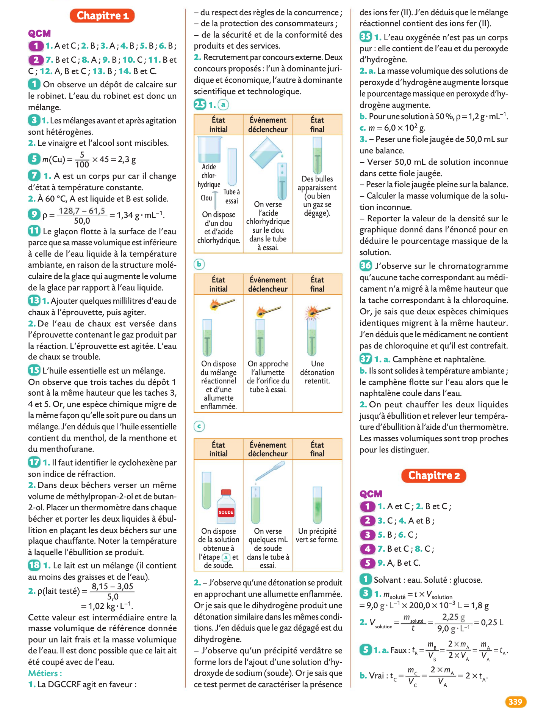
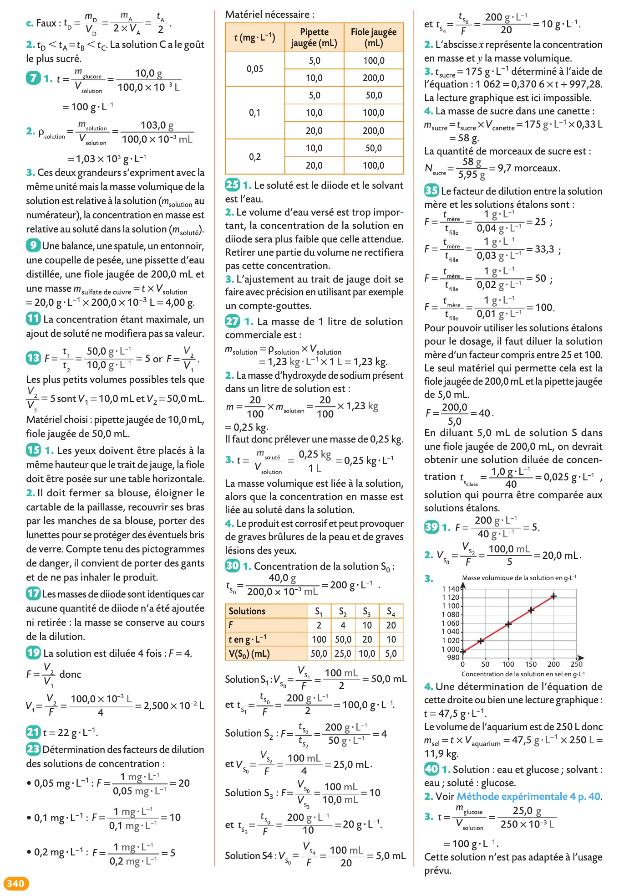
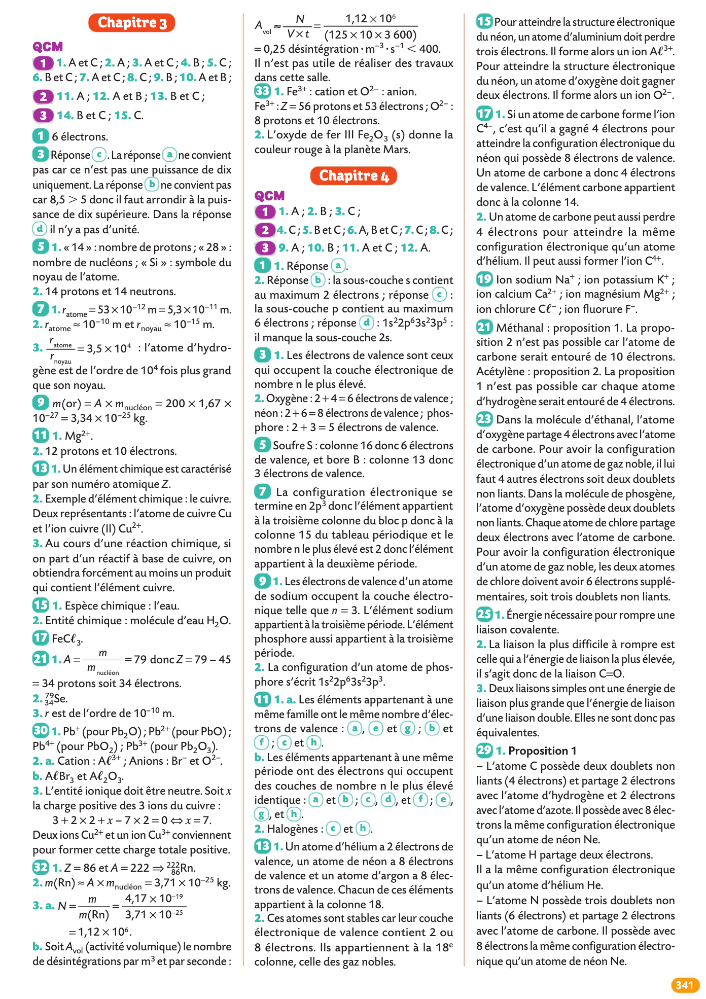
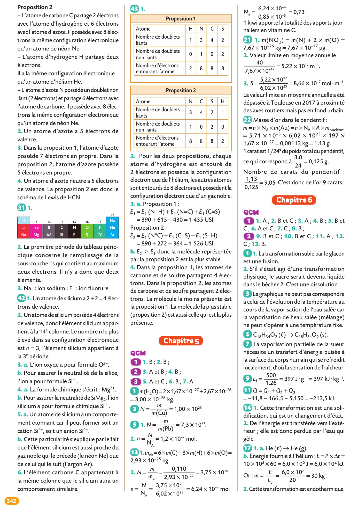
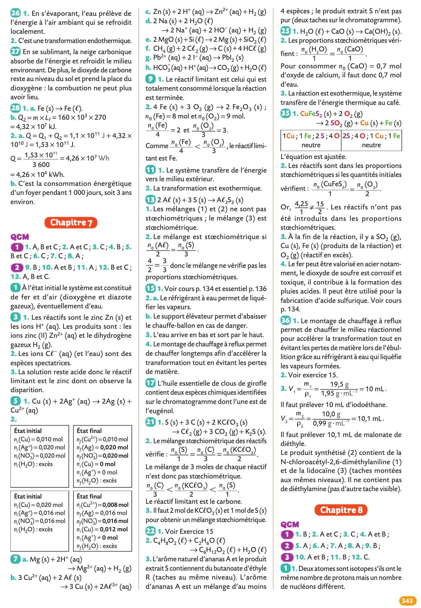
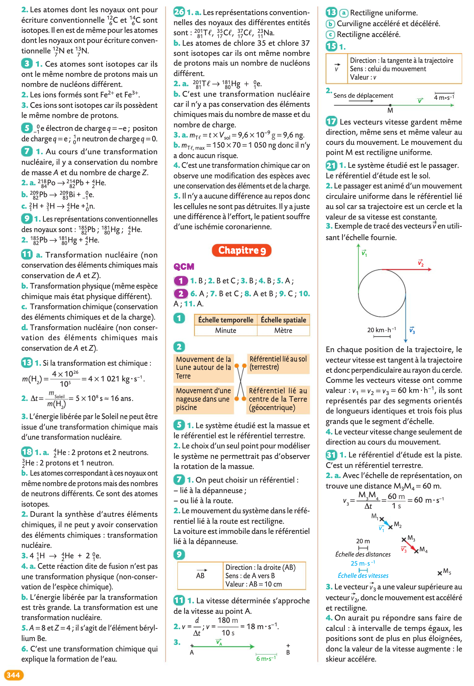
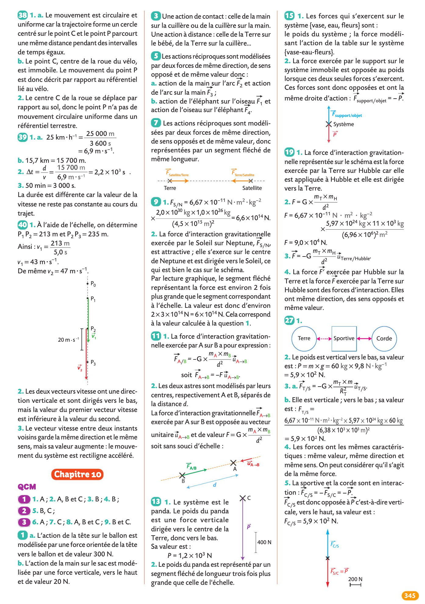
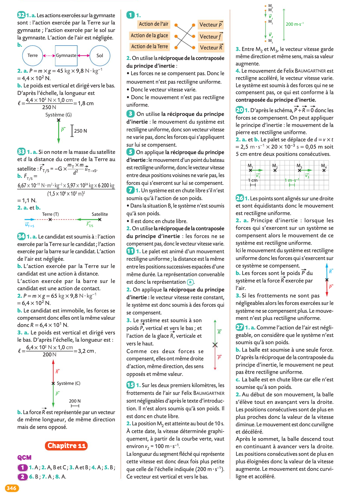
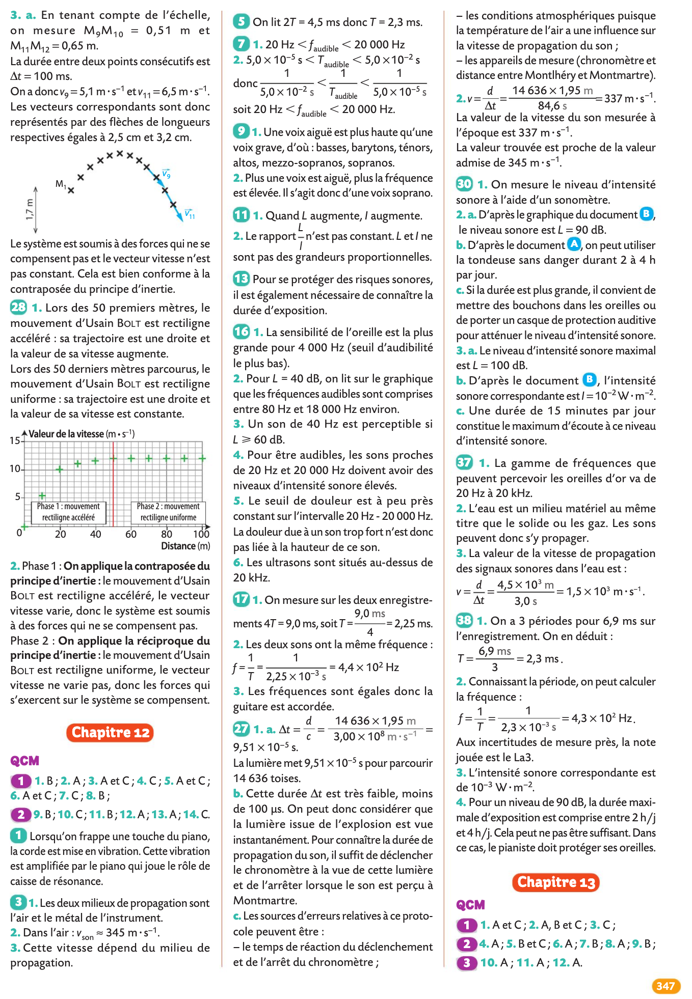
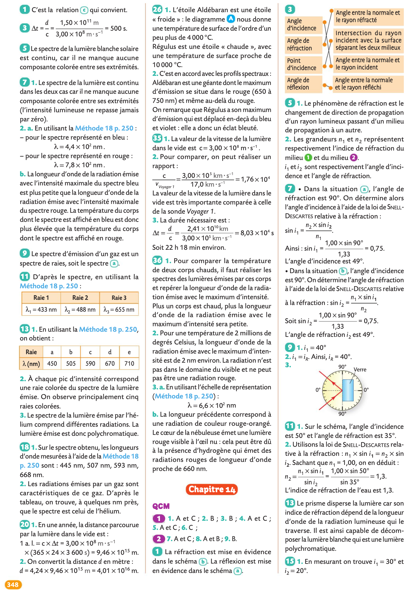
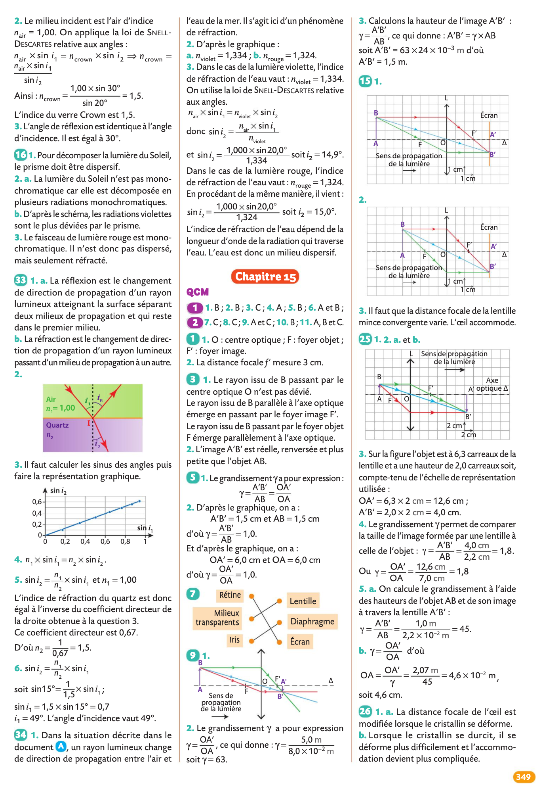
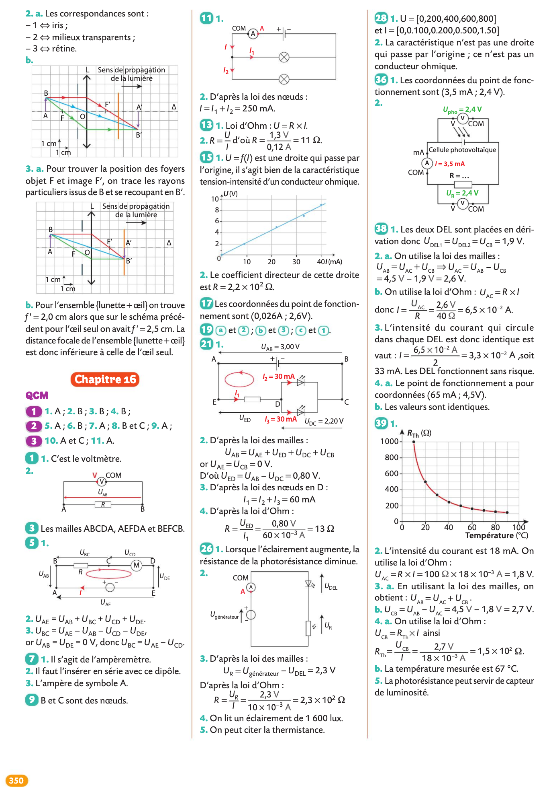

