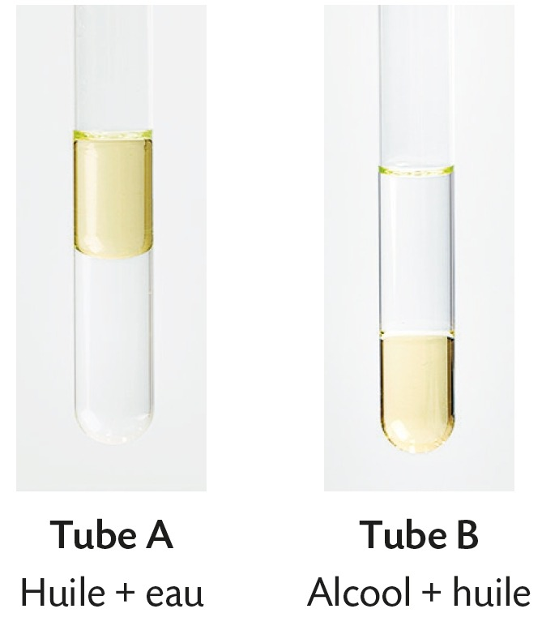
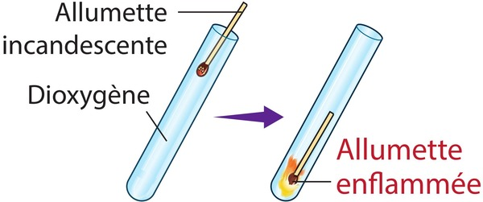
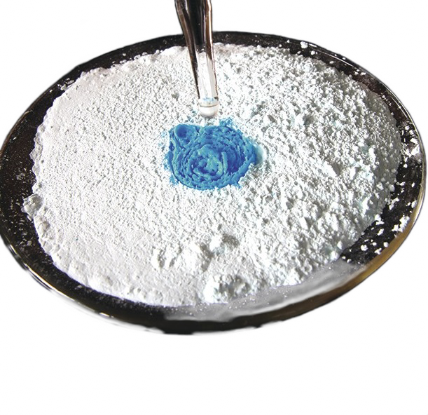
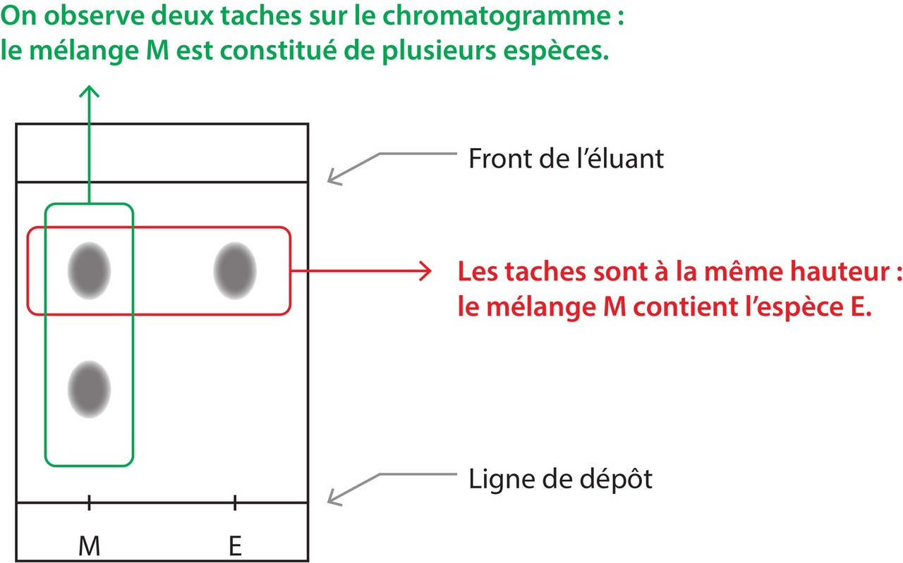

# Chapitre I : Corps purs et mélanges

{{ initexo(0) }}

## I. Corps purs et mélanges

### 1. Définitions
	
- **Corps pur** : substance constituée d’une seule espèce chimique (exemples : eau distillée $H_2O$, dioxygène pur $O_2$…).
- **Mélange** : substance constituée de plusieurs espèces chimiques.
    - Mélange homogène : une seule phase visible (exemples : eau salée, air).
    - Mélange hétérogène : plusieurs phases visibles à l'œil nu (exemple : eau + huile).

!!! example "{{ exercice() }} : liquides non miscibles :heart:" 
    === "Énoncé"
        {: .center width="200"}
        
        1. Identifier la phase aqueuse et la phase organique pour le tube A.
        2. Identifier la phase aqueuse et la phase organique pour le tube B.
        3. Classer les densités (deau , dalcool et dhuile) par ordre croissant. 

[**Exercices n°2, 3©, 4 p. 28**{: .exo}](../data/p28.png)

### 2. Quantifier la composition d'un mélange
Pour un mélange, la composition massique (ou volumique) de chaque constituant s'obtient de façon très logique en partant de la notion de fraction ( ⚠️ il est indispensable d'avoir les mêmes unités au numérateur et au dénominateur) :

 - **La proportion en masse** d'une espèce dans un mélange est le quotient de la masse de cette espèce par la masse totale du mélange.
 - **La proportion en volume** d'une espèce dans un mélange est le quotient du volume de cette espèce par le volume total du mélange.

Remarques : 

 - Le résultat est un nombre sans unité. 
 - Souvent ces proportions sont exprimées en *pour cent* (%) et sont alors nommés respectivement **pourcentage massique** et **pourcentage volumique**.
 - Les proportions et les pourcentages en volumes sont surtout utilisés pour les mélanges de liquides ou de gaz (exemple: l'air contient, en volume, environ 78 % de diazote, 21 % de dioxygène et 1 % d'autres gaz).

### 3. Déterminer la masse ou le volume de chaque espèce

Si l'on connaît la composition du mélange.

!!! success "Masse d'une espèce"
    mespèce = pourcentage massique × mmélange

!!! success "Volume d'une espèce"
    Vespèce = pourcentage volumique × Vmélange

[**Exercices n°5©, 6 p. 29**{: .exo}](../data/p29.png) et [**27 p. 33**{: .exo}](../data/p33.png)

## II. Identifier les espèces chimiques

!!! note "Principe"
    Pour identifier une espèce chimique inconnue, le chimiste compare ses caractéristiques à celles d'espèces connues, répertoriées dans des tables.

### 1. Méthodes physiques

<figure markdown="span">
    {: .center   width="300"}
    <figcaption>Caractéristiques physiques et pictogrammes de sécurité de l'acétone</figcaption>
</figure>

#### a. Température de changement d’état

!!! success  "On peut définir une valeur de la température de changement d'état d'un corps pur, alors qu'on ne le peut pas pour un mélange."
    Exemple : 

    {: .center   width="400"}
    
    Remarque : une température de fusion (cas d'un solide) peut se mesurer avec un banc Kofler et une température d'ébullition (cas d'un liquide) dépend fortement de la pression.
    
[**Exercices n°7©, 8 p. 29**{: .exo}](../data/p29.png) et [**28 p. 33**{: .exo}](../data/p33.png)

#### b. Masse volumique et densité de matière

!!! success "Masse volumique "
    La  masse volumique se note $\rho$ et se lit rho.
    
    {: .center width="300"}
    
    D'autres unités sont possibles.

!!! example "{{ exercice() }} : utiliser une formule et unités SI :heart:" 
    === "Énoncé"
        $$\rho = \frac{m}{V}$$
        
        1. L'unité SI de la masse est le kilogramme. Son symbole est-il "kg" ou "Kg"... ou peu importe, car les deux écritures sont correctes ? 
        2. Rajouter les unités à la formule précédente si la masse est exprimée en kilogrammes et le volume en mètres cubes ([unités SI](https://metrologie-francaise.lne.fr/fr/metrologie/unites-de-mesure-si)).
        3. Donner l'expression de $m$ en fonction de $\rho$ et $V$.
        4. Donner l'expression de $V$ en fonction de $\rho$ et $m$.

!!! example "{{ exercice() }} : déterminer la masse volumique d'un solide :heart:" 
    === "Énoncé"
        {: .center width="300"}

        1. Donner le protocole à suivre pour déterminer la masse volumique d'un solide.
        2. Donner la masse volumique du solide placé dans l'éprouvette graduée.
        3. Utiliser la conversion d'unités de la calculatrice NumWorks pour montrer que 1 L = 1000 cm³ et que 1 mL = 1 cm³.
        4. La masse volumique du cuivre est de 8,96 g/cm³. Le solide est-il en cuivre comme indiqué sur l'image ?
    === "NumWorks"
        <iframe width="560" height="315" src="https://www.youtube.com/embed/Rq4CVP2V4_E?si=38Metg90MOOQBNji" title="YouTube video player" frameborder="0" allow="accelerometer; autoplay; clipboard-write; encrypted-media; gyroscope; picture-in-picture; web-share" referrerpolicy="strict-origin-when-cross-origin" allowfullscreen></iframe>
    

!!! example "{{ exercice() }} : déterminer la masse volumique d'un liquide :heart:" 
    === "Énoncé"
        {: .center width="300"}

        1. Donner le protocole à suivre pour déterminer la masse volumique d'un liquide.
        2. Donner la masse volumique de l'eau de mer.

!!! success "Densité"

    - densité d'un liquide : 
    
$d=\frac{\rho_{liquide}}{\rho_{eau}}$

    - densité d'un gaz :
    
    
$d=\frac{\rho_{gaz}}{\rho_{air}}$

    Grandeur sans unité.
    
    
[**Exercices n°9©, 10, 12 p. 29**{: .exo}](../data/p29.png) et [**20 p. 31**{: .exo}](../data/p31.png) et  [**26 p. 33**{: .exo}](../data/p33.png) et  [**31 p. 34**{: .exo}](../data/p34.png)

### 2. Méthodes chimiques (tests caractéristiques)
#### a. Test du dioxyde de carbone 

{width="500"}

Révélé par l’eau de chaux : elle devient trouble (précipité blanc de carbonate de calcium).

#### b. Test du dihydrogène 

{width="110"}

Enflammé, le gaz produit une détonation (“pop”) caractéristique.

#### c. Test du dioxygène 
{width="250"}

Une allumette incandescente se rallume dans du dioxygène.

#### d. Test de la présence d’eau

{width="150"}

Test au sulfate de cuivre anhydre : blanc à sec, devient bleu au contact de l’eau.

[**Exercice n°13© p. 30**{: .exo}](../data/p30.png) et [**25© p. 32**{: .exo}](../data/p32.png)

### 3. La chromatographie

!!! note 
    Cette technique sera étudiée de façon plus complète [plus tard dans l'année](./Chapitre 10.md#chromatographie).

#### a. Principe
La chromatographie est une méthode permettant de séparer et d'identifier les constituants d’un mélange. La séparation est basée sur la différente affinité des constituants pour la phase fixe (papier ou plaque) et la phase mobile (solvant). Pour un éluant et une phase fixe donnés, une espèce chimique migre de la même façon, qu'elle soit pure ou dans un mélange.

#### b. Chromatographie sur couche mince (CCM)
- Une goutte du mélange est déposée en bas de la plaque.
- La plaque est plongée dans un solvant (sans que la goutte soit immergée).
- Les constituants montent à différentes hauteurs.

{: .center width="250"}

#### c. Révélation d'un chromatogramme

Les chromatogrammes d'espèces chimiques incolores doivent être révélés afin de repérer la position de ces espèces après élution. La révélation peut se faire sous une lampe émettant un rayonnement ultraviolet ou à l'aide d'un révélateur chimique.
