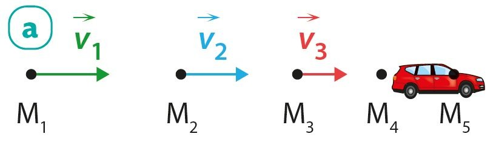
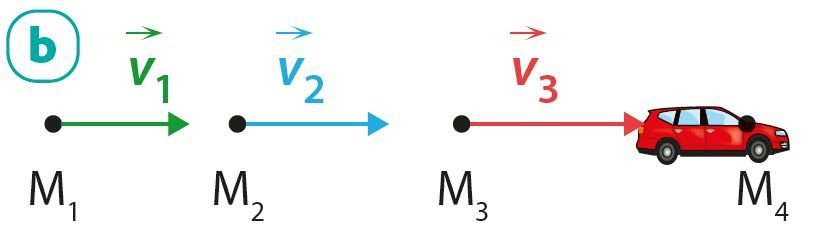
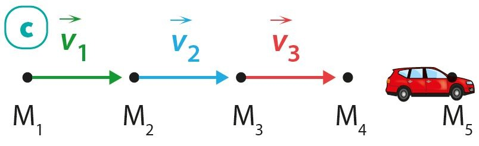

# Chapitre III : Description des mouvements

{{ initexo(0) }}

## I. Le déplacement d'un système

L'objet dont on étudie le mouvement est appelé le système.
Pour simplifier, au lycée, on se limite à l'étude d'un seul point du système : son centre des masses.

{width="800"}

[**Exercices n°6, 9©, 10 p. 179**{: .exo}](../data/p179.png)

### Référentiels usuels :heart:

| Référentiel               | terrestre                                                         | géocentrique                                                                                                   | héliocentrique                                            |
|---------------------------|-------------------------------------------------------------------|----------------------------------------------------------------------------------------------------------------|-----------------------------------------------------------|
| Point d'origine du repère | un point à la surface de la Terre                                 | le centre de la Terre                                                                                          | le centre du Soleil                                       |
| Axes du repère        | 3 axes perpendiculaires dont un correspond à la verticale du lieu | 3 axes qui pointent en direction de 3 étoiles différentes (le repère ne tourne pas sur lui même avec la Terre) | 3 axes qui pointent en direction de 3 étoiles différentes |
| Exemple d'utilisation     | étude des mouvements à la surface de la Terre                     | étude des mouvements des satellites de la Terre                                                                | étude du mouvement des planètes du système solaire        |

[**Exercice n°3© p. 178**{: .exo}](../data/p178.png) 

### Mouvements usuels :heart:

!!! success "Le mouvement du système est..."
    - **stationnaire** si le système est immobile par rapport au référentiel choisi ;  
    - **rectiligne** si sa trajectoire est une portion de droite ;  
    - **circulaire** si sa trajectoire est une portion de cercle ;  
    - **curviligne** dans les autres cas.  

[**Exercice n°8 p. 179**{: .exo}](../data/p179.png)

## II. Le vecteur vitesse entre deux positions M et M'

!!! note "Vecteur vitesse moyenne" 
    $\vec{v}_{moy}=\frac{\overrightarrow{MM'}}{\Delta t}$
​

Au cours d'un mouvement, la vitesse peut évoluer en sens, en direction et en valeur. La notion de vitesse moyenne ne permet pas de le savoir. Le vecteur vitesse $\vec v$ en un point de la trajectoire est assimilé au vecteur vitesse moyenne obtenu pour une durée Δt extrêmement courte. Plus la durée Δt est courte, meilleure est l'approximation.

!!! note "Représentation du vecteur vitesse $\vec v$ en un point"
    - **direction** :  tangente à la trajectoire
    - **sens** :  celui du mouvement
    - **valeur** :  celle de la vitesse, en m⋅s–1
    
    {width="300"}
    
    Le vecteur vitesse est représenté à l'aide d'une **échelle** adaptée.

Il existe différentes unités de vitesse comme le mètre par seconde (**m∙s-1**) ou le kilomètre par heure (**km∙h-1**). 

!!! tip "Convertir des km∙h-1 en m∙s-1 et réciproquement"
    Une vitesse de 1 km∙h-1 correspond à une distance de 1000 m parcourue en une durée de 3600 s par conséquent… 
    
    - pour convertir des km∙h-1 en m∙s-1 on divise par 3,6 
    - pour convertir des m∙s-1 en km∙h-1 on multiplie par 3,6 

!!! warning "Attention"
    **La valeur de $\vec v$ se note $v$** (sans flèche) et non pas $\vec v$ !
    
🎯 **Exemple :** **$v=5$ m∙s-1 est JUSTE**{: .stabilo-vert} (alors que  **$\vec v=5$ m∙s-1 est FAUX !**{: .stabilo-rouge-fluo})

!!! success "Le mouvement du système est..."
    - **uniforme** si la valeur $v$ de $\vec v$ ne change pas
    - **varié** si la valeur de $\vec v$ change (**accéléré** si la valeur de $\vec v$ augmente ; **ralenti/décéléré** si elle diminue)

## III. Décrire un mouvement

Pour décrire un mouvement, on utilise deux caractéristiques : **la forme de la trajectoire** et **l'évolution de la vitesse**. Par exemple, on peut dire que le mouvement d'un système est *rectiligne uniforme*.

!!! example "{{ exercice() }} : décrire un mouvement :heart:" 
    === "Énoncé"
        Décrire le mouvement de la voiture dans chacune des situations suivantes.
        
        { width="300"}  
        { width="300"}  
        { width="300"}

[**Exercices n°13©, 17©, 18 p. 180**{: .exo}](../data/p180.png) et
[**21©, 22 p. 181**{: .exo}](../data/p181.png) et
[**24 p. 182**{: .exo}](../data/p182.png) et
[**30 p. 183**{: .exo}](../data/p183.png) et 
[**36 p. 185**{: .exo}](../data/p185.png)
