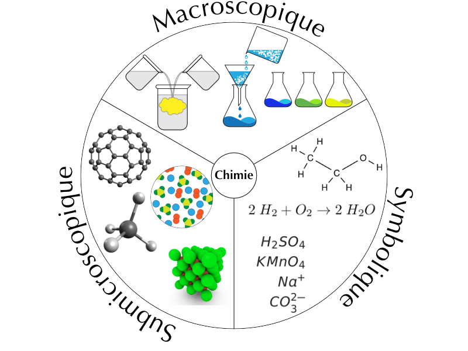
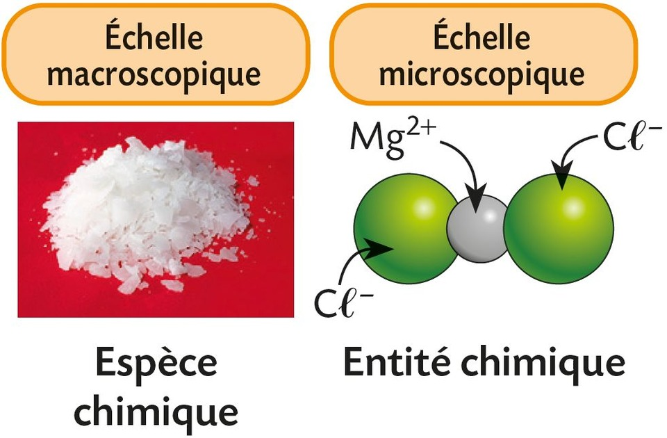
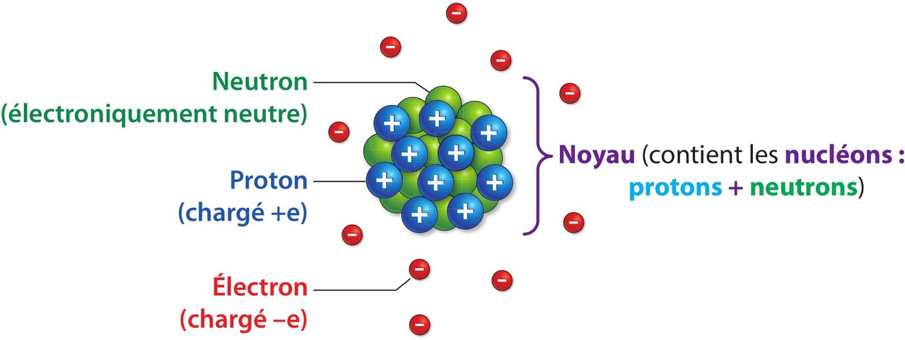
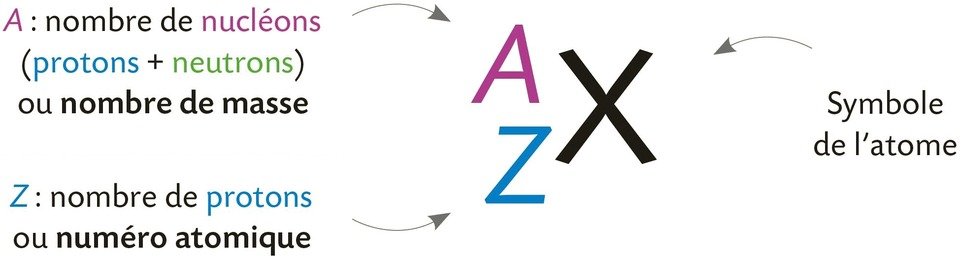
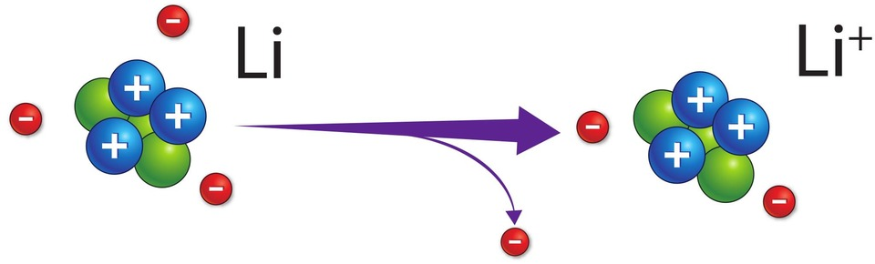

# Chapitre V : Constitution de la matière

{{ initexo(0) }}

## 1 - Du macroscopique au (sub)microscopique

{: .center width="500"}

- **Niveau macroscopique :** ce qu'on observe directement (ex. un verre d'eau, la glace qui fond).
- **Niveau microscopique (au sens « visible avec un microscope optique ») :** cellules, bactéries, grains de pollen…
- **Niveau submicroscopique :** atomes, ions, molécules → entités trop petites pour être vues même au microscope optique ; on les représente par des modèles.

!!! success "Qu'est-ce qu'une espèce chimique"
    - Une **espèce chimique** est une substance constituée d'un seul type d'**entités chimiques identiques**.   
    {: width="300"}
    - Elle est **observable ou identifiable expérimentalement** (par des propriétés physiques ou chimiques).

🎯 **Exemples**

| Espèce chimique           | Type                | Détails sur les entités présentes  |
|---------------------------|---------------------|------------------------------------|
| O₂ (dioxygène)            | Moléculaire         | Gaz constitué de molécules O₂      |
| H₂O (eau)                 | Moléculaire         | Liquide constitué de molécules H₂O |
| NaCℓ (chlorure de sodium) | Ionique             | Réseau d'ions Na⁺ et Cℓ⁻           |
| Solution de CuCℓ₂         | Ionique en solution | Contient les ions Cu²⁺ et Cℓ⁻      |

!!! success "Qu'est-ce qu'un élément chimique"
    - Un **élément chimique** est une **abstraction** qui regroupe l'ensemble des **entités microscopiques** (atomes, ions, noyaux) ayant le **même nombre de protons** dans leur noyau, c'est-à-dire le **même numéro atomique (Z)**.  
    -  C'est une notion qui permet notamment de **classer les entités de la matière dans le tableau périodique**.

🎯 **Exemples**

| Élément chimique | Numéro atomique (Z)  | Exemples d'entités associées                  |
|------------------|----------------------|-----------------------------------------------|
| Carbone (C)      | 6                    | ¹²C, ¹³C, C dans CO₂, CH₄                     |
| Fer (Fe)         | 26                   | Fe, Fe²⁺, Fe³⁺                                |
| Chlore (Cℓ)      | 17                   | Cℓ, Cℓ⁻, Cℓ dans HCℓ, Cℓ₂, NaCℓ               |

⚖️ **Comparaison**

|                      | **Espèce chimique**                              | **Élément chimique**                                       |
|----------------------|--------------------------------------------------|------------------------------------------------------------|
| **Défini par**       | Même type d'entités chimiques                    | Même nombre de protons (même Z)                            |
| **Peut contenir**    | Atomes, molécules, ions                          | Atomes, ions, noyaux, isotopes                             |
| **Exemples**         | H₂O, O₂, NaCℓ, Cu²⁺/Cℓ⁻ en solution              | H, C, O, Fe, Cℓ…                                           |

- **En TP** de chimie, on manipule des **espèces chimiques** (solides, liquides, gaz, solutions), c'est-à-dire des substances constituées d'un seul type d'entités chimiques.
- **Les équations chimiques**, elles, reposent sur la **conservation des éléments chimiques**, même si leurs formes peuvent changer (**atome, ion, molécule…**).
- Au cours d'une réaction chimique, les **espèces chimiques** se transforment, mais les **éléments chimiques** sont conservés.

## 2 - Les atomes

### a. Constitution d'un atome
Un atome est constitué d'un noyau chargé positivement et d'électrons chargés négativement en mouvement désordonné autour de ce noyau.

{: .center width="500"}

!!! success "Charge élémentaire"
    La charge électrique 
e, de valeur 

e = 1,60 × 10–19 C, est appelée charge élémentaire (Coulomb).

??? success "Un atome est électriquement neutre"
    - Les charges électriques du proton (+e) et de l'électron (–e) sont opposées.
    - Un atome est électriquement neutre car il possède autant de protons que d'électrons.

??? success " L'atome a une structure lacunaire"
    - L'ordre de grandeur du rayon d'un atome est de 10–10 m. 
    - L'ordre de grandeur du rayon du noyau est d'environ 10–15 m. 
    - Le rayon d'un atome est donc environ 105 fois plus grand que celui de son noyau.



    - L'espace existant entre les électrons mais aussi entre les électrons et le noyau est vide.

!!! Info "Ordre de grandeur"
    L'ordre de grandeur d'un nombre écrit en notation scientifique est la **puissance de 10 la plus proche** de ce nombre.

[**Exercices n°7©, 9©, 10 p. 72**{: .exo}](../data/p72.png)

### b. Noyau

L'écriture conventionnelle du noyau d'un atome de symbole **X** est:


{: .center width="500"}

Le nombre de neutrons est donc égal à A – Z.

🎯 **Exemple :** le noyau d'un atome de cuivre de notation $_{29}^{63}\textbf{Cu}$ possède 29 protons et 63 – 29 = 34 neutrons.

### c. Masses 
- La masse d'un neutron est environ égale à celle d'un proton (mneutron = mproton = mnucléon = 1,67× 10-27kg). 
- La masse d'un électron est négligeable devant celle d'un nucléon (elle est 1836 fois plus faible).

!!! success "La masse d'un atome est proche de celle de son noyau"
    - matome ≈ A × mnucléon
    - Voilà pourquoi le nombre **A** de nucléons est appelé le *nombre de masse*

[**Exercice 5© p. 71**{: .exo}](../data/p71.png) et 
[**21© p. 73**{: .exo}](../data/p73.png)

## 3 - Les ions monoatomiques

!!! success "ion monoatomique"
    - Un ion monoatomique se forme lorsqu'**un atome gagne ou perd un ou plusieurs électrons**.  
    {: .center width="300"}
    (exemple : lorsqu'un atome de lithium Li perd un électron, l'ion formé Li+ porte une charge électrique positive +e car il possède 3 protons et seulement 2 électrons.)

    - Lors de la formation d'un ion, le noyau reste inchangé.    

### Exemple d'anion
{: width="100"}
Formé à partir d'un atome de chlore Cℓ qui gagne un électron.      

### Exemple de cation
{: width="100"}
Formé à partir d'un atome de magnésium Mg qui perd deux électrons. 

## 4 - Les composés ioniques

!!! warning "Tout échantillon de matière est électriquement neutre"

!!! success "Solution ionique"
    - Certaines solutions aqueuses comportent des ions : on parle alors de **solutions ioniques**.  
    - Lorsqu'on analyse une solution ionique, on constate qu'elle est toujours **électriquement neutre**.  
    - Il est donc **impossible de trouver une solution contenant uniquement des anions ou uniquement des cations**.  
    - Une solution ionique contient à la fois des **anions** et des **cations**, en des proportions telles que **la somme des charges soit nulle**.  
    - Les **charges positives des cations** compensent exactement les **charges négatives des anions**.

**Si l'on évapore l'eau** d'une solution ionique, les ions s'organisent pour former un **réseau cristallin régulier**, appelé **composé ionique**.

!!! success "Composé ionique"
    - Des espèces ioniques (cations et anions) s'associent pour former un **composé ionique** de **charge globale nulle**.
    - À l'état solide, ces ions forment un **réseau régulier** dont la charge totale est nulle.

**Si l'on dissout un composé ionique dans de l'eau**, le réseau cristallin est dissocié : les ions (anions et cations) se retrouvent en solution. **La solution ionique obtenue est également neutre**.

!!! note "Formule d'un composé ionique"

    - La formule d'un composé ionique comporte d'abord le **symbole du cation**, puis celui de l'**anion** (sans les indications de charge).
    - Si **les conditions de neutralité** font qu'un ion doit apparaître plus d'une fois, **la formule va comporter des indices** (en bas à droite des symboles) qui indiquent le rapport minimal entre les ions pour assurer la neutralité. 

🎯 **Exemples :**

- Le chlorure de sodium **NaCℓ** est un composé ionique formé par l'association d'ions **Na⁺** et **Cℓ⁻**, en nombre **égal** (1 pour 1). La charge totale est donc **nulle** : `(+1) + (–1) = 0`
- Le chlorure de cuivre(II) **CuCℓ₂** est un composé ionique formé par l'association d'**un ion Cu²⁺** et de **deux ions Cℓ⁻**. La charge totale est également **nulle** : `(+2) + 2 × (–1) = 0`

[**Exercices n°11©, 12 p. 72**{: .exo}](../data/p72.png) et 
[**18, 20, p. 73**{: .exo}](../data/p73.png) et 
[**22, 26 p. 74**{: .exo}](../data/p74.png)
