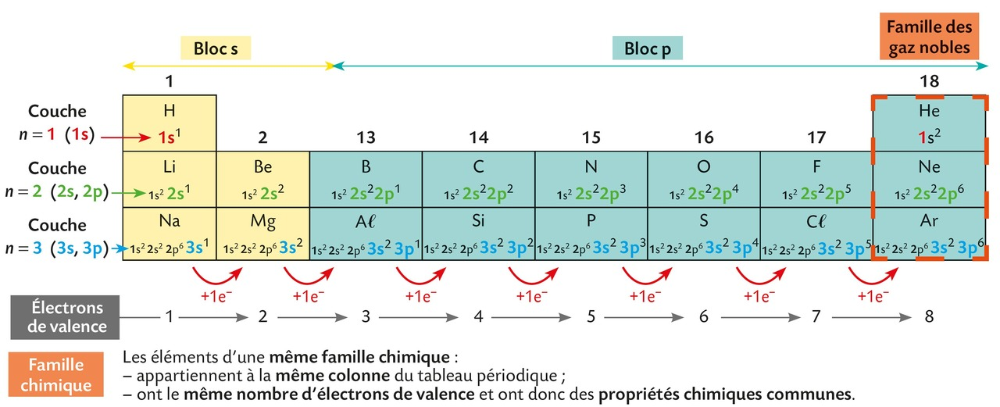
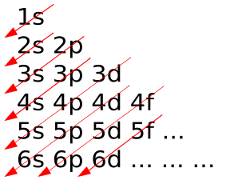
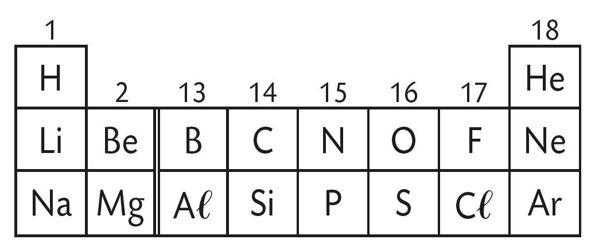
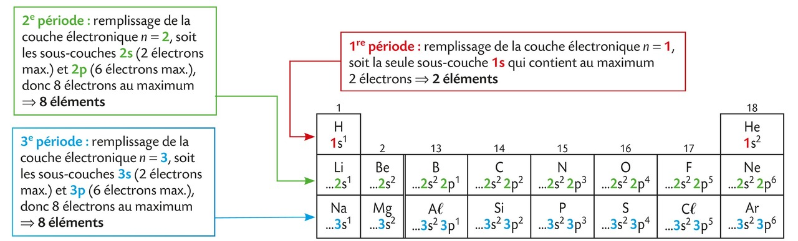
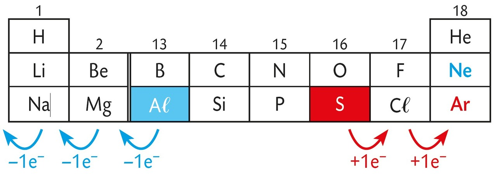
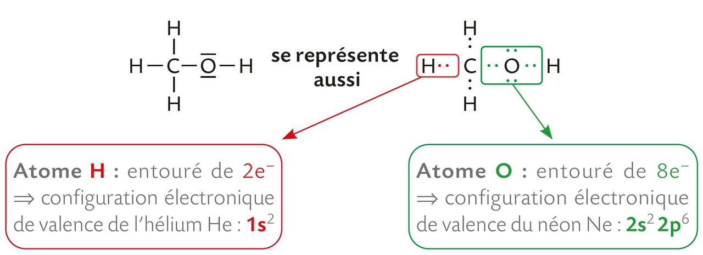
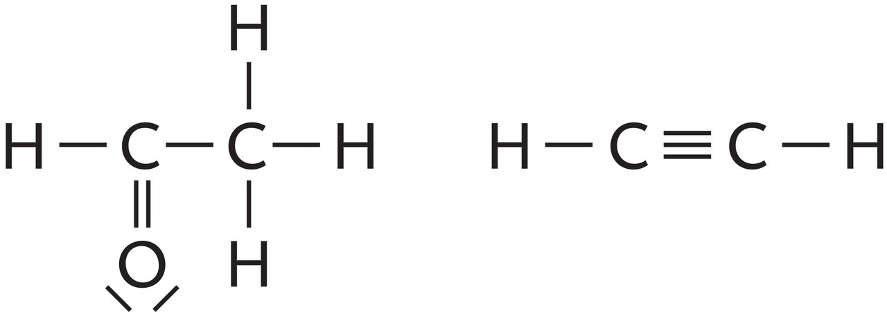
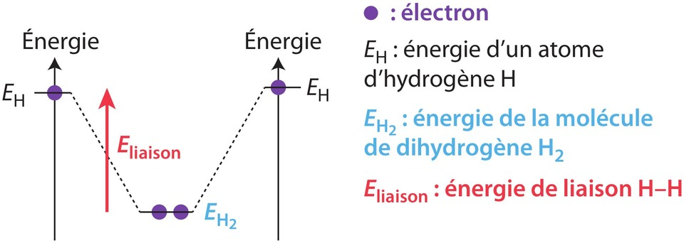
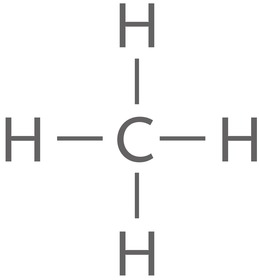

# Chapitre VI : Vers des entités plus stables

{{ initexo(0) }}

## 1 - La configuration électronique d'un atome

!!! success "Configuration électronique d'un atome"
    - **Les `Z` électrons d'un atome se répartissent en couches électroniques** (notées n = 1, 2, 3, etc. mais les couches suivantes sont hors programme), elles-mêmes **composées d'une ou plusieurs sous-couches** (notées s, p, d, f). 
    - La configuration électronique d'un atome (à l'état fondamental) décrit la répartition de ses électrons sur les différentes sous-couches.
    - **Le nombre d'électrons présents sur une sous-couche est noté en exposant**. 

    - **Lorsqu'une sous-couche est pleine (on dit aussi saturée), les électrons restants occupent la sous-couche suivante** puis, si nécessaire, celle d'après.

!!! example "{{exercice()}} : configuration électronique"
    === "Énoncé"
  
        **Le tableau suivant donne la configuration électronique des 18 premiers éléments chimiques (à l'état fondammental).**   
        {: width="800"}
        
        1. Combien de sous-couches comporte la couche n = 1 ?
        1. Combien de sous-couches comporte la couche n = 2 ?
        1. Combien de sous-couches comporte la couche n = 3 ?        
    === "Correction"
        1. La couche n = 1 comporte 1 seule sous-couche (la sous-couche notée 1s)
        1. La couche n = 2 comporte 2 sous-couches (la sous-couche notée 2s et celle notée 2p)
        1. La couche n = 3 comporte 2 sous-couches (la sous-couche notée 3s et celle notée 3p)        

- Dans le tableau de l'exercice précédent, le **bloc s**{: .stabilo-jaune-pastel} correspond au remplissage des *sous-couches s* tandis que le **bloc p**{: .stabilo-bleu-pastel} correspond à celui des *sous-couches p*. L'hélium de configuration électronique 1s2 est une exception. Il est placé dans le bloc p car ses propriétés sont semblables à celles des autres **gaz nobles**{: .stabilo-orange-pastel}.
- **Teaser :** les notions d'*électrons de valence* et de *famille chimique* seront expliquées un peu plus tard dans ce chapitre. 

!!! example "{{exercice()}} : remplir les sous-couches :heart:"
    === "Énoncé"
        - Les électrons se répartissent dans les sous-couches selon un ordre déterminé : 1s → 2s → 2p → 3s → 3p → 4s…  Ensuite cela se complique mais seules les 3 premières couches (impliquant uniquement des sous-couches s et p) sont au programme du lycée.

        - Examiner le tableau de l'exercice précédent puis donner le nombre d'électrons maximum pouvant se trouver sur les sous-couches s et p. 
    === "Correction"
        - **La sous-couche s contient au maximum 2 électrons**. :heart:
        - **La sous-couche p contient au maximum 6 électrons**. :heart:
        - Hors programme : la sous-couche d contient au maximum 10 électrons.
    === "Règle de Klechkowski (hors programme)"
        Méthode empirique permettant de prédire avec une assez bonne précision l'ordre de remplissage des électrons dans les sous-couches des atomes électriquement neutres à l'état fondamental.   
        {: width="200"}

!!! example "{{exercice()}} : configuration électronique du silicium"
    === "Énoncé"
        Donner la configuration électronique du silicium (Z = 14) à l'état fondamental.
    === "Correction"
        Configuration électronique du silicium (Z = 14) à l'état fondamental : 1s22s22p63s23p2

## 2 - Le tableau périodique des éléments

### a. Structure du tableau
- Le chimiste D. MENDELEÏEV entreprit de classer les éléments dans un tableau en vue de souligner et de prédire leurs propriétés chimiques. Ce tableau a été ajusté au cours du temps. 
- Dans le tableau périodique, **les éléments sont rangés par numéro atomique Z croissant**.
- Le tableau périodique actuel est formé de **7 lignes (appelées périodes)**, et de **18 colonnes (nommées familles)**.
- Une nouvelle ligne (ou période) est utilisée à chaque fois que la configuration électronique fait intervenir une nouvelle valeur du nombre n.

{: .center width="800"}

[👉 Ouvrir le tableau périodique dans un nouvel onglet](../data/tableau_periodique.pdf){:target="_blank"}

Le tableau utilisé dans les exercices précédents est une version simplifiée du tableau périodique qui rassemble uniquement les 18 premiers éléments (donc les 3 premières périodes pour lesquelles  les colonnes 3 à 12 sont vides).

{: .center width="400"}

Dans un tableau périodique simplifié, il faut être vigilant à respecter la numérotation des colonnes du tableau complet. C'est pourquoi la 3e colonne de ce tableau est numérotée « 13 ».

Dans le tableau ci-dessous sont indiquées les couches en cours de remplissage.

{: .center width="800"}

### b. La couche de valence

!!! success "Électrons de valence"
    - Les **électrons de valence** sont ceux qui occupent la couche électronique de nombre n le plus élevé (donc la **dernière couche**). 
    - La dernière couche est appelée **couche électronique de valence**, sa configuration électronique se nomme **configuration électronique de valence**.
    - Les électrons de valence d'un atome sont responsables de sa **réactivité chimique**.
    - Les atomes des éléments qui appartiennent à une **même colonne** possèdent le **même nombre d'électrons de valence**.

🎯 **Exemples** 

- La configuration électronique d'un atome de silicium de valence est : 3s2 3p2. Il possède 2 + 2 = 4 électrons de valence.
- La configuration électronique d'un atome d'azote N est 1s2 2s2 2p3, celle d'un atome de phosphore P est : 1s2 2s2 2p6 3s2 3p3.
Les atomes N et P possèdent chacun 2 + 3 = 5 électrons de valence, donc les éléments correspondants appartiennent à la même colonne.

!!! success "Famille chimique"
    Les éléments d'une **même colonne** ont des **propriétés chimiques communes** et constituent une **même famille chimique**.

🎯 **Exemple** Les éléments de la colonne 18 (hélium He, néon Ne et argon Ar) constituent la famille des *gaz nobles*.

## 3 - Les entités stables chimiquement

### a. Les gaz nobles

!!! success "Configuration des gaz nobles"
    - Les éléments de la colonne 18 (hélium He (g), néon Ne (g), etc.) sont chimiquement stables et constituent la famille des gaz nobles.
    
    | Gaz noble | Configuration électronique de l'atome                                      |
    |-----------|----------------------------------------------------------------------------|
    | Hélium    | 1s2                                                             |
    | Néon      | 1s2 2s2 2p6                               |
    | Argon     | 1s2 2s2 2p6 3s2 3p6 |

    - La configuration électronique de valence des atomes qui la constituent est de la forme ns2 np6 ou, dans le cas de l'hélium, 1s2. 
    - Un atome d'hélium possède 2 électrons de valence (duet), un atome de néon et un atome d'argon en possèdent 8 (octet).

!!! warning "Règle de stabilité"
    - **Au cours des transformations chimiques, les atomes acquièrent la même configuration électronique que celle d'un atome de gaz noble**, c'est-à-dire une configuration électronique de valence en **duet** ou en **octet**.
    - La formation d'**ions** ou de **molécules**, sont les deux mécanismes permettant aux éléments d'acquérir une **configuration électronique stable**.

### b. Les ions

!!! success "Formation d'ions monoatomiques"
    - **En perdant ou en gagnant un ou plusieurs électrons, un atome peut former un ion monoatomique stable**.
    - L'ion monoatomique a alors la **configuration électronique de l'atome du gaz noble le plus proche** dans le tableau périodique.

🎯 **Exemples** 

{: .center width="400"}

- Un atome d'aluminium perd 3 électrons. L'ion formé Aℓ3+ a la configuration électronique d'un atome de néon Ne. Le néon est le gaz noble le plus proche.

- Un atome de soufre gagne 2 électrons. L'ion formé S2- a la configuration électronique d'un atome d'argon Ar. L'argon est le gaz noble le plus proche.

!!! success "La charge de l'ion dépend du numéro de la colonne dans laquelle se trouve l'élément dans le tableau périodique"
    - Les atomes des éléments d'une **même colonne** du tableau périodique forment des **ions monoatomiques de même charge**.

    
Il convient de connaître le nom et la formule des quelques ions monoatomiques indiqués dans le tableau ci-dessous.

| Formule         | Nom           |
|-----------------|---------------|
| H+   | ion hydrogène |
| Na+  | ion sodium    |
| K+   | ion potassium |
| Ca2+ | ion calcium   |
| Mg2+ | ion magnésium |
| F–   | ion fluorure  |
| Cℓ–  | ion chlorure  |

### c. Les molécules

!!! success "Le schéma de Lewis"
    - Le schéma de Lewis d'une molécule est une modélisation de l'enchaînement des atomes dans la molécule.
    - Chaque atome est représenté par son symbole.
    - Les électrons de valence sont regroupés en doublet(s) liant(s) ou doublet(s) non-liant(s) représentés par des tirets (un doublet correspond à 2 électrons).
    
🎯 **Exemple :**

- Schéma de Lewis d'une molécule d'eau : 
{: width="250"}

!!! success "Liaisons covalentes"
    - Dans une molécule, les atomes sont liés par des liaisons covalentes obtenues par la mise en commun de 2 électrons (doublet liant). Chacun des atomes possède une configuration électronique semblable à celle de l'atome du gaz noble le plus proche.
    - Les électrons des liaisons appartiennent aux deux atomes, et les électrons des doublets non liants appartiennent uniquement à l'atome sur lequel ils sont situés.

🎯 **Exemple :** 

- Schéma de Lewis de la molécule de méthanol :
{: .center width="600"}

!!! success "Liaisons multiples"
    - Une liaison covalente peut être simple ou multiple (double, triple). 
    - Dans une liaison double, quatre électrons sont mis en commun.
    - Dans une double liaison, les deux atomes partagent 4 électrons. 
    - Dans une triple liaison, les deux atomes partagent 6 électrons.

- Schémas de Lewis avec des liaisons multiples : 
{: .center width="250"}

!!! success "Stabilité des liaisons covalentes"
    
    |                             | C–H | C–C | C=C |
    |-----------------------------|-----|-----|-----|
    | Énergie de liaison (kJ/mol) | 413 | 348 | 614 |

    - L'énergie de liaison d'une liaison covalente correspond à l'énergie nécessaire pour rompre la liaison covalente.
    - Deux atomes liés par une liaison covalente sont plus stables que les deux atomes isolés. Par exemple, la molécule de dihydrogène H2 est plus stable énergétiquement que les deux atomes isolés H.
    {: .center width="500"}
    - Plus l'énergie de liaison est grande, plus la liaison est stable.

{: width="70"}

🎯 **Exemple :** Pour rompre toutes les liaisons de la molécule CH4, il faut fournir l'énergie E = 4×ECH , soit E = 1 652 kJ/mol.

