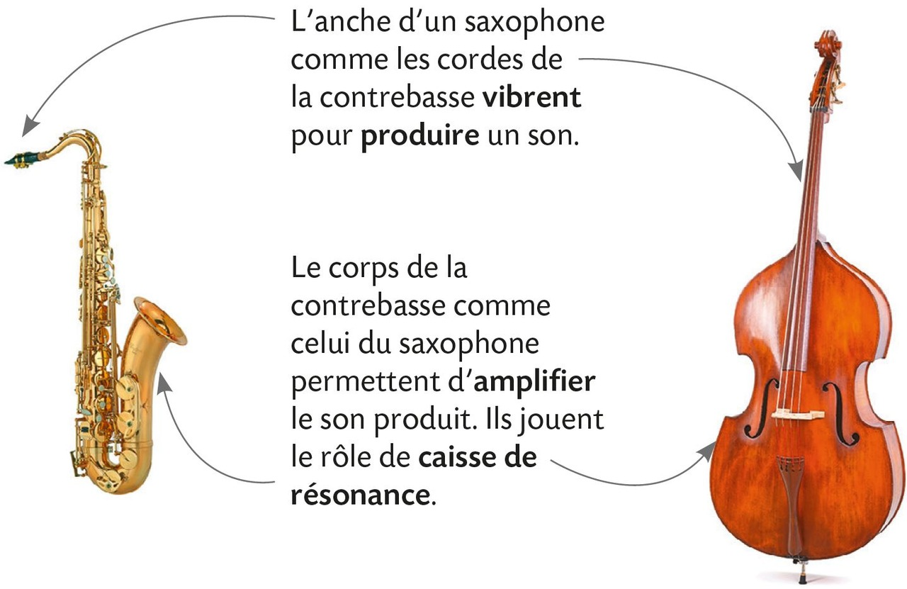
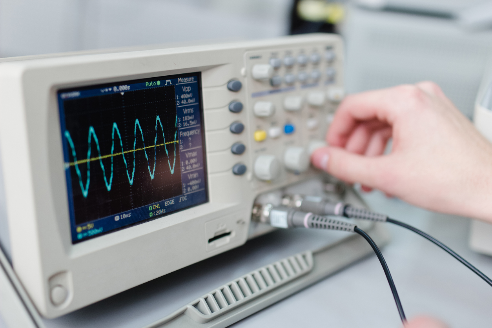
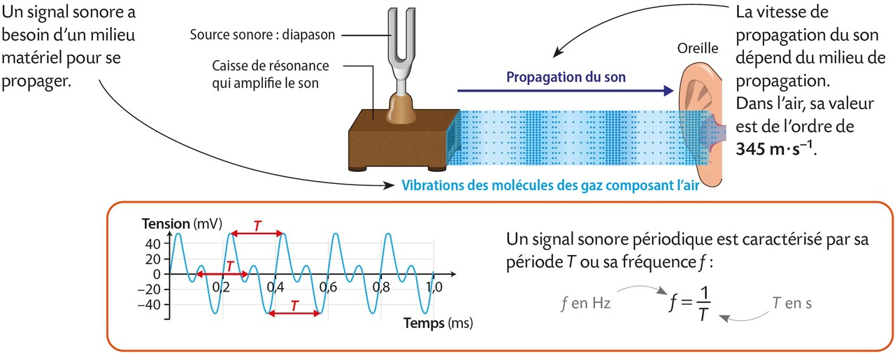
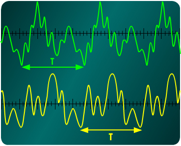
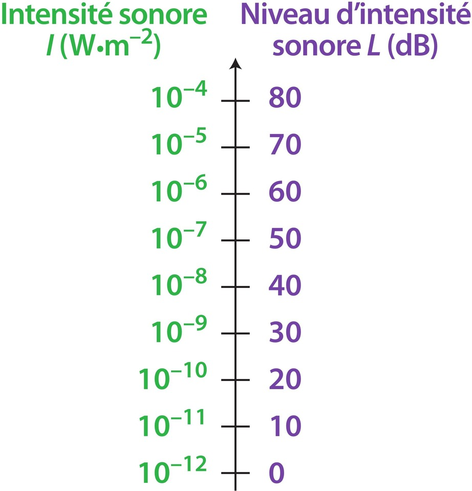
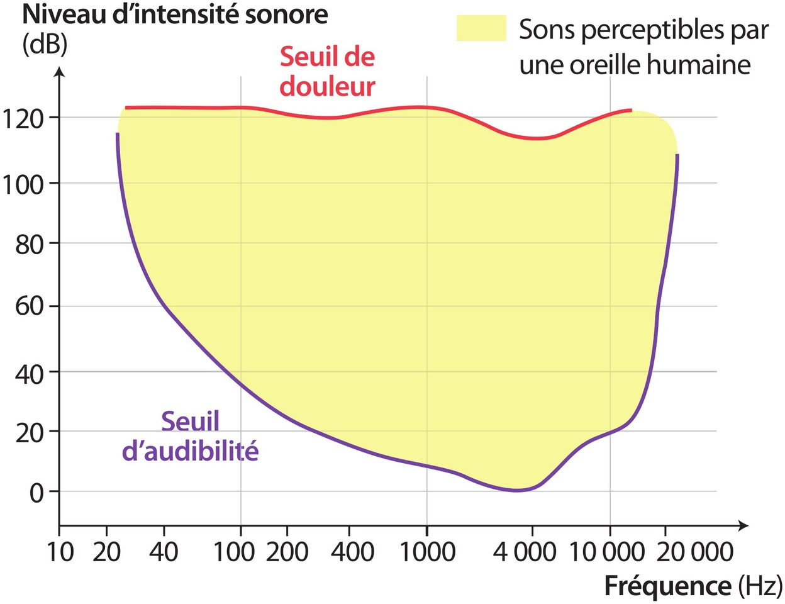

# Chapitre VIII : Émission et perception d'un son  

{{ initexo(0) }}

## I. Émission et propagation d'un signal sonore

### 1. Création d'un son

- **Un son est créé par la vibration rapide d'un objet** comme les cordes d'une guitare, les ailes d'un insecte ou les feuilles d'un arbre au vent. Cette vibration est souvent d'amplitude micrométrique à millimétrique et provoque des sons de faible intensité.  
- Pour résoudre ce problème, beaucoup d'instruments et d'êtres vivants sont dotés d'une **caisse de résonance**.

{: .center .img-rounded width="500"}

### 2. Propagation du son

On entend un son en étant à distance de la source qui l'a créé : entre la source sonore et l'oreille, il y a **propagation du son**.

!!! success "Onde sonore"
    - La vibration initiale est transmise **de proche en proche au niveau microscopique** entre molécules ou atomes du milieu de propagation qui oscillent autour de leur position initiale.
    -  Comme une « ola » dans un stade : la vague se déplace, mais les supporters ne l'accompagnent pas dans son déplacement latéral.

    On parle de **signal sonore** ou **d'onde sonore** qui se propage depuis la source. 

- **L'onde sonore nécessite un milieu de propagation (solide, liquide ou gazeux)** pour se déplacer : air, bois, métal, eau… 
- En l'absence de milieu matériel, donc **dans le vide**, **il ne peut y avoir propagation du son**. → Par exemple, sur la Lune, qui n'a pas d'atmosphère, les sons ne se propagent pas.

!!! success "Le son est une onde mécanique"
    Un **signal sonore** est un phénomène de :
    
    - **déplacement d'une perturbation de proche en proche sans transport effectif de matière** (définition d'une onde)
    - **dans un milieu matériel** (définition d'une onde mécanique)

### 3. Vitesse de propagation

Dans un **milieu donné**, le son se propage avec une **vitesse caractéristique**, appelée **célérité**, qui dépend :

- de la **nature du milieu**
- de la **température**

Dans l'air, à environ 20 °C, la célérité du son est proche de **340 m·s⁻¹**.

!!! success "La vitesse de propagation du son augmente avec la densité du milieu."

| Milieu    | Air   | Eau liquide | Acier  |
|-----------|-------|-------------|--------|
| v (m·s⁻¹) | ≈ 340 | ≈ 1500      | ≈ 5000 |

[**Exercice n°3© p. 237**{: .exo}](../data/p237.png) et
[**24 p. 241**{: .exo}](../data/p241.png) 

## II. Description d'un signal sonore

### Acquisition

À l'aide d'un **microphone**, on peut transformer un **signal sonore** en **signal électrique**, visualisable :

- sur un **oscilloscope** (les **tensions observées** sont proportionnelles à l'**intensité** de l'onde sonore) ;

{: .center .img-rounded width="300"}

- ou sur un **ordinateur** (après conversion de l'analogique au numérique). 

{: .center .img-rounded width="300"}

Le signal affiché permet alors **d'analyser** le son.

### Analyse

Un **signal sonore est périodique** si son enregistrement présente une **répétition régulière** d'un même motif. Remarque : il s'agit d'un cas particulier car les signaux sonores ne sont pas forcément périodiques. 

🎯 Exemple de signal sonore périodique :

{: .center  width="900"}

!!! success "La période" 
    - Par lecture graphique :
        - La **période T** d'un signal périodique se lit sur un **graphique** représentant le signal (temps en abscisse).  
        - C'est la durée du plus court **motif qui se répète à l'identique**.  
        - Elle s'exprime en **seconde (s)**.

    - Par calcul (si la fréquence est donnée) : **$\displaystyle T=\frac{1}{f}$**{: .stabilo-jaune} où $f$ est en hertz.

!!! success "La fréquence"
    - La **fréquence f** du son est le **nombre de périodes par seconde**.
    - Elle s'exprime en **hertz (Hz)**.
    - Par calcul : **$\displaystyle f=\frac{1}{T}$**{: .stabilo-jaune} où $T$ est en secondes.

[**Exercices n°6, 8 p. 238**{: .exo}](../data/p238.png) et
[**32 p. 244**{: .exo}](../data/p244.png)

## III. Le son et l'oreille

### 1. Domaine des fréquences audibles

L'**oreille humaine** ne perçoit que certaines **fréquences**.

!!! success "Domaine de fréquences audibles"
    - Le domaine des **sons audibles** est compris entre **20 Hz** et **20 kHz** (ce domaine varie selon les individus et **diminue avec l'âge**).
    - Un son trop **grave** (f < 20 Hz : **infrasons**) ou trop **aigu** (f > 20 kHz : **ultrasons**) n'est pas entendu.

### 2. Hauteur d'un son et timbre

!!! success "La **fréquence** détermine la **hauteur** d'un son"
    - Un son de **fréquence élevée** → **son aigu**  
    - Un son de **fréquence basse** → **son grave**

En musique, des sons de **même hauteur** correspondent à la **même note**. 

🎯 **Exemple :** Le Sol₃ à 196 Hz est la note de la corde de Sol à vide sur de nombreux instruments à cordes, notamment :

- la guitare : la 3e corde (en partant du bas) est accordée en Sol₃ ;
- le violon : la 2e corde est un Sol₃ ;
- l'alto : la 2e corde est également un Sol₃ ;
- le banjo et la mandoline : ces instruments possèdent aussi une corde accordée à cette fréquence.
Cette fréquence peut aussi être trouvée sur d'autres instruments comme certains bols chantants tibétains.

Cependant, deux instruments jouant la **même note** restent **distincts à l'oreille** : leur **timbre** est **différent**.

{: .center width="300"}

!!! success "Le timbre"
    Le **timbre** est l'ensemble des caractéristiques du signal permettant de **distinguer un son d'un autre** de **même hauteur**.

!!! example "{{ exercice() }} : hauteur d'un son"
    === "Énoncé"
        - La contrebasse, couvre une large plage de fréquence allant d'environ 40 Hz à 2 kHz. 
        - Les fréquences minimales et maximales audibles d'un violon peuvent varier, mais on peut considérer une plage allant de 196 Hz (Sol) à environ 2637 Hz (Mi)
        
        {: .center .img-rounded width="300"}
        
        1. Lequel de ces deux instruments permet de jouer les notes les plus graves ?  
        1. Lequel de ces deux instruments permet de jouer les notes les plus aiguës ?
        1. Les deux instruments peuvent-ils joueur un Sol₃ ? Si oui, qu'est-ce qui distingue les deux sons ?
    === "Correction"
        1. La contrebasse peut joueur des notes plus graves (sons de plus basse fréquence) que le violon.
        1. Le violon peut joueur des notes plus aiguës (sons de plus haute fréquence) que la contrebasse.
        1. Les deux instruments peuvent jouer un Sol₃ puisque la fréquence de cette note se trouve dans la gamme de fréquence deux deux instruments. Ce qui distingue les deux sons à l'oreille c'est le **timbre** et à l'observation du signal à l'oscilloscope ou à l'ordinateur c'est la **forme du signal qui est différente bien que la fréquence soit la même**.

### 3. Intensité et niveau sonore

- Un son est deux fois plus intense si la source sonore vibre avec une amplitude deux fois plus grande.
Pourtant, il ne sera pas perçu deux fois plus fort par l'oreille. **L'oreille ne réagit donc pas proportionnellement à l'intensité sonore I**.
- Une grandeur liée à la sensibilité de l'oreille humaine, et plus facile à manipuler, est le **niveau d'intensité sonore L**{: .stabilo-violet} exprimé en décibel (dB).

{: .center width="280"}

[**Exercice n°12 p. 238**{: .exo}](../data/p238.png)

- On peut mesurer le niveau d'intensité sonore grâce à un **sonomètre** (ou une application sur son smartphone).

{: .center .img-rounded width="400"}

### 4. Perception des sons par l'oreille

{: .center width="500"}

!!! warning "Danger" 
    Un **niveau d'intensité sonore trop élevé** peut **endommager l'oreille**.

[**Exercices n°19, 20, 22 p. 240**{: .exo}](../data/p240.png) et
[**29 p. 243**{: .exo}](../data/p243.png)

