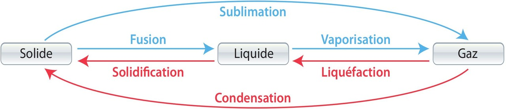
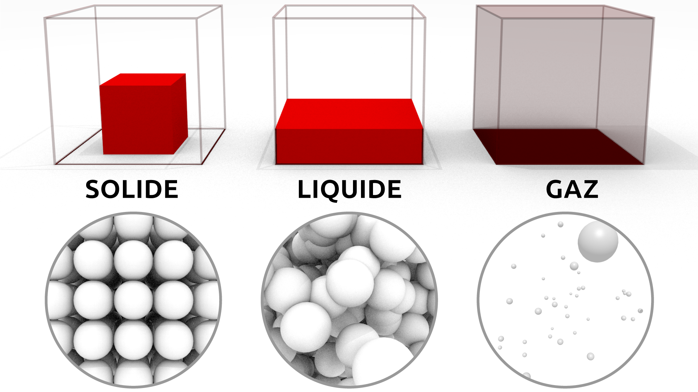
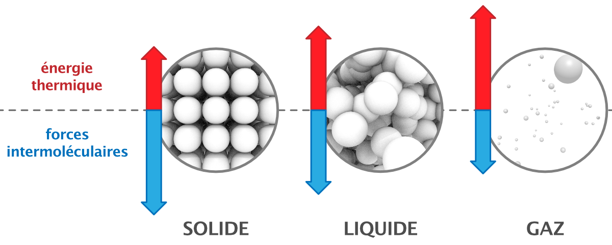
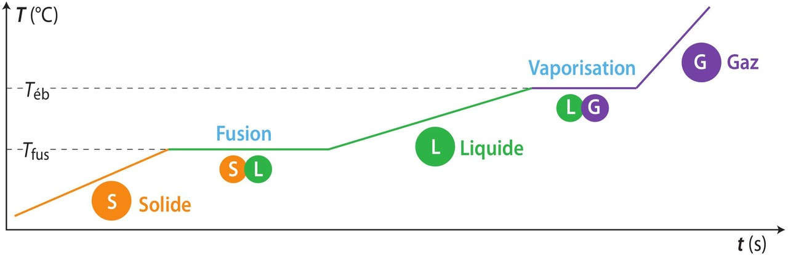
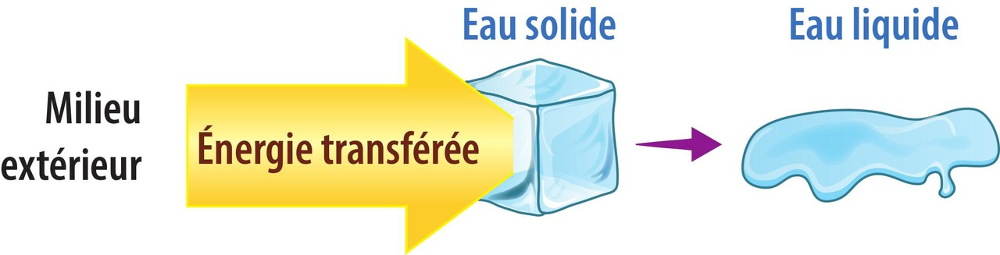
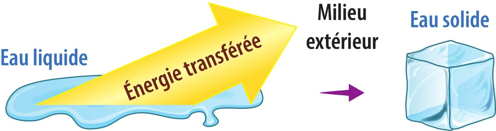

# Chapitre IX : Transformations physiques

{{ initexo(0) }}

## I. Les changements d'état

### 1. Changements d'état physique de la vie courante et dans l'environnement

La matière existe sous trois états physiques : **solide** (s), **liquide** (l) et **gazeux** (g).

Une transformation d'un système d'un état physique à un autre qui conserve les espèces chimiques est un **changement d'état**.  

Ainsi, lors d'un changement d'état physique, les propriétés de la matière changent et l'arrangement spatial des molécules est modifié.

Dans la vie courante ou dans l'environnement, on peut citer :

- des **liquéfactions** : par exemple lorsque de la buée se forme sur une vitre froide (pour un physicien, la condensation c'est autre chose) ;
- des **vaporisations** : par exemple lorsque l'eau liquide du linge s'évapore (l'ébullition et l'évaporation correspondent à un phénomène de vaporisation) ;
- des **fusions** : par exemple lors de la formation du magma dans le manteau terrestre ;
- des **solidifications** : par exemple lorsque de la lave devient une roche solide après une éruption.

{: .center width="600"}

La **sublimation** (transformation d'un solide en gaz) et la **condensation** (transformation d'un gaz en solide) sont, par exemple, utilisées au laboratoire pour purifier des espèces chimiques.

### 2. Modélisation microscopique

{: .center width="400"}

- **État gazeux** : dispersé.  
  Un gaz est composé d'entités chimiques libres les unes par rapport aux autres, sans liaison entre elles. Elles se choquent sans cesse. Les particules sont agitées et espacées.

- **États liquide et solide** : condensés.  
  Les distances entre entités chimiques sont du même ordre de grandeur que les dimensions de ces entités.

- **Liquide** : entités chimiques très proches, en mouvement, reliées par des liaisons faibles. Les particules sont mobiles et peu liées entre elles.

- **Solide** : entités chimiques fortement liées les unes aux autres, avec très peu de liberté de mouvement. Les particules sont quasi immobiles et liées entre elles.

!!! success "Lors d'un changement d'état" 
    Au niveau microscopique, lors d'un changement d'état physique, **l'agitation des entités** est modifiée jusqu'à ce que les liaisons entre les particules s'affaiblissent, se cassent ou se créent.  
    
    
{: .center width="600"}        
    
    
🎯 **Exemple :** lors de la solidification d'un liquide, les entités ralentissent, les liaisons entre les molécules deviennent plus fortes ; les particules sont alors quasi immobiles et liées entre elles.

!!! success "Observation de paliers lors du changement d'état des corps purs"
    Dans le cas d'un corps pur, les changements d'état ont lieu à **température constante** lorsque la pression est maintenue constante. Cela permet de caractériser des espèces chimiques. Les deux états coexistent lors du changement d'état.
    
{: .center width="600"}    
    

### 3. Écriture symbolique d'un changement d'état

Un changement d'état d'un corps pur est modélisé par une réaction dont l'équation utilise le même formalisme que pour une transformation chimique.  
L'état physique est précisé par une lettre entre parenthèses.

🎯 **Exemples :**

- Fusion du gallium : Ga (s) → Ga (ℓ)
- Vaporisation de l'eau : H2O (ℓ) → H2O (g)
- Solidification du saccharose : C12H22O11 (ℓ) → C12H22O11 (s)

### 4. Distinction entre fusion et dissolution

!!! warning "Attention à ne pas confondre fusion et dissolution"
    **Lorsque du sucre est introduit dans de l'eau,** il est inexact de dire que « le sucre fond ». Le sucre ne passe pas d'un état solide à un état liquide : **il se dissout dans l'eau**.

!!! success "Fusion"
    Transformation de l'état solide à l'état liquide. L'agitation des particules augmente, les liaisons deviennent plus faibles.

!!! success "Dissolution"
    Autre transformation physique conservant la formule chimique. Elle nécessite un solvant. Les particules du solide sont séparées de leurs voisines par le solvant et se retrouvent dispersées dans ce nouveau milieu.  

    **Si le solvant est l'eau, l'espèce chimique dissoute est notée (aq) pour *aqueux*.**{: .stabilo-jaune}

[**Automatismes p. 120**{: .exo}](../data/p120.png) et
[**exercices n°5©, 6 p. 121**{: .exo}](../data/p121.png)

## II. Énergie de changement d'état

### 1. Transformation endothermique et exothermique

- Lors d'un **chauffage**, le corps capte de l'énergie du milieu extérieur : transformation **endothermique**.  
  L'agitation des particules augmente, les liaisons peuvent se rompre, le désordre augmente.

{: .center width="400"}

!!! success "Changements d'état endothermiques"
    **fusion**, **vaporisation**, **sublimation** : transformations lors desquelles **le système reçoit de l'énergie** du milieu extérieur par transfert thermique

- Lors d'un **refroidissement**, le corps perd de l'énergie : transformation **exothermique**.  
  L'agitation des particules diminue, les liaisons se créent, l'ordre augmente.

{: .center width="400"}

!!! success "Changements d'état exothermiques"
    **solidification**, **liquéfaction**, **condensation** : transformations lors desquelles **le système cède de l'énergie** au milieu extérieur par transfert thermique

[**Exercices : 7©, 8 p. 121**{: .exo}](../data/p121.png) et
[**14© p. 122**{: .exo}](../data/p122.png)

### 2. Énergie massique de changement d'état

L'énergie acquise ou perdue lors d'un changement d'état provient d'un transfert thermique avec un autre système.  
On note ce transfert thermique **Q**.

De même que les températures de changement d'état sont répertoriées dans des tables pour diverses substances, les valeurs de l'énergie (ou enthalpie) massique de changement d'état (notée L) le sont également. Ces valeurs correspondent à l'**énergie nécessaire pour qu'un kilogramme d'une substance donnée change d'état**. 

| Substance            | Température de Fusion (°C) | Lf (kJ/kg) | Température de Vaporisation (°C) | Lv (kJ/kg) |
|:---------------------|:---------------------------|:----------------------|:---------------------------------|:----------------------|
| **Eau**              | 0                          | 333                   | 100                              | 2257                  |
| **Alcool éthylique** | -114                       | 109                   | 78                               | 855                   |
| **Mercure**          | -39                        | 11,8                  | 357                              | 295                   |
| **Azote**            | -210                       | 25,7                  | -196                             | 200                   |
| **Aluminium**        | 660                        | 397                   | 2467                             | 10890                 |
| **Fer**              | 1535                       | 270                   | 2750                             | 6340                  |
| **Plomb**            | 327                        | 24,7                  | 1750                             | 858                   |

Elles sont essentielles pour les calculs de l'énergie échangée lors d'un changement d'état.

#### Relations :

**$Q = m \times L$**{: .stabilo-jaune} ou **$\displaystyle L = \frac{Q}{m}$**{: .stabilo-jaune}

avec :

- $Q$ en joules (J),
- $m$ en kilogrammes (kg),
- $L$ en joules par kilogramme (J·kg⁻¹)

!!! note
    L'énergie massique reçue par un système lors du changement d'un état 1 à un état 2 est égale à l'énergie massique cédée lors du changement inverse.

[**Exercices n°11©, 12 p. 121**{: .exo}](../data/p121.png) et 
[**13, 15 p. 122**{: .exo}](../data/p122.png) et
[**19 p. 123**{: .exo}](../data/p123.png) et
[**24 p. 125**{: .exo}](../data/p125.png) 

