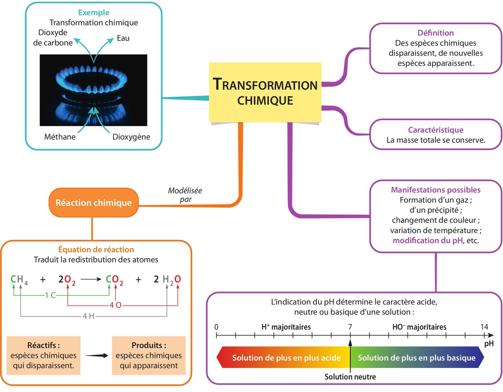
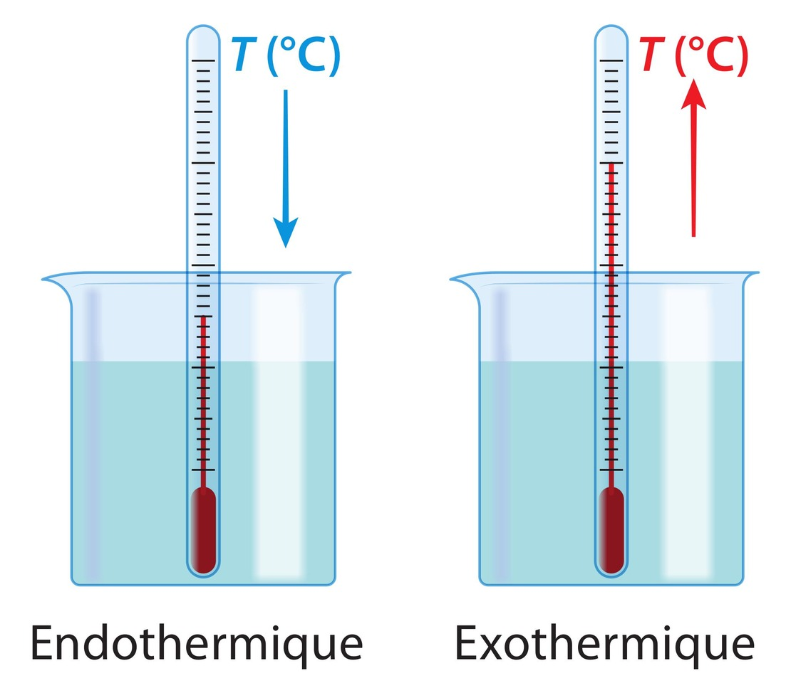
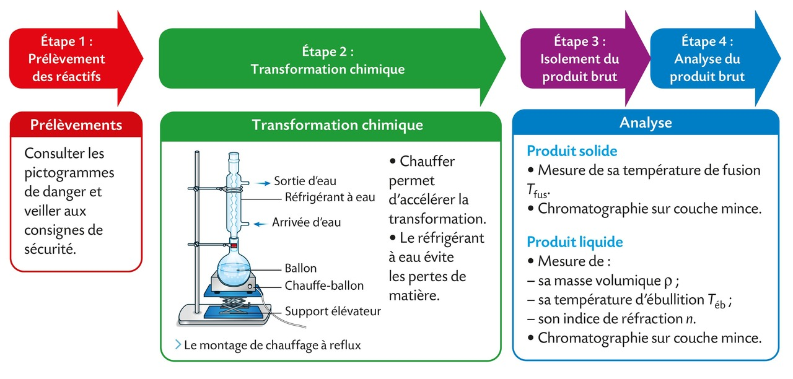
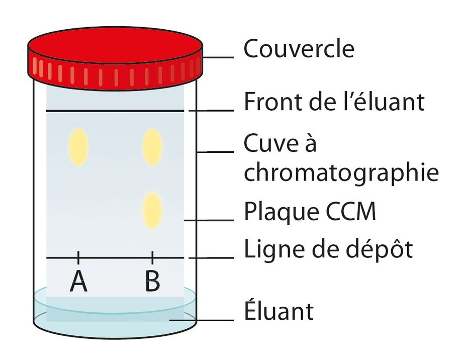
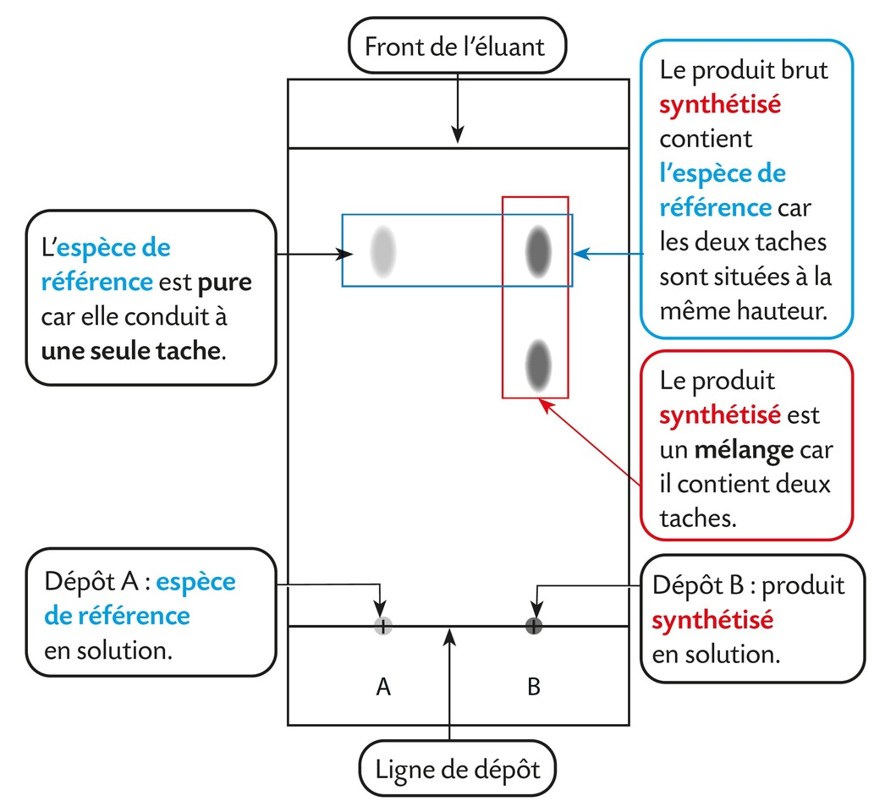

# Chapitre X : Transformations chimiques

{{ initexo(0) }}

## I. Modélisation d'une transformation chimique

!!! success "Qu'est-ce qu'une transformation chimique ?"
    Une **transformation chimique** est le passage d'un *système chimique* d'un **état initial** (avant que les espèces chimiques ne réagissent entre elles) à un **état final** (lorsque le système n'évolue plus).

!!! note "Système chimique"
    - En chimie comme en physique, le système fait référence à ce qui est étudié.
    - Le *système chimique* est l'**ensemble des espèces chimiques que l'on étudie**.
    - Lors de son évolution, la composition du *système chimique* est modifiée. 

!!! success "Manifestations"
    - À l'échelle macroscopique, on observe par exemple un changement de couleur, un dégagement gazeux, une variation de pH, de température ou de pression...
    - Certaines modifications peuvent être mises en évidence grâce à des tests d'identification.

{: .center width="800"}

### Réactifs, produits (et espèces spectatrices)

Lors d'une transformation chimique :

- certaines espèces chimiques sont **consommées**, ce sont les **réactifs**,
- d'autres espèces chimiques **se forment**, ce sont les **produits**.

!!! success "Réactif"
    Espèce chimique consommée partiellement ou totalement. **Sa quantité de matière diminue**.
    
!!! success "Produit" 
    Espèce chimique formée. **Sa quantité de matière augmente**.

!!! success "Espèce spectatrice"
    Espèce chimique présente à l'état initial, dont la quantité de matière n'évolue pas.

🎯 **Exemple :** combustion complète du méthane dans l'air (principalement composé de N2 et O2). Du dioxyde de carbone et de l'eau se forment.

- Réactifs : méthane (CH4) et dioxygène (O2)  
- Produits : dioxyde de carbone (CO2) et eau (H2O)  
- Espèce spectatrice : diazote (N2)

### Réaction chimique

Une transformation chimique est modélisée par une **réaction chimique**.  
On représente l'évolution par une **flèche** : réactifs à gauche, produits à droite.

{: .center .img-rounded width="500"}

🎯 **Exemple :** le méthane réagit avec le dioxygène pour former du dioxyde de carbone et de l'eau ; la combustion complète du méthane s'écrit donc :

- En toutes lettres : *méthane + dioxygène → dioxyde de carbone + eau*
- Même chose en symboles (mais ⚠️ l'équation reste à équilibrer) : ... CH4 + ... O2 → ... CO2 + ... H2O
- En symboles (ici l'équation a bien été équilibrée) : CH4 + 2 O2 → CO2 + 2 H2O

### Écriture de l'équation chimique

**L'équation chimique** est l'écriture symbolique d'une réaction chimique.  
Elle **doit être ajustée** avec des nombres stœchiométriques entiers (les plus petits possibles) pour respecter les lois de conservation.

!!! success "Lois de conservation"
    Lors d'une réaction chimique, il y a conservation :

    - **des éléments chimiques :** même nombre de chaque atome des deux côtés ;
    - **de la charge électrique globale :** la charge électrique globale des réactifs est identique à celle des produits.

L'équation de la réaction chimique traduit le bilan de matière qui indique les proportions, en mol, dans lesquelles
les réactifs sont consommés et les produits se forment.

🎯 **Exemple 1 :** combustion complète du méthane  
CH4 (g) + 2 O2 (g) → CO2 (g) + 2 H2O (g)

| Élément     | Réactifs | Produits |
|-------------|----------|----------|
| Carbone C   | 1        | 1        |
| Hydrogène H | 4        | 4        |
| Oxygène O   | 4        | 4        |

🎯 **Exemple 2 :** réaction du zinc avec une solution d'acide chlorhydrique  
Zn (s) + 2 H+ (aq) → Zn2+ (aq) + H2 (g)

| Élément     | Réactifs | Produits |
|-------------|----------|----------|
| Zinc Zn     | 1        | 1        |
| Hydrogène H | 2        | 2        |

La charge électrique globale est conservée.

[**Exercices n°2 p. 140**{: .exo}](../data/p140.png) et
[**5©, 6, 7© p. 141**{: .exo}](../data/p141.png) et 
[**8 p. 142**{: .exo}](../data/p142.png)

## II. Réactif limitant d'une transformation chimique

Une transformation chimique s'arrête quand au moins un réactif est totalement consommé.  
- **Réactif limitant** : réactif consommé en premier.  
- **Réactif en excès** : réactif restant partiellement à la fin.  

!!! warning "Attention"
    - Le réactif limitant n'est pas nécessairement celui qui est introduit en plus petite quantité à l'état initial

!!! success "Identifier le réactif limitant"
    - Le réactif limitant d'une transformation chimique est celui pour lequel le rapport de sa quantité de matière initiale sur son nombre stœchiométrique est le plus petit.

    Donc, pour une équation ajustée de la forme : **$a\,A + b\,B \;\;\rightarrow\;\; c\,C + d\,D$**{: .stabilo-jaune}
    
    - si **$\dfrac{n_i(A)}{a} < \dfrac{n_i(B)}{b}$**{: .stabilo-jaune} alors **A est le réactif limitant** ;
    - si **$\dfrac{n_i(A)}{a} > \dfrac{n_i(B)}{b}$**{: .stabilo-jaune} alors **B est le réactif limitant** ;    
    - si **$\dfrac{n_i(A)}{a} = \dfrac{n_i(B)}{b}$**{: .stabilo-jaune} alors **les deux réactifs sont limitants** car ils ont été introduits dans des proportions stochiométriques. 
    
🎯 **Exemple :**

Soit l'équation ajustée suivante : Zn (s) + 2 H+ (aq) → Zn2+ (aq) + H2 (g)

Les quantités initiales sont : 
ni(Zn) = 3,0 × 10−2 mol et
ni(H+) = 1,0 × 10−2 mol.

Cherchons le(s) réactif(s) limitant(s).

Calculs :  $\dfrac{n_i(Zn)}{1} = 3,0 \times 10^{-2}$ mol tandis que $\dfrac{n_i(H^+)}{2} = 5,0 \times 10^{-3}$ mol. 

Comparaison et conclusion :  $\dfrac{n_i(Zn)}{1} > \dfrac{n_i(H^+)}{2}$  donc l'ion  hydrogène H+ (aq) est le réactif limitant.

[**Exercices n°10, 14 p. 142**{: .exo}](../data/p142.png)

---

## III. Effets thermiques d'une transformation chimique

- Briser des liaisons nécessite de l'énergie (amorce pour une combustion).  
- Former de nouvelles liaisons libère de l'énergie.  

Le bilan énergétique global d'une transformation chimique peut donc conduire à une absorption ou à une libération d'énergie thermique. L'énergie est échangée avec le milieu extérieur.

{: .center width="200"}

- **Réaction endothermique** : le système chimique absorbe de l'énergie, sa température diminue.  
- **Réaction exothermique** : le système chimique libère de l'énergie, sa température augmente.  

[**Exercices n°11©, 12 p. 142**{: .exo}](../data/p142.png)

---

## IV. Synthèse d'une espèce chimique

De très nombreuses espèces chimiques présentes dans la nature sont utiles dans notre vie quotidienne
(médicaments, colorants...). On a appris à les extraire de la nature, mais pour des raisons principalement
économiques et écologiques, on préfère souvent les synthétiser au laboratoire.

!!! note "Différence entre espèce naturelle et espèce synthétique"
    - Une espèce chimique **naturelle** est issue de la nature alors qu'une espèce chimique **synthétique** est fabriquée en laboratoire ou dans l'industrie à partir d'autres espèces chimiques par des transformations chimiques.
    - Une espèce synthétisée au laboratoire est **identique** à celle présente dans la nature.

Pour réaliser une synthèse chimique au laboratoire, il faut suivre un protocole opératoire, sorte de « recette » de la
synthèse, qu'il faut scrupuleusement respecter.

La synthèse d'une espèce chimique au laboratoire s'effectue généralement en quatre étapes :

{: .center width="800"} 

### Analyse du produit brut

En début d'année, nous avions déjà présenté des *techniques d'identification* et notamment [la chromatographie sur couche mince](./Chapitre 01.md#chromatographie) :

{: width="250"} 
{:  width="500"} 

[**Exercices n°15©, 16, 17© p. 143**{: .exo}](../data/p143.png) et 
[**22©, 23 p. 144**{: .exo}](../data/p144.png) et 
[**32 p. 146**{: .exo}](../data/p146.png) et 
[**34 p. 147**{: .exo}](../data/p147.png)

