# Chapitre XI : Propagation des ondes lumineuses

{{ initexo(0) }}

## I. Changement de milieu de propagation

### 1. Phénomènes de réflexion et de réfraction

- La lumière se propage en ligne droite dans un milieu homogène et transparent. Cependant, lorsqu'elle change de 
milieu de propagation (passage de l'air à l'eau par exemple), la lumière peut subir deux phénomènes : une **réflexion** 
(le rayon repart dans le milieu initial) ou une **réfraction** (changement de direction de propagation). La surface de 
séparation entre deux milieux est aussi appelée **dioptre**.

{: .center .img-rounded width="200"}

- Le rayon arrivant sur le dioptre est appelé **rayon incident**, celui qui subit la réflexion est le **rayon réfléchi** et le rayon qui subit la réfraction est le **rayon réfracté**.

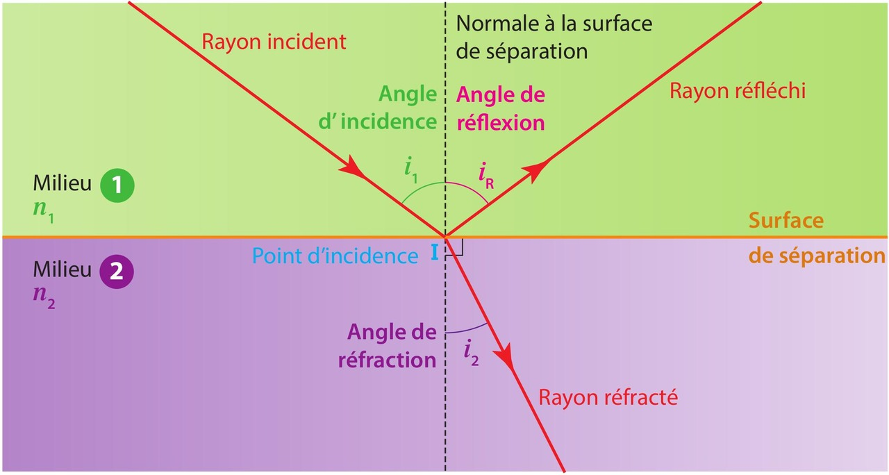{: .center .img-rounded width="600"}

### 2. Les lois du modèle de la réfraction et de la réflexion

On appelle angle d'incidence i1 l'angle formé par le rayon incident et la normale au 
dioptre, angle de réfraction i2 l'angle formé par le rayon réfracté et la normale au 
dioptre, et angle de réflexion r, l'angle formé par le rayon réfléchi et la normale.

!!! success "Les lois de Snell-Descartes"

    Elles ont été établies indépendamment par Willebrord Snell et René Descartes au XVIIe siècle.

    - **1re loi de Snell-Descartes :** **le rayon incident, le rayon réfracté, le rayon réfléchi et la normale sont dans le même plan.**{: .stabilo-jaune}
    - **2e loi de Snell-Descartes :**  **n1·sin(i1) = n2·sin(i2)**{: .stabilo-jaune} pour la réfraction  et  **i1 = r**{: .stabilo-jaune} pour la réflexion où n1 et n2 sont les indices de réfraction des milieux 1 et 2.

### 3. Dispersion de la lumière

La dispersion d'une lumière polychromatique (composée de plusieurs radiations donc de plusieurs couleurs) est le 
phénomène de séparation des radiations qui composent cette lumière.  

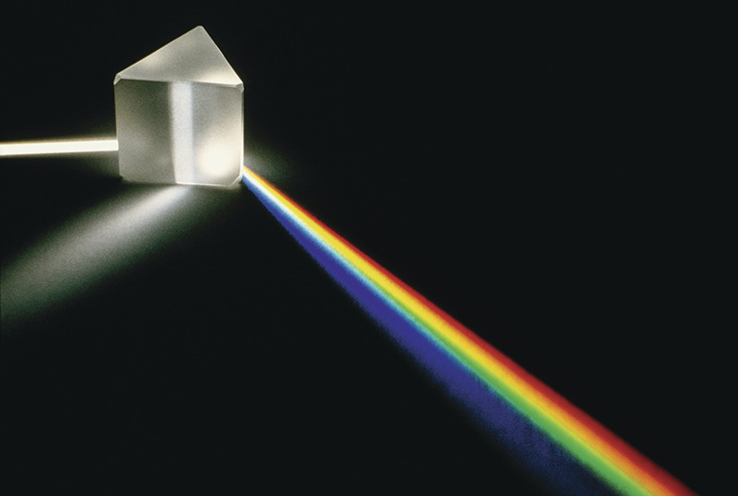{: .center .img-rounded width="300"}

On dit qu'un milieu est dispersif si son indice de réfraction dépend de la longueur d'onde de la radiation lumineuse 
qui le traverse.  

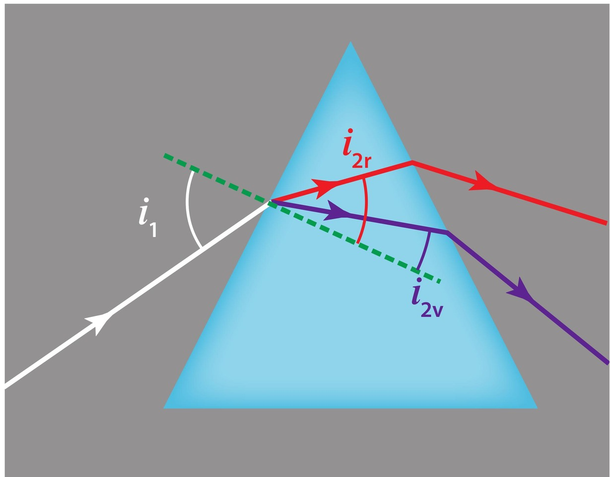{: .center .img-rounded width="300"}

Ce type de milieu permet de décomposer la lumière blanche.  

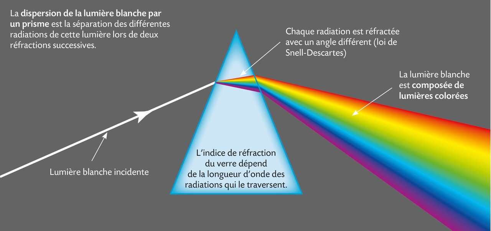{: .center .img-rounded width="600"}

L'image de cette décomposition des couleurs sur un écran s'appelle le spectre de la lumière.  

{: .center .img-rounded width="300"}

Il peut permettre d'identifier si une source lumineuse est monochromatique ou non. 

🎯 **Exemple :** l'arc-en-ciel est une application directe de la dispersion de la lumière du Soleil par les gouttes d'eau de la pluie qui tombent. Chacune des gouttes agit comme un prisme et dévie les rayons lumineux différemment en fonction de leur longueur d'onde et donc de leur couleur.  

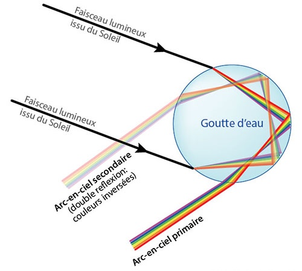{: .center .img-rounded width="500"}

La multiplicité des gouttes nous donne une vision d'ensemble de ce phénomène de dispersion qu'on appelle arc-en-ciel. 

{: .center .img-rounded width="450"}

[**Exercices : 3, 4, 5, 6, 12, 15, 18, 22, 23, 25, 28 p. 279 à 284**{: .exo}]

---

## II. L'œil et les lentilles

### 1. Les lentilles

Une simple bouteille d'eau abandonnée dans une zone à risques peut être à l'origine d'un incendie de forêt. 
En se comportant comme une lentille convergente qui peut concentrer des rayons lumineux en un point appelé foyer, la bouteille peut enflammer la végétation.

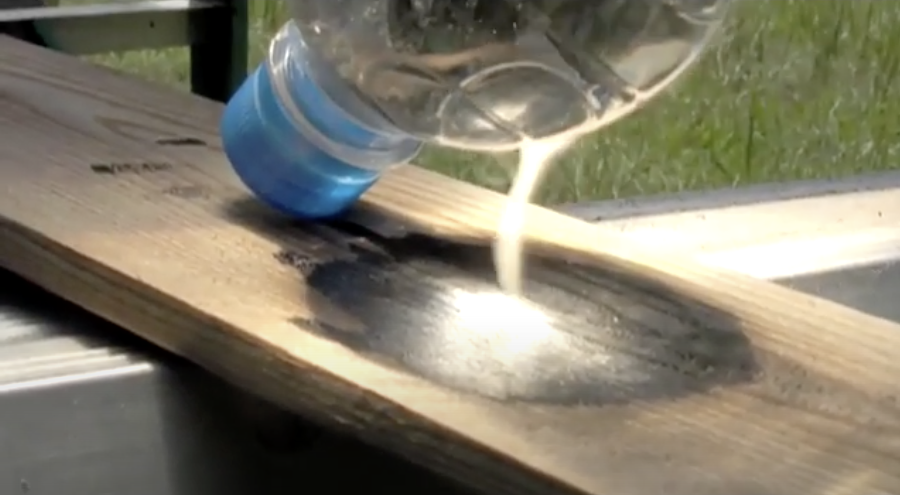{: .center .img-rounded width="300"}

Une lentille est un milieu transparent limité par deux surfaces dont au moins une n'est pas plane.

Le milieu transparent qui constitue la lentille est caractérisé par son indice de réfraction. Un rayon 
lumineux est dévié par réfraction à travers la lentille.

!!! success "Deux types de lentilles"
    - Les **lentilles convergentes** dont les bords sont plus minces que leur épaisseur au centre. Un faisceau de lumière incident parallèle émerge de cette lentille en un point : il converge.  
    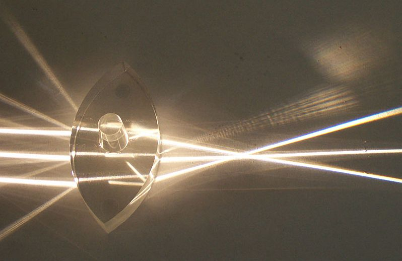{: .center .img-rounded width="300"}
    - Les **lentilles divergentes** dont les bords sont plus épais que leur épaisseur au centre. Un faisceau de lumière incident parallèle émerge de cette lentille en s'élargissant : il diverge.
    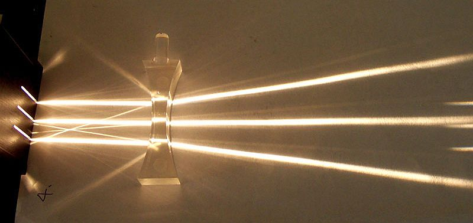{: .center .img-rounded width="300"}

#### Modèle de la lentille mince convergente

- Une lentille est dite mince si son épaisseur au centre est faible par rapport aux rayons de courbure de ses surfaces. 
- Une lentille mince convergente est **symbolisée par une double flèche verticale de centre O**. 
- **L'axe optique de la lentille noté Δ** est la droite perpendiculaire à la lentille passant par le **centre optique O**.

    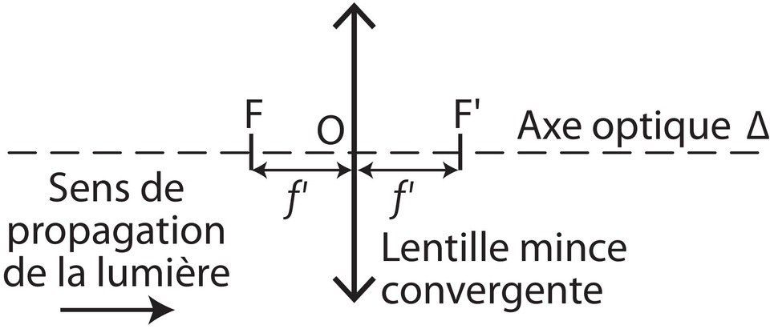{: .center .img-rounded width="300"}

On lui associe deux foyers :

- Son foyer image F' : point de convergence sur l'axe optique d'un faisceau incident de lumière parallèle à l'axe optique.

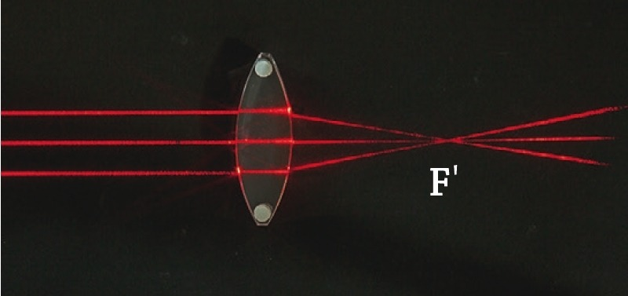{: .center .img-rounded width="300"}

- Son foyer objet F : point symétrique du foyer image F' par rapport au centre optique O. Tout faisceau incident 
de lumière passant par F émerge en un faisceau parallèle à l'axe optique.

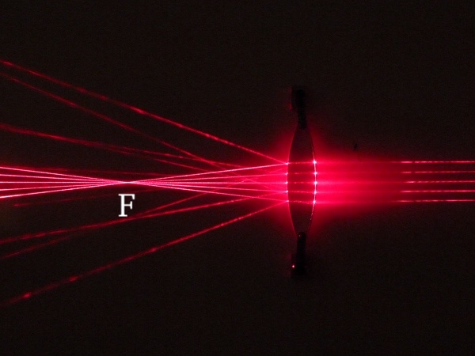{: .center .img-rounded width="300"}

!!! success "Distance focale"
    - Une lentille mince est caractérisée par son centre optique O, son foyer objet F et son foyer image F'.  
    - **La distance focale f' est la distance entre le centre optique O et le foyer image F'.** 
    - Plus F' est proche de O, plus la lentille est convergente. 

### 2. Image d'un objet par une lentille mince convergente

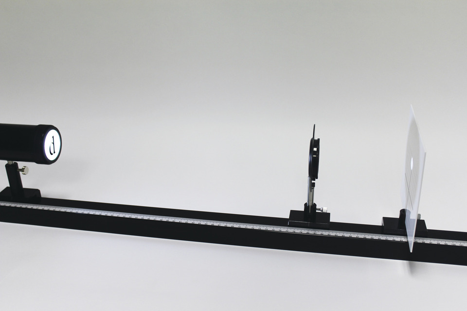{: .center .img-rounded width="500"}

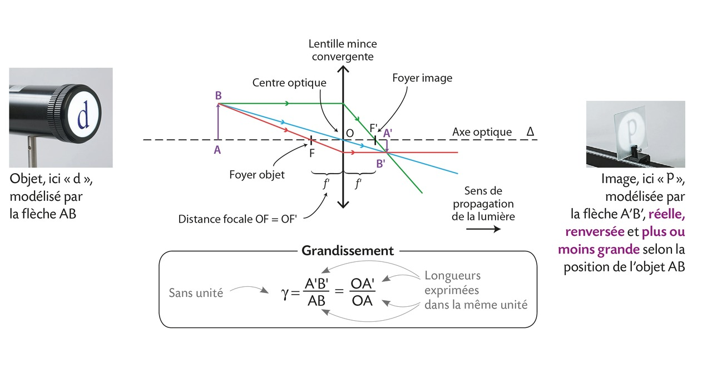{: .center  width="800"}

On se limitera à l’étude d’un objet plan perpendiculaire à l’axe optique, cet **objet est noté AB**, A étant sur l’axe 
optique, et **on le représente par une flèche verticale**. L’image A’ d’un point A situé sur l’axe optique est sur l’axe optique. Tous les rayons issus du point objet B convergent en un point unique B’, image de B à travers la lentille.  

!!! success "Méthode pour tracer l'image"

    Pour déterminer l'image d'un objet par une lentille convergente, il est convient de savoir tracer les trois rayons particuliers suivants qui sont issus du point B :

    - le rayon (en bleu sur la figure) passant par le centre optique O qui ne subit aucune déviation ;  
    - le rayon (en vert sur la figure) arrivant parallèlement à l'axe optique qui émerge de la lentille en passant par le foyer image F' ;  
    - le rayon (en rouge sur la figure) passant par le foyer objet F qui émerge parallèlement à l'axe optique.  

Remarques :  

- Si AB est perpendiculaire à l’axe optique alors son image **A’B’** est aussi **perpendiculaire à l’axe optique**.  
- **L'image A'B' est dite réelle car elle est observable sur un écran**. Elle est dite renversée car elle est de sens opposé à celui de l'objet (elle est dite droite si elle est de même sens).

!!! success "Le grandissement"

    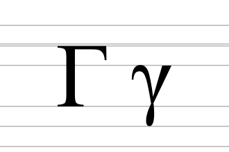{: .center  width="200"}

    - Le **grandissement** noté $\gamma$ (lettre grecque gamma minuscule) est défini par le rapport entre la taille de l'image et celle de l'objet. Il s'exprime aussi à l'aide des égalités obtenues par application du théorème de Thalès (cf. la formule plus haut).
    - Le grandissement n'a pas d'unité.  
    - Il est inférieur à 1 si l'image est plus petite que l'objet et supérieur à 1 dans le cas contraire.  

### 3. Modélisation de l'œil

La quantité de lumière pénétrant dans l'œil est régulée par l'ouverture de l'iris. L'ensemble des milieux transparents 
que traverse la lumière peut être assimilé à une lentille mince convergente. Pour une vision nette, l'image de l'objet 
se forme sur la rétine.

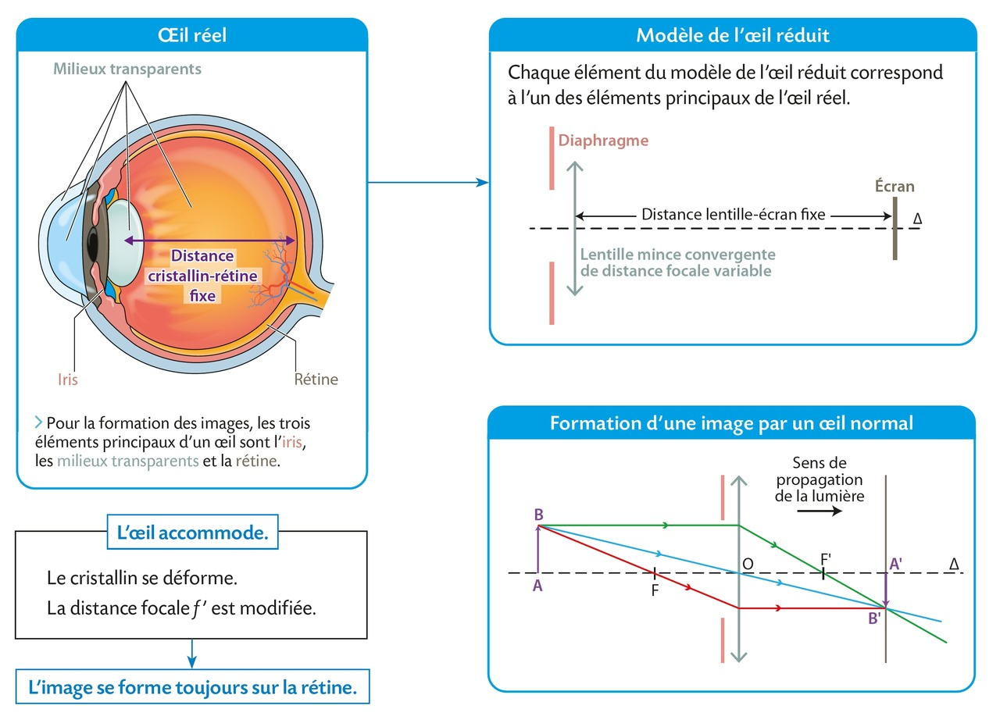{: .center .img-rounded width="800"}

L'œil peut être modélisé par :

- un **diaphragme** qui correspond à **l'iris** ;  
- une **lentille mince convergente** de distance focale f' variable qui correspond à l'ensemble des milieux transparents notamment **le cristallin** ;  
- un **écran** qui correspond à **la rétine**.  

On parle alors de **modèle de l'œil réduit**.

**Remarques :**

- Dans un œil, la distance cristallin-rétine reste toujours constante. Elle vaut environ 17 mm pour l'œil humain.  
- L'image formée sur la rétine est renversée. C'est le cerveau qui permet d'interpréter à l'endroit les images 
renversées formées sur la rétine.  
- Pour que l'image d'un objet pas trop proche de l'œil se forme sur la rétine, **le cristallin peut se déformer**, ce qui 
modifie sa distance focale f'. On dit que **l'œil accommode**.  
- Si l'objet est suffisamment éloigné, l'image se forme sur la rétine sans que l'œil accommode. On dit alors que 
l'œil est au repos. 

[**Exercices : 3, 4, 5, 6, 11, 17, 21, 23 p. 298 à 303**{: .exo}]

---

## Je dois savoir et savoir faire
- Définir : réflexion ; réfraction ; réflexion totale ; lentille convergente et divergente ;  
- Repérer sur un schéma et dessiner : rayon incident, rayon réfléchi, rayon réfracté ;  
- Écrire et utiliser la loi de Snell-Descartes, la relation de grandissement pour une lentille.  

---

## Pour réviser
- QCM page 277 et 295  
- Exercices résolus 1 p. 278 et 1, 2 p. 296, 297  
- Exercices corrigés dans le livre et en classe  
- Je prépare l'évaluation : exercices 33, 34 p. 286 et 25, 26 p. 304
