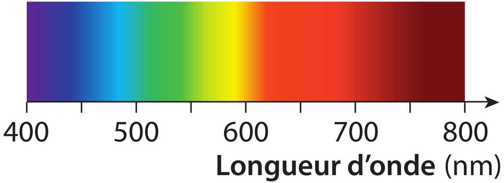
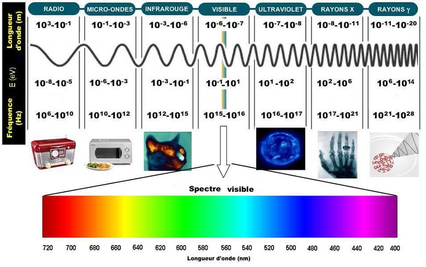
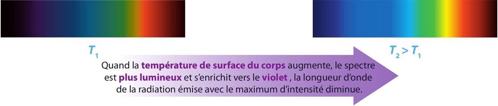
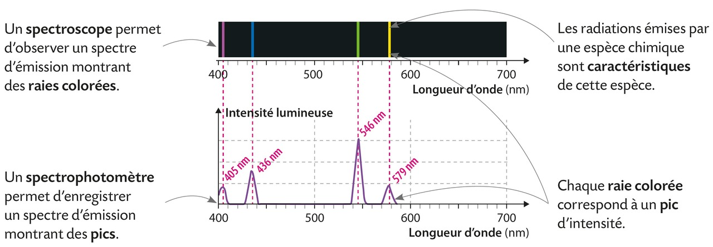
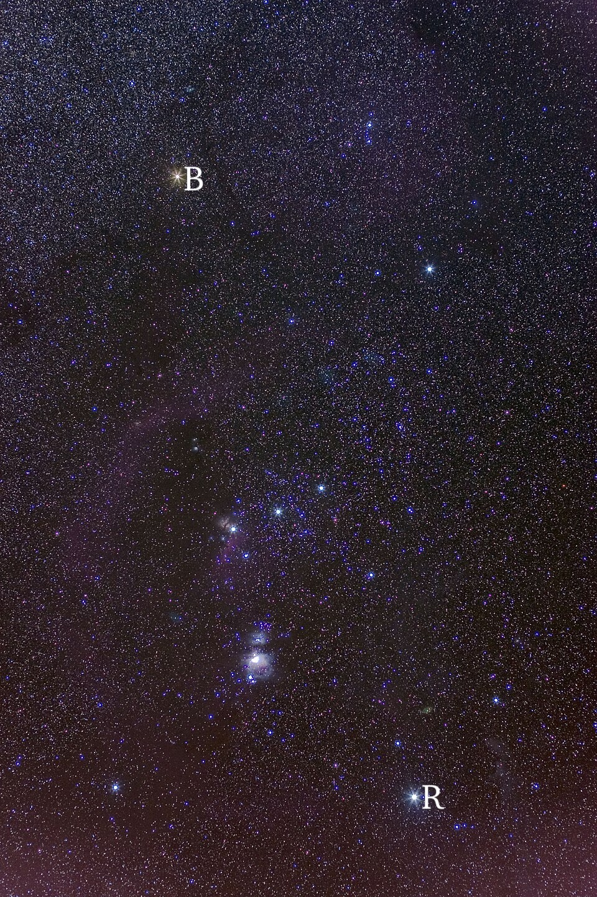
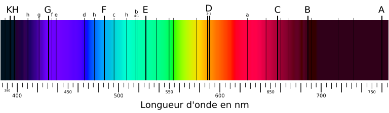

# Chapitre XII : Spectres lumineux

{{ initexo(0) }}

## I - Dispersion de la lumière et longueur d'onde

### 1 - Radiation lumineuse

!!! note "Rappel"
    La lumière blanche peut être dispersée à l'aide d'un réseau, d'un prisme et même de gouttes d'eau. 
    Le faisceau émergent est étalé et présente toutes les couleurs de l'arc-en-ciel.

    {: .center .img-rounded width="300"}

    La lumière blanche est composée de toutes les lumières colorées visibles ; en les déviant différemment, le prisme ou le réseau les sépare.
    Ce phénomène s'appelle [la dispersion de la lumière](./Chapitre 11.md#dispersion).
    La figure colorée obtenue est le **spectre de la lumière blanche**.  

{: .center .img-rounded width="300"}

Ce **spectre** est dit **continu**, car il ne manque aucune composante colorée entre ses extrémités.

!!! success "Lumière monochromatique"
    
    - Une lumière qui ne peut pas être dispersée par un prisme est appelée **lumière monochromatique**. Elle est composée d'une seule radiation.  
   
🎯 **Exemples :**   

- Un faisceau de lumière émise par un laser n'est pas dispersé par le prisme, il est simplement dévié.  
- Le spectre de la lumière blanche comporte une infinité de composantes colorées. Chaque composante correspond à une radiation monochromatique (une seule couleur).

!!! success "Lumière polychromatique"
    Une lumière qui peut être dispersée par un prisme est donc appelée **lumière polychromatique** : c'est une superposition de plusieurs radiations.  

🎯 **Exemple :** la lumière blanche est polychromatique.

### 2 - La longueur d'onde et la fréquence

On associe à chaque radiation une grandeur appelée **longueur d'onde** dans le vide. On la note λ (lambda) et généralement elle s'exprime **en nanomètre** : 
**1 nm = 10-9 m**{: .stabilo-jaune}

La lumière visible est une **OEM (onde électromagnétique)** dont la fréquence appartient à un domaine très restreint compris entre celui des infrarouges (IR) et celui des ultraviolets (UV).

L'œil n'est sensible qu'aux radiations dont la longueur d'onde est comprise entre **400 nm (violet) et 800 nm (rouge)** environ.

{: .center .img-rounded width="700"}

Les radiations dont la longueur d'onde n’entre pas dans ce domaine appartiennent à d’autres domaines (rayons γ, rayons X, UV, IR, micro-ondes, ondes radio...).

### 3 - Vitesse de propagation de la lumière

!!! success "Propagation rectiligne de la lumière"
    Dans le vide ou dans les milieux transparents et homogènes(comme c'est le cas de l'air en général), la lumière se propage en ligne droite.  

!!! success "Célérité (c-à-d vitesse de propagation de l'onde)"
    === "Dans le vide et dans l'air"
        La célérité des ondes électromagnétiques (la lumière étant une onde EM) dans le vide ou dans l'air est :  **c = 3,00 × 108 m·s-1**{: .stabilo-jaune}.

    === "Dans d'autres milieux"
        **Dans les milieux matériels,** les ondes électromagnétiques se propagent plus ou moins bien. Leur **vitesse de propagation est alors toujours inférieure à celle dans le vide**. Elle dépend de la nature du milieu et de la fréquence de l'onde.

    === "Complément d'informations"
        La vitesse de propagation peut se déterminer par la relation $c=\dfrac{d}{t}$ mais aussi par la relation $c=\dfrac{\lambda}{T}$
        
        où :

        - $c$ : vitesse de propagation, en m·s-1  
        - $d$ : distance parcourue par l'onde, en mètre (m)  
        - $t$ : durée du parcours, en seconde (s)  
        - $\lambda$ : longueur d'onde en mètre (m)
        - $T$ : période de l'onde en secondes (s)
        
        Des mesures précises montrent que la lumière se propage dans le vide à la vitesse  c = 2,997 924 58 × 108 m·s-1. Nous retiendrons sa valeur approchée : c ≈ 3,00 × 108 m·s-1.

## II - Spectres d'émission

Un spectre d'émission est obtenu en observant directement une lumière émise à l'aide d'un spectroscope ou d'un analyseur de spectre. On peut aussi réaliser un montage expérimental comportant un prisme ou un réseau.  

### 1 - Spectre du rayonnement émis par un corps chaud

Lorsqu'un corps est porté à haute température, il émet de la lumière. **Le spectre d'émission** observé est un **spectre continu**, semblable à celui de la lumière blanche. 

{: .center  width="700"}

🎯 **Exemple :** la lumière émise par un corps fortement chauffé (un filament d'ampoule, une coulée de lave, etc.) dépend uniquement de sa température.

{: .center .img-rounded width="300"}

### 2 - Spectre de raies

Lorsqu'un gaz à basse pression est chauffé ou parcouru par des décharges électriques, il émet de la lumière.  
**Le spectre d'émission** observé est composé de **fines raies colorées sur fond noir** : c'est un **spectre de raies**.  
Chaque raie colorée correspond à un rayonnement monochromatique caractérisé par une longueur d'onde λ.  

{: .center .img-rounded width="800"}

Un spectre de raies d'émission est un **spectre discontinu** : il comporte des raies colorées, chacune associée à un rayonnement monochromatique.

L'ensemble des raies du spectre d'un élément chimique est caractéristique de cet élément et permet de l'identifier.  
Les longueurs d'onde des raies spectrales caractéristiques de chaque élément chimique sont référencées dans des tables.

| Élément chimique | Longueurs d'onde λ (en nm)        |
|------------------|-----------------------------------|
| Hydrogène (H)    | 410 ; 434 ; 486 ; 656             |
| Mercure (Hg)     | 405 ; 436 ; 546 ; 577 ; 579 ; 615 |
| Sodium (Na)      | 589 ; 590                         |

🎯 **Exemple :** si un spectre de raies d'émission comporte quatre raies colorées de longueurs d'onde respectives **410 nm, 434 nm, 486 nm et 656 nm** ; par comparaison avec les tables, on identifie l'élément correspondant : il s'agit de l'**hydrogène**.

## III - La lumière : messagère des étoiles

### 1 - Température de surface d'une étoile

Une étoile peut être assimilée à une boule de gaz très chaud et sous haute pression.  
La lumière émise par sa surface, la **photosphère**, donne le fond continu d'origine thermique du spectre de l'étoile.  
La couleur de l'étoile, comme celle du filament d'une lampe, renseigne sur sa température de surface.

🎯 **Exemple :**

- Dans la constellation d'Orion, **Rigel**, étoile chaude (T ≈ 11 000 °C), apparaît blanche, presque bleutée.  
- **Bételgeuse**, plus froide (T ≈ 3 000 °C), a un aspect rougeâtre.

{: .center  .img-rounded width="300"}

La température de surface d'une étoile peut être déterminée par l'étude de l'intensité lumineuse du fond continu de son spectre.  

🎯 **Exemple :**
Le spectre continu de la lumière du Soleil présente un maximum d'intensité lumineuse dans le bleu-vert (~ 500 nm), ce qui correspond à une température de **5 500 °C** à la surface du Soleil.

### 2 - Composition chimique d'une étoile

- L'atmosphère, ou chromosphère, d'une étoile peut être assimilée à une couche gazeuse relativement froide et à basse pression.  
- Lorsque la lumière émise par la photosphère de l'étoile traverse cette couche, les atomes ou ions présents absorbent un certain nombre de radiations.
- Les entités chimiques de l'atmosphère d'une étoile sont identifiées par les **raies d'absorption** présentes dans le spectre de la lumière stellaire.  

!!! info "Le Soleil"

    Vers 1814, Joseph Von Fraunhofer obtient le spectre de la lumière de notre étoile, le Soleil, à l'aide d'une lunette astronomique à laquelle il a associé une fente et un prisme.

    {: .center .img-rounded width="600"}

    Certaines raies sont plus marquées que d'autres.

    - L'analyse complète du rayonnement solaire permet de connaître la composition chimique de l'enveloppe gazeuse du Soleil.
    - L'enveloppe gazeuse du Soleil est essentiellement composée d'**hydrogène** et d'**hélium**.  
    - Elle contient aussi, dans des proportions moindres, de nombreuses autres entités chimiques comme l'oxygène, le carbone ou le fer.

