# Chapitre XIII : Lois relatives à la tension et à l'intensité du courant

{{ initexo(0) }}

## 1 - Les lois relatives à la tension et à l'intensité du courant

### a. La tension électrique

- Entre deux points A et B, **la tension peut être positive ou négative** on dit que **la tension est une grandeur algébrique**.

- On représente la tension par un **segment fléché qui pointe vers la première lettre** du symbole de cette tension.

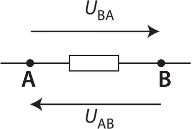{: .center width="150"}

- Les tensions UAB et UBA sont opposées : **UAB = – UBA**{: .stabilo-jaune}

!!! success "Mesurer une tension"
    Une tension s'exprime en volt et se mesure avec un voltmètre branché en **dérivation**. Pour mesurer la tension UAB, la **borne V du voltmètre** doit être branchée sur la borne **A** du dipôle et la **borne COM du voltmètre** doit être branchée sur la borne **B** du dipôle.
    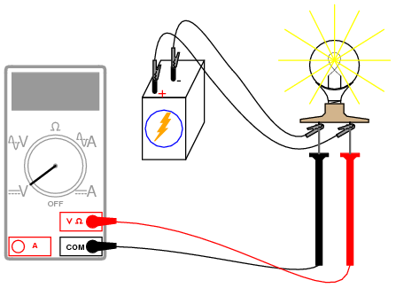{: .center width="300"}

### b. Mailles

Un circuit électrique est constitué d'une ou plusieurs boucles aussi appelées mailles. Une maille est un parcours fermé sur un circuit électrique auquel on associe arbitrairement un sens de parcours :

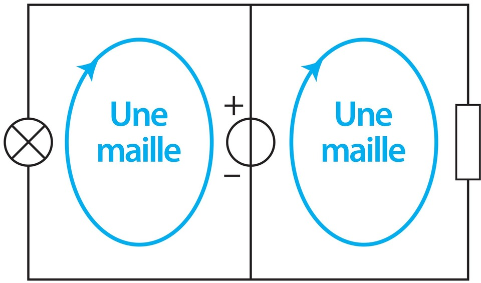{: .center width="200"}

*Les flèches bleues permettent d'orienter chaque maille en vue de l'application de la loi des mailles. On peut imaginer une troisième maille englobant tout le circuit.*

!!! success "Loi des mailles"
    - Dans une maille, la somme des tensions fléchées dans le sens de parcours de la maille est égale à zéro.
    - Si une flèche de tension est dans le sens de la maille elle est comptée positivement sinon elle est comptée négativement. 

🎯 **Exemple :** dans le circuit ci-dessous comportant une maille, on représente les tensions UAB, UBC, UCD, UDE et UAE.

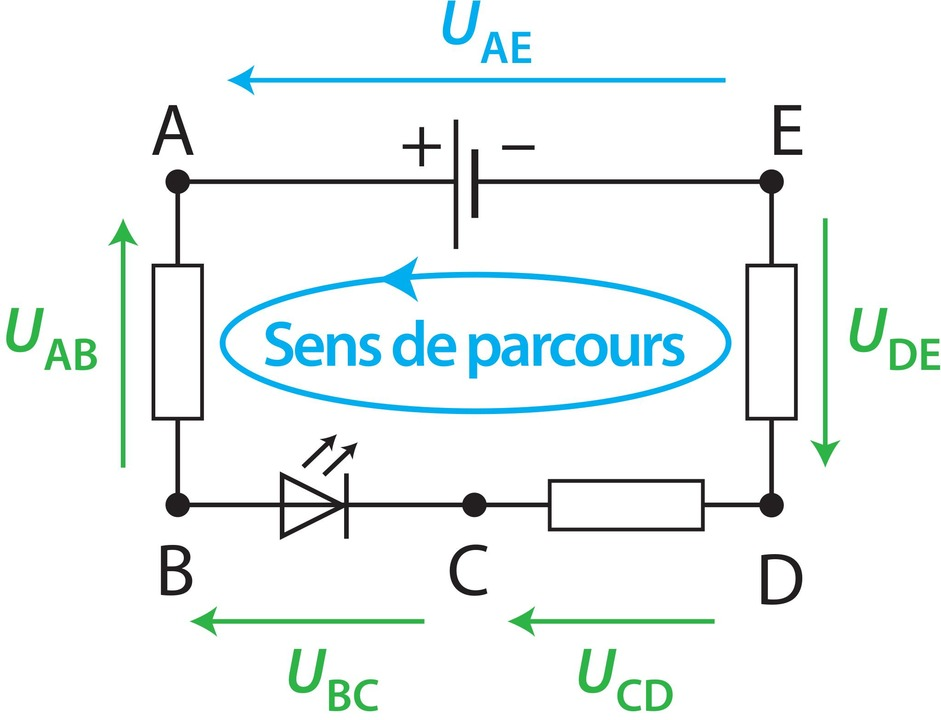{: .center width="300"}

En suivant le sens de parcours choisi dans la boucle, une de ces tensions est dans le sens de parcours (donc comptée positivement) et quatre autres sont dans l'autre sens (donc comptées négativement). 

- La loi des mailles s'écrit  donc : **UAE - UAB - UBC - UCD - UDE = 0**{: .stabilo-jaune}

- Autrement dit : UAE = UAB + UBC + UCD + UDE

!!! success "Tension aux bornes d'un fil"
    On peut considérer que la tension entre les bornes d'un fil de connexion est nulle.

[**Vidéo de cours - Loi des nœuds, loi des mailles**](data/chap13_video_mailles.mp4)

### c. Le courant électrique

Par convention, à l'extérieur du générateur, le courant électrique circule de la borne positive du générateur vers la borne négative.

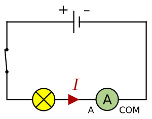{: .center width="200"}

!!! success "Mesurer l'intensité du courant"
    - L'intensité du courant s'exprime en ampère (A) et se mesure avec un ampèremètre branché en série dans le circuit.  
    - Pour mesurer une intensité positive, le courant doit entrer par la borne A de l'ampèremètre et sortir par la borne COM.

### d. Nœud

Dans un circuit électrique comportant des dérivations, un nœud est un point du circuit relié à au moins trois dipôles.

!!! success "Loi des nœuds"
    La somme des intensités des courants qui arrivent à un nœud est égale à la somme des intensités des courants qui en repartent.

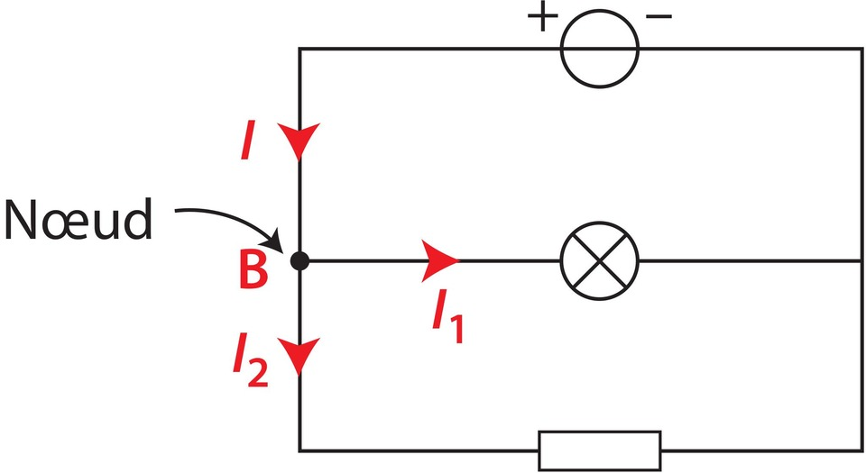{: .center width="250"}

Exemple : Dans le circuit ci-dessus, d'après le sens des flèches d'intensité, la loi des nœuds en B s'écrit **I = I1 + I2**{: .stabilo-jaune}.

## 2 - Caractéristique d'un dipôle

La caractéristique tension-intensité d'un dipôle, appelée plus simplement caractéristique, est la courbe donnant la tension U entre ses bornes en fonction de l'intensité I du courant qui le traverse.

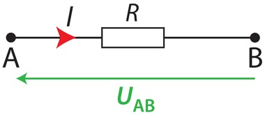{: .center width="150"}

**La caractéristique d'un conducteur ohmique est une droite passant par l'origine**.

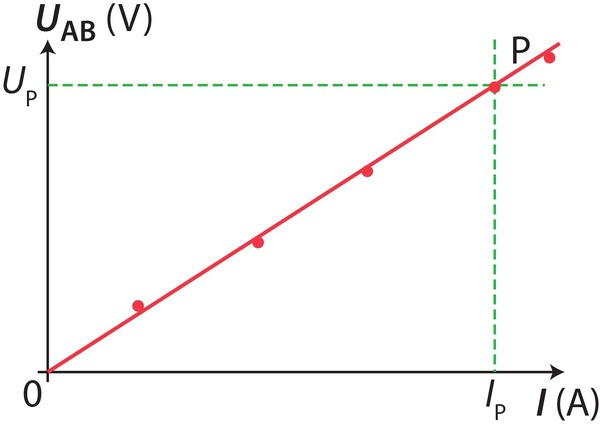{: .center width="250"}

**La résistance R du conducteur ohmique est égale au coefficient directeur de la droite**.

Pour l'exemple précédent :  $R = \dfrac{U_P}{I_P}$.

## 3 - Loi d'Ohm

!!! success "Loi d'Ohm"
    La tension UAB entre les bornes d'un conducteur ohmique de résistance R et l'intensité I du courant électrique qui le traverse sont proportionnelles.
    {: .center width="150"}
    Lorsque le courant circule de A vers B, la loi d'Ohm s'écrit :
    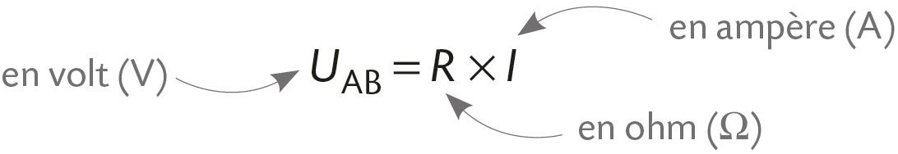{: .center width="400"}

## 4 - Point de fonctionnement

- Lorsqu'un circuit ne comporte que deux dipôles, le point de fonctionnement P du circuit se situe à l'intersection de la caractéristique du générateur et de celle de l'autre dipôle.  
- Les coordonnées du point de fonctionnement P indiquent la tension entre les bornes de chacun des dipôles et l'intensité du courant qui les traverse quand ce générateur alimente ce dipôle récepteur.

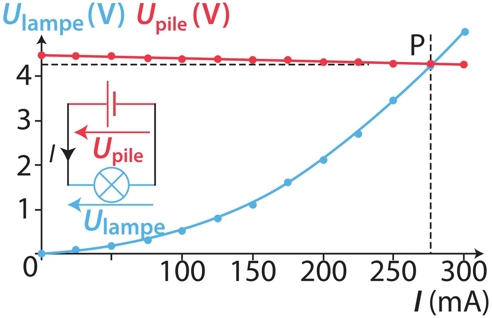{: .center width="300"}

Pour l'exemple ci-dessus, le point de fonctionnement P a pour coordonnées : U = 4,2 V et I = 275 mA ce qui nous donne la tension aux bornes de chaque dipôle ( Upile = Ulampe = 4,2V ) et l'intensité du courant dans le circuit ( I = 275 mA ) quand la pile alimente la lampe.

[**Vidéo de cours - Caractéristique et point de fonctionnement**](data/chap13_video_point_fonctionnement.mp4)

## 5 - Les capteurs électriques

Un capteur électrique permet de convertir une grandeur physique (température, luminosité…) en signal électrique.

| Paramètre extérieur | Exemple de dipôle | Exemple de capteur     | Objet de la vie quotidienne                   |
|---------------------|-------------------|------------------------|-----------------------------------------------|
| Température         | Thermistance      | Capteur de température | Thermomètre électronique                      |
| Luminosité          | Photorésistance   | Capteur de lumière     | Veilleuse pour enfants à allumage automatique |

La variation de la résistance d'une thermistance en fonction de la température est exploitée pour réaliser des capteurs de température.

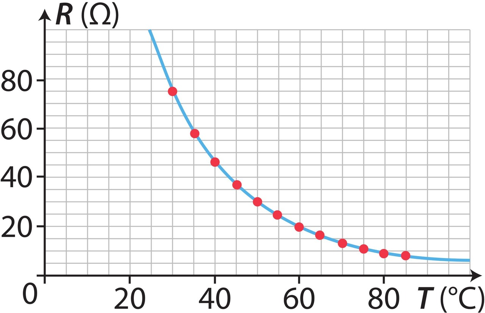{: .center width="300"}

{: .center .img-rounded width="250"}
