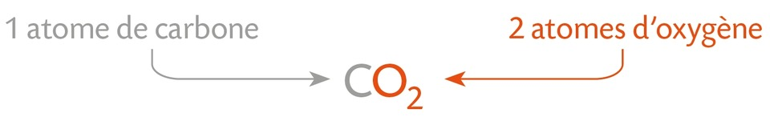
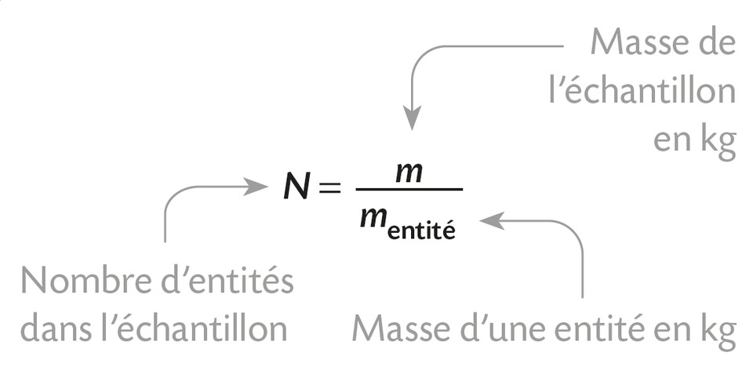
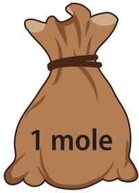
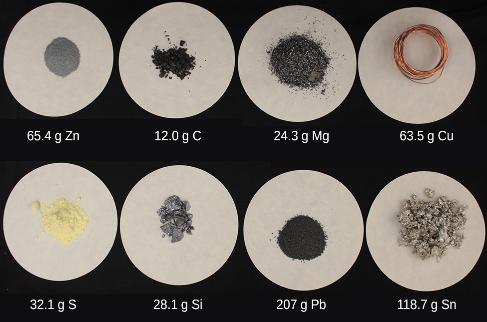
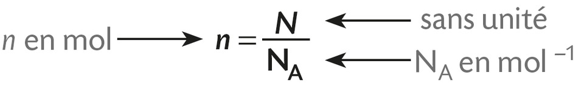

# Chapitre VII : La quantité de matière

{{ initexo(0) }}

## I- De la masse au nombre d'entités chimiques

### 1. Masse d'une entité chimique

!!! success "Masse d'un atome ou masse d'un ion"
    Comme nous l'avions déjà établi, la masse d'un atome ou de l'ion monoatomique correspondant est pratiquement égale à celle de leur noyau : $m_{\text{atome}} \simeq m_{\text{ion}} \simeq A \times m_n${: .stabilo-jaune}  
    où $m_n$ est la masse d'un nucléon (mneutron = mproton = mnucléon = 1,67× 10-27kg si arrondi avec 3 chiffres significatifs). 

!!! example "{{ exercice() }} : masse d'un atome de carbone 12" 
    === "Énoncé"
        - La masse réelle d'un atome de carbone 12 est mC-12 = 1,992&nbsp;646&nbsp;879 × 10-26 kg
        - Calculer la masse de 12 nucléons et vérifiez que vous obtenez approximativement la même valeur.
    === "Correction"
        12 &times; mn = 12 &times; 1,67 &times; 10-27 = 2,00 &times; 10-26 kg. 
    === "Explication (hors programme)"
        La masse que vous venez de calculer correspond approximativement à la masse d'un atome de carbone 12 mais, en réalité, la masse mC-12 d'un atome de carbone qui possède 12 nucléons est légèrement inférieure à la masse de 12 neutrons. Cela s'explique par le <em>défaut de masse</em> lié à l'énergie de liaison nucléaire libérée lors de la formation du noyau par la relation d'Einstein : $E = \Delta m \cdot c^2$.
        

!!! success "Masse d'une molécule"
    La masse d'une molécule est égale à la somme des masses des atomes qui la constituent.

    {:.center width="300"}

[**Exercices n°1©, 2 p. 105**{: .exo}](../data/p105.png)

---

### 2. Nombre d'entités chimiques dans un échantillon

Une espèce chimique est formée d'un nombre considérable d'entités chimiques identiques. Connaissant la masse d'un échantillon d'une espèce et la masse de l'entité, on détermine le nombre d'entités par: 
{: .center width="300"}

!!! example "{{ exercice() }} : nombre de molécules de butane dans une cartouche de butane"
    === "Énoncé"
        Sachant qu'une molécule de butane a une masse de $9,67 \times 10^{-26}$ kg et qu'une cartouche de butane contient 190g de butane, calculer le nombre de molécules de butane présentes dans la cartouche.
    === "Correction"
        $\displaystyle N = \frac{m_{\text{gaz}}}{m_{\text{molécule de butane}}} = \frac{190 \times 10^{-3}}{9,67 \times 10^{-26}} = 1,96 \times 10^{24} \text{ molécules de butane.}$

!!! example "{{ exercice() }} : nombre d'atomes de carbone dans 12g de carbone" 
    === "Énoncé"
        - L'entité choisie dans cet exercice est l'atome de carbone 12. 
        - La masse de l'entité {atome de carbone 12} est mC-12 = 1,992&nbsp;646&nbsp;879 × 10-26 kg.
        - Calculer le nombre d'atomes de carbone présents dans une masse de 12g de carbone.
    === "Correction"
        - Masse de l'échantillon : méchantillon = 12&nbsp;g = 0,012&nbsp;kg
        - Masse d'un atome de carbone&nbsp;12 : mC-12<\sub> = 1,992&nbsp;646&nbsp;879 × 10-26&nbsp;kg
        - Nombre d'atomes :  $\displaystyle N = \frac{0.012}{1.992646879\times 10^{-26}} = 6.02214076 \times 10^{23}$ atomes.
        - 👉 Ce nombre est appelé le **nombre d'Avogadro, noté <em>NA</em>**{: .stabilo-vert}.

[**Exercice n°3©, 4 p. 105**{: .exo}](../data/p105.png)

## II- Quantité de matière

### 1. Unité de quantité de matière : la mole

Le nombre de molécules dans une seule gouttelette d'eau est d'environ 100 milliards de fois plus élevé que le nombre de personnes sur Terre.

{: .center .img-rounded width="200"}    

Pour manipuler des nombres moins grands, les chimistes utilisent la **quantité de matière**, notée \( n \) et exprimée en **moles (mol)**.  

!!! success "La mole"
    - Une mole d'entités représente un «lot» de \( 6,022 \times 10^{23} \) entités identiques (atomes, molécules ou ions).
    {: .center width="80"}
    - Ce nombre appelé **nombre d'Avogadro** ou **constante d'Avogadro** et noté \( N_A \) correspond exactement au nombre d'atomes de carbone 12 présents dans 12g de carbone.
    - **On retient :** NA = 6,02 &times; 1023 mol-1 (quelle que soit l'espèce chimique)
    {: .center .img-rounded width="500"}    
    Remarque : les coupelles contiennent toutes **une mole** d'entités, c'est-à-dire le même nombre d'entités.

### 2. Quantité de matière et nombre d'entités

- La quantité de matière représente le nombre moles c'est-à-dire le nombre de «lots».

- La quantité de matière \( n \) d'un échantillon et le nombre \( N \) d'entités chimiques sont liés par :  

{: .center width="400"}

\[\text{ou} \quad  n = \frac{N}{6,02 \times 10^{23}}       \quad \text{ou} \quad  N = 6,02 \times 10^{23} \times n \]

!!! example "{{ exercice() }} : quantité de matière de butane dans une cartouche"
    === "Énoncé"
        Calculer la quantité de matière de butane contenu dans une cartouche de gaz pleine (contenant 190g de butane). Donner les résultats avec 2 chiffres significatifs.
        
        - Méthode 1 : sachant que la cartouche contient 1,96 &times; 1024 molécules de butane.
        - Méthode 2 : sachant que la masse d'une  mole (= un «lot») de molécules de butane de formule brute C4H10 est de 4 &times; 12,0 + 10 &times; 1,0 = 58,0 grammes. 
    === "Correction"
        La quantité de matière de butane dans une cartouche est… 
        
        - Méthode 1 : $n = \frac{N}{6,02 \times 10^{23}} = \frac{1,96 \times 10^{24}}{6,02 \times 10^{23}} = 3,3 \text{ mol.}$
        - Méthode 2 : $n = \frac{190}{58,0} = 3,3 \text{ mol.}$

### 3. Masse d'une mole

Nous avons vu qu'une **mole** contient toujours le même nombre d'entités : c'est le **nombre d'Avogadro**.

En revanche, la masse d'une mole dépend de l'entité que le chimiste décide de regrouper en «lots».

🎯 **Exemples :**  

- Si l'entité choisie est **l'atome de carbone**, alors une mole d'atomes de carbone a une masse de **12,0 g**.  
  → On dit que la **masse molaire atomique du carbone** est **12 g/mol**.  

- Si l'entité choisie est **la molécule de butane**, alors une mole de molécules de butane a une masse de **58,0 g**.  
  → On dit que la **masse molaire moléculaire du butane** est **58 g/mol**.

💡 La masse d'une mole est suffisamment grande pour pouvoir être **pesée sur une balance de laboratoire**.  

!!! tip "Intérêt pratique de la mole"
    La notion de **mole** permet ainsi de passer du monde **microscopique** (atomes, ions, molécules) au monde **macroscopique**, mesurable en laboratoire.

[**Exercices n°6, 7, 8 p. 106**{: .exo}](../data/p106.png)
et [**10 p. 107**{: .exo}](../data/p107.png)
et [**16 p. 108**{: .exo}](../data/p108.png)
et [**20 p. 109**{: .exo}](../data/p109.png)

