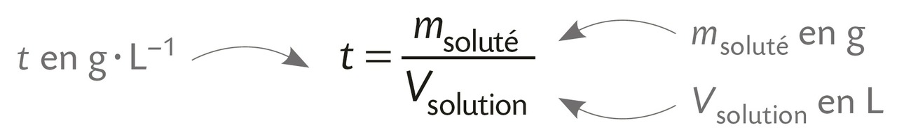
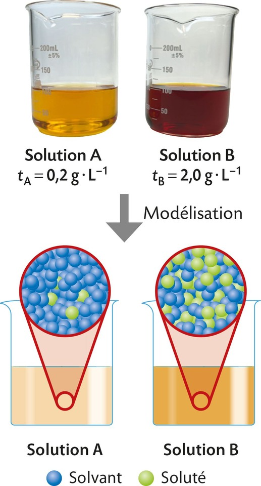
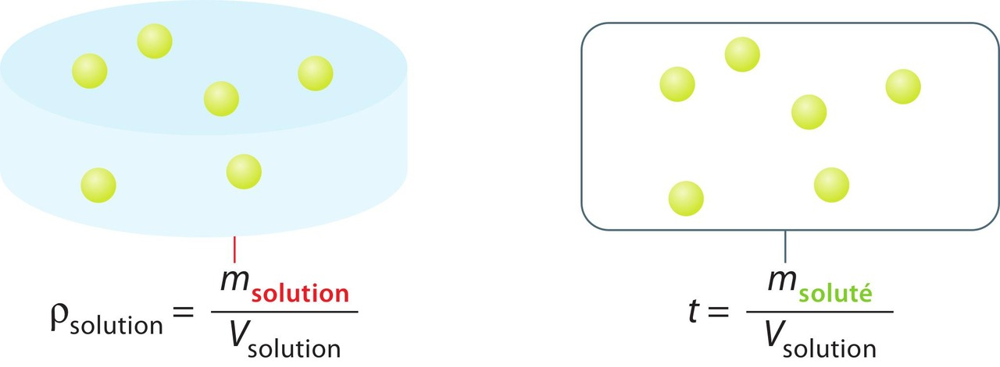
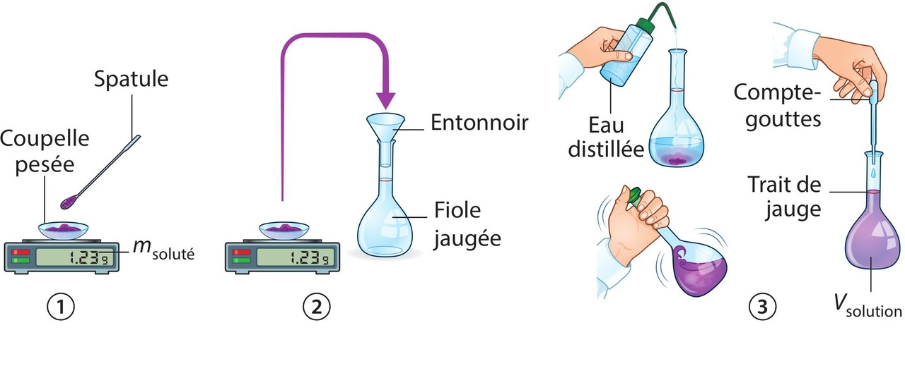
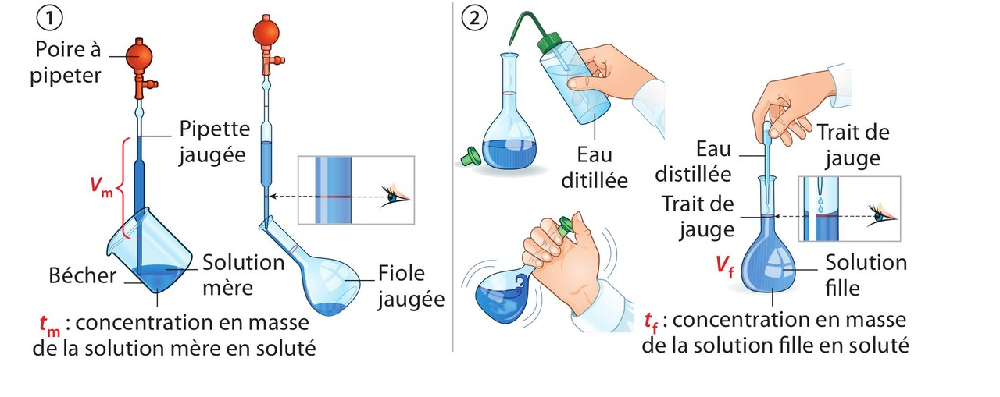
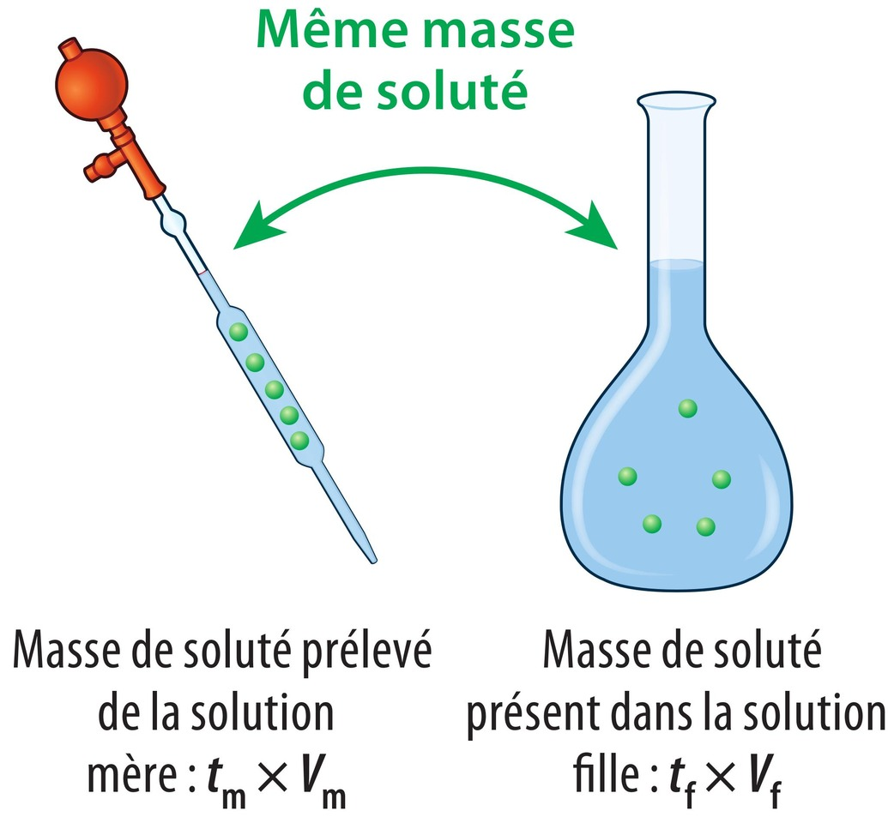

# Chapitre II : Solutions aqueuses

{{ initexo(0) }}

## 1. Les solutions 

- Une **solution** est un mélange homogène formé par une espèce chimique majoritaire appelée **solvant**, des espèces minoritaires appelées **solutés**.
- Lorsque le solvant est l’eau, la solution est appelée **solution aqueuse**.
- Les solutés peuvent être :
    - ioniques : présence d'ions en solution (exemple: Na+(aq) + Cℓ-(aq)) 
    - ou moléculaires : molécules en solution aqueuse (exemple: I2(aq)).

!!! success "Que signifie (s) (g) (ℓ) (aq) ?"
    Il s'agit de l'état dans lequel peuvent se trouver des espèces chimiques :

    - (s) signifie solide
    - (g) signifie gazeux    
    - (ℓ)  signifie liquide 
    - (aq) signifie que les espèces sont dissoutes en solutions aqueuses. Attention à ne pas confondre avec (ℓ).

## 2. La concentration en masse

!!! success "Définition"
    La concentration en masse **t** d’une solution en une espèce chimique dissoute est donné par:
    {: .center width="350"}

{: .center width="200"}

Pour un même volume, la solution B contient plus de soluté que la solution A. La solution B est plus concentrée en diiode que la solution A. Elle est plus colorée.

!!! warning "Ne pas confondre la concentration en masse avec la  masse volumique"
    - La concentration en masse **t** et la masse volumique **ρsolution** d'une même solution sont des grandeurs différentes bien qu'elles s'expriment avec la même unité (g·L–1).

    -  La masse volumique de la solution ρsolution fait référence à la masse de la solution (c'est-à-dire la somme de la masse de soluté et de la masse de solvant) alors que la concentration **t** fait uniquement référence à la masse de soluté.
    
    {: .center width="400"}

## 3. La dissolution

Une dissolution est le processus par lequel un soluté est dissous dans un solvant pour former un mélange homogène.

{: .center width="500"}

Lors d'une dissolution, le soluté se disperse dans le solvant.

!!! warning "Saturation"
    - Au-delà d'une certaine masse introduite dans le solvant, le soluté ne peut plus se dissoudre et se dépose au fond du récipient, même après agitation.
    - Lorsque la solution est saturée, la concentration en masse en soluté est maximale.

!!!success "Masse de soluté à prélever"
    Pour préparer par dissolution une solution aqueuse de volume Vsolution et de concentration en masse de soluté **t**, il faut prélever une masse de soluté msoluté à dissoudre dans de l'eau :
    {: .center width="350"}

Exemple : Pour préparer une solution de volume Vsolution = 50,0 mL et de concentration en masse t = 18,0 g·L–1 en glucose, la masse de soluté à peser est mglucose = t × Vsolution = 18,0 g·L–1 × 50,0 × 10–3 L = 0,900 g.

!!! success "Chiffres significatifs"
    Lors d'une multiplication ou d'une division, le résultat doit comporter autant de chiffres significatifs que la donnée qui en possède le moins.

## 4. La dilution

La dilution d'une solution aqueuse consiste à ajouter de l'eau à cette solution dans le but d'en diminuer sa concentration en soluté.

{: .center width="600"}

La solution obtenue (solution fille) est moins concentrée que la solution initiale (solution mère).

!!! success "Masse de soluté"
    La masse de soluté se conserve au cours de la dilution.

    {: .center width="250"}

!!! success "Facteur de dilution"
    Lors d'une dilution, la solution mère est diluée F fois. La solution mère est F fois plus concentrée en soluté que la solution fille. Le volume de solution fille est F fois plus grand que le volume de solution mère.
    

    

    $\displaystyle F = \frac{t_m}{​t_f}\quad$      et      $\quad \displaystyle F = \frac{V_f}{V_m}$​
    

    F est appelé facteur de dilution. Le facteur de dilution est toujours supérieur à 1.

!!! success "Volume de solution mère à prélever"
    $\displaystyle V_m = \frac{V_f}{F}$

    Le volume prélevé de solution mère est versé dans la fiole de la solution fille.
    

    

!!! example "{{ exercice() }} :heart:" 
    Une solution mère de concentration tm = 10,0 g·L–1 en soluté est diluée 5 fois pour obtenir un volume Vf = 100,0 mL de solution fille. 

    1. Déterminer le volume de solution mère à prélever.
    2. Déterminer la concentration de la solution fille.
