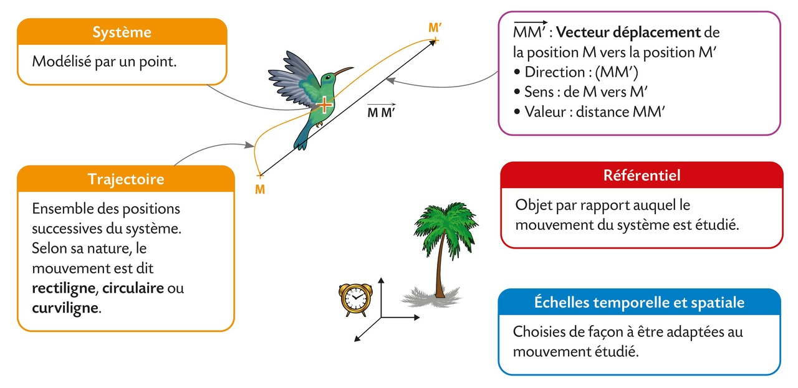
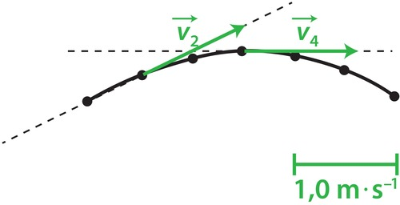

# Chapitre III : Description des mouvements

{{ initexo(0) }}

## 1. Le déplacement d'un système

L'objet dont on étudie le mouvement est appelé le système.
Pour simplifier, au lycée, on se limite à l'étude d'un seul point du système : son centre des masses.

{width="800"}

!!! success "Le mouvement du système est..."
    - **rectiligne** si sa trajectoire est une portion de droite ;  
    - **circulaire** si sa trajectoire est une portion de cercle ;  
    - **curviligne** dans les autres cas.  

## 2. Le vecteur vitesse entre deux positions M et M'

!!! note "Vecteur vitesse moyenne" 
    $\vec{v}_{moy}=\frac{\overrightarrow{MM'}}{\Delta t}$
​

Au cours d'un mouvement, la vitesse peut évoluer en sens, en direction et en valeur. La notion de vitesse moyenne ne permet pas de le savoir. Le vecteur vitesse $\vec v$ en un point de la trajectoire est assimilé au vecteur vitesse moyenne obtenu pour une durée Δt extrêmement courte. Plus la durée Δt est courte, meilleure est l'approximation.

!!! note "Représentation du vecteur vitesse $\vec v$ en un point"
    - **direction** :  tangente à la trajectoire
    - **sens** :  celui du mouvement
    - **valeur** :  celle de la vitesse, en m⋅s–1
    
    {width="300"}
    
    Le vecteur vitesse est représenté à l'aide d'une **échelle** adaptée.

!!! success "Le mouvement du système est..."
    - **uniforme** si la valeur de $\vec v$ ne change pas
    - **varié** si la valeur de $\vec v$ change (**accéléré** si la valeur de $\vec v$ augmente ; ** ralenti** si elle diminue)

## 3. Décrire un mouvement

Pour décrire un mouvement, on utilise deux caractéristiques : la forme de la trajectoire et l’évolution de la vitesse. Par exemple, on peut dire que le mouvement d’un système est *rectiligne uniforme*.
