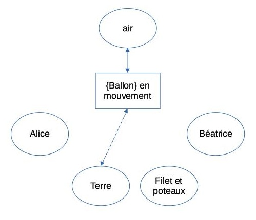
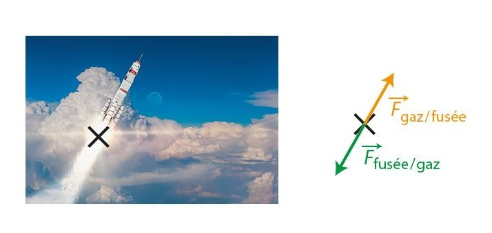
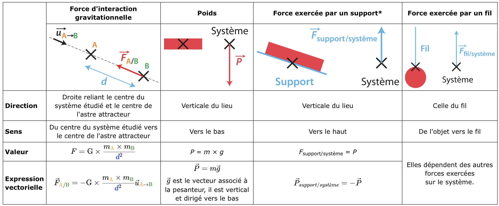
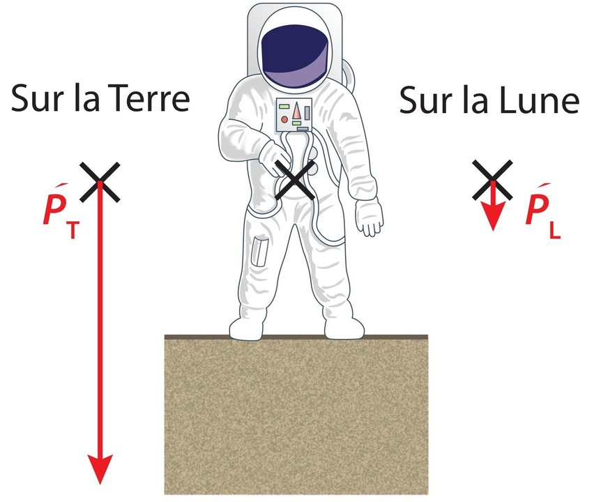
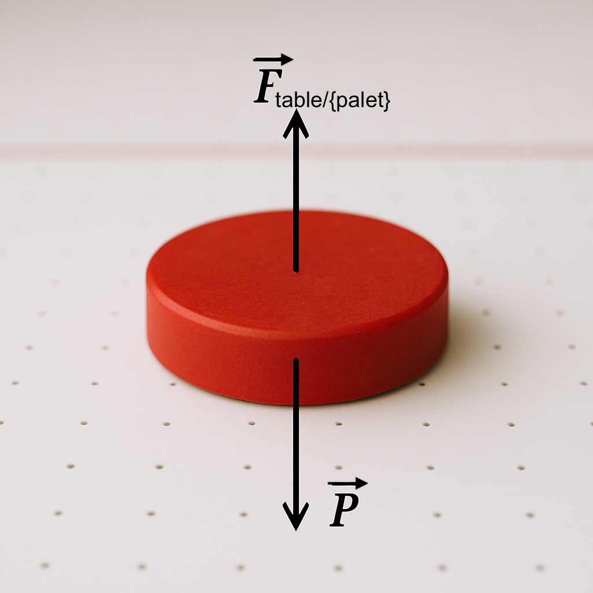
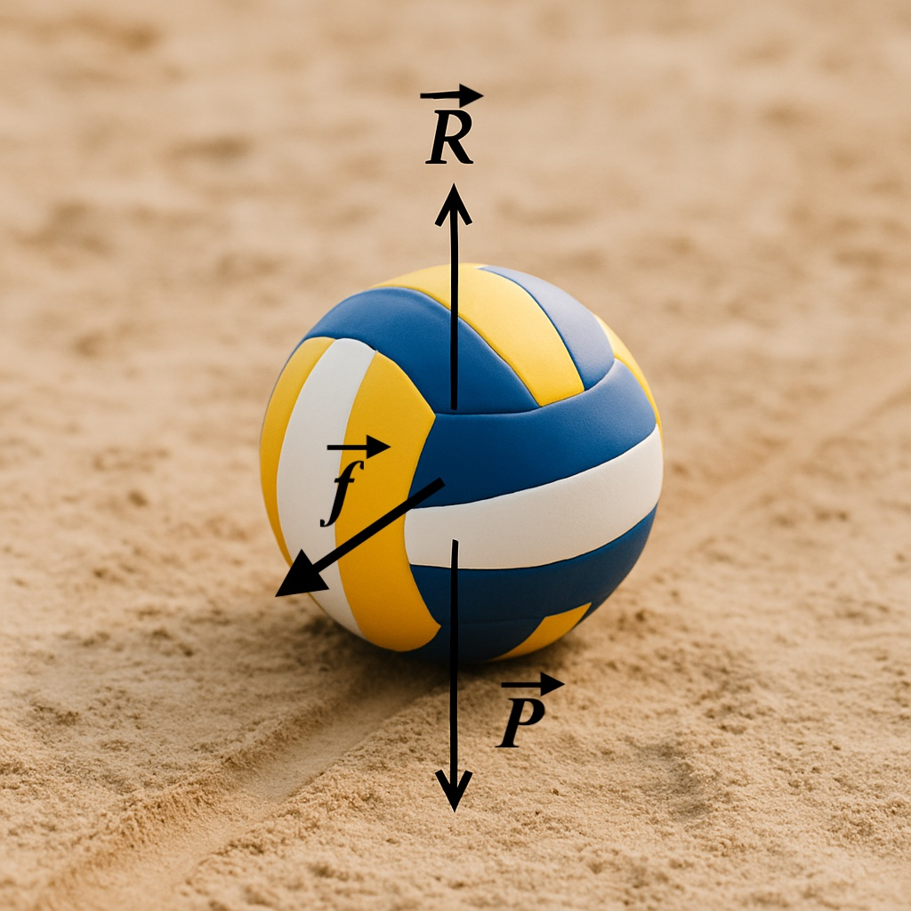
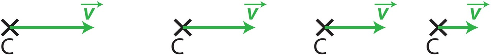
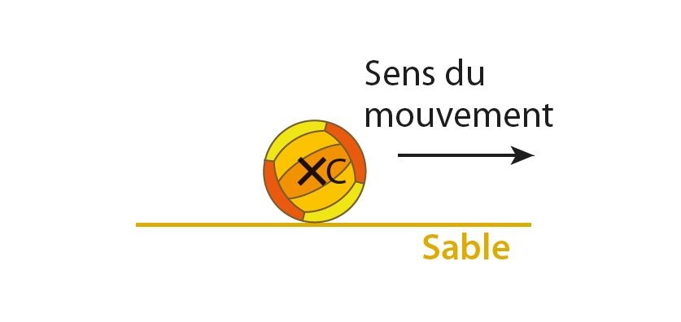
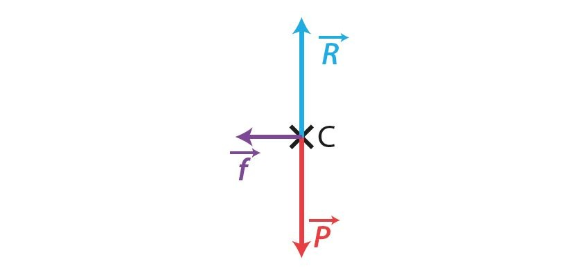
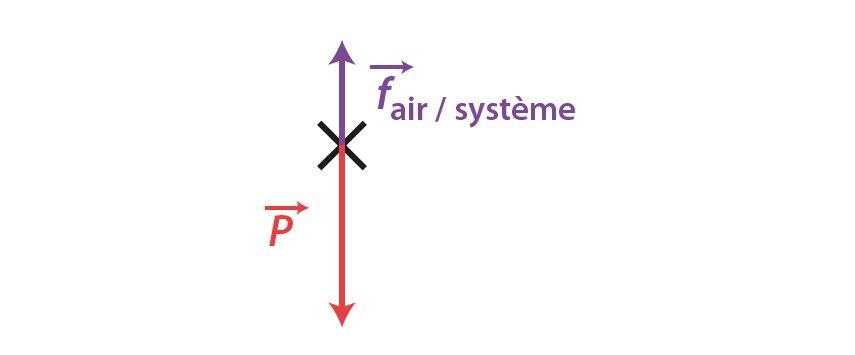

# Chapitre IV : Forces et mouvements

{{ initexo(0) }}

## 1. Objets et système

🎯 **Exemple de situation** : Alice (à gauche de l'image) s'apprête à smasher le ballon de volley envoyé par Béatrice. On veut représenter les forces qui s'exercent sur le ballon au moment où la photo a été prise.

{: .center .img-rounded width="300"}

!!! note "Qu'est-ce qu'un objet ?"
    Pour un physicien, **un objet** est toute portion de matière ou ensemble matériel que l'on choisit d'étudier ou de modéliser dans une situation donnée. Cela peut être : une balle, une personne, une voiture, la roue d’une voiture, une planète, une goutte d’eau, un parachutiste avec son parachute (comme un tout), le parachutiste (suspendu à un parachute), le parachute (auquel un parachutiste est suspendu) …  
    Le physicien est libre de choisir les objets qui lui paraissent pertinents. 

!!! note "Qu'est-ce qu'un système ?"
    - Le **système** est le nom donné à l’objet étudié.
    - Le système est souvent modélisé par un **point matériel** (on néglige sa forme et sa taille pour ne garder que sa masse et sa position) et son nom est souvent écrit entre accolades.
    - Le système peut être soumis à différentes **actions mécaniques** exercées par l’**extérieur** (tout ce qui n’appartient pas au système étudié).

!!! example "{{ exercice() }} : système et environnement extérieur (pour l'exemple)"
    === "Énoncé"
        Déterminer le système et l'environnement extérieur pour l'exemple de la situation étudiée.
    === "Correction"
        - L’objet constituant le **système étudié** est le `{ballon}`.  
        - Tous les autres objets (`Alice`, `Béatrice`, le `filet et ses poteaux`, l’`air`, la `Terre`, etc.) font partie de l’**environnement extérieur**.

🔍 **Remarques**

- On ne considère ici que des **objets matériels**.  

- La **force exercée** par Béatrice lors du lancer n’est pas un objet, mais une **interaction**.
De même, la **vitesse du vent** ou celle du ballon sont des **états** de ces objets, pas des objets eux-mêmes.

- Cependant, **préciser l’état d’un objet** (ex. : air en mouvement, ballon en chute) peut aider à **repérer les interactions**.

## 2. Diagramme objets-interactions

Le DOI (Diagramme Objets-Interactions) est un outil simple mais puissant qui permet de visualiser les interactions entre objets. Il facilite l'analyse des forces en ne conservant que celles qui s'appliquent au système étudié (ce qui permet d'éviter la confusion entre action et réaction) quand on effectue [le bilan des forces](#5-bilan-des-forces).

Un diagramme objets-interactions permet de recenser toutes les interactions impliquant le système à un instant t. Les interactions à **distance** (sans contact entre les objets) sont représentées par des **pointillés**, tandis que les interactions de **contact** sont représentées par des **traits pleins**.

!!! example "{{ exercice() }} : diagramme objets-interactions" 
    === "Énoncé"
        Modifier le DOI ci-dessous, s'il y a lieu de le faire pour la situation étudiée.
        
        {: .center width="400"}

    === "Correction"
        - Au moment que nous étudions, ni `Alice` ni `Béatrice` n'ont d'interaction avec le ballon. 
        - Pour la situation étudiée, le DOI ci-dessous est donc juste. Seuls trois objets sont indispensables à l'étude. 
        
        {: .center width="400"}

        - Avoir considéré d'autres objets comme `Alice` ou `Béatrice` n'est pas une faute ; cela fait partie du processus de recherche. Le DOI nous a permis d'identifier les objets qui sont pertinents

## 3. Modélisation d'une action par un vecteur force

- Chaque action est modélisée par une force. 
- Une force est représentée par un vecteur. 

🎯 **Exemple** : l'action mécanique exercée par la Terre sur le ballon est modélisée par une force $\vec F_{Terre/ballon} = \vec P$ (dont la valeur s'exprime en Newtons) qu'on appelle le poids (à ne pas confondre avec la masse qui s'exprime en kilogrammes).

!!! note "Le vecteur force $\vec F$"
    Comme tout vecteur, le vecteur force a :  
    • **une direction** : celle de la droite d'action de la force ;  
    • **un sens** : celui de la force ;  
    • **une norme** : $\left|\left| \vec F \right|\right|$ proportionnelle à $F$, la valeur de la force qui est en Newtons (N).  

!!! note "Point d'application d'une force"
    • Point où l'on considère que s'exerce la force.   
    • Quand le système est modélisé par un point, ce point est considéré comme point d'application de la force.

🔍 **Remarque**

- Dans la plupart des situations, plusieurs forces agissent en même temps.
Il faut donner un nom différent à chaque vecteur force pour éviter toute confusion.

## 4. Le principe des actions réciproques

Lorsque deux systèmes sont en interaction, ils exercent l'un sur l'autre des actions réciproques modélisées par des forces opposées qui ont :

- la même droite d'action ;
- des sens opposés ;
- une même valeur.

Ce principe s’applique aussi bien aux actions de contact qu’aux actions à distance, que les systèmes soient en mouvement ou immobiles.​

{: .center width="400"}

## 5. Bilan des forces

Lorsque l’on étudie un système, on effectue le bilan des forces : il s’agit alors de ne conserver que les forces qui agissent sur le système étudié, sans les confondre avec les forces qui s’exercent sur d'autres objets.

!!! warning
    - $\vec F_{obj./{syst.}}$ : il faut la traiter
    - $\vec F_{syst./{obj.}}$ : on n'en parle pas

!!! example "{{ exercice() }} : caractéristiques des forces" 
    === "Énoncé"
         - Pour l'exemple étudié, on peut représenter deux forces :
            - Le poids $\vec P$ du ballon qui représente l'action de l'objet Terre sur le système {ballon}.
            - La force de frottements $\vec f\phantom{f}$ qui représente l'action de l'air sur le ballon.
         - Compléter les caractéristiques du vecteur $\vec P$
             - **direction** : ?
             - **sens** : ?
             - **norme** : donnée par la formule $P = m \times g$   
           - Caractéristique du vecteur $\vec f\phantom{f}$
             - **de direction** : tangente au mouvement  
             - **de sens** : inverse au sens du mouvement du ballon  
             - **de norme** : $f$ de valeur inconnue
         
    === "Correction"

        !!! abstract "Caractéristique du vecteur $\vec P$"
            - **direction** : verticale  
            - **sens** : vers la Terre donc vers le bas  
            - **norme** : donnée par la formule $P = m \times g$   
  

!!! example "{{ exercice() }} : représentation des forces" 
    === "Énoncé"
        Alice (à gauche de l'image) s'apprête à smasher le ballon de volley envoyé par Béatrice. Le ballon qui se déplace vers la gauche est au sommet de sa trajectoire.   
        Corriger la proposition ci-dessous, s'il y a lieu de le faire.
        
        {: .center .img-rounded width="300"}
    === "Correction"
        Représentation juste car les caractéristiques de la force de frottements sont les suivantes :
        !!! abstract "Caractéristique du vecteur $\vec f\phantom{f}$"
            - **de direction** : tangente au mouvement  
            - **de sens** : vers la droite car inverse au sens du mouvement du ballon  
            - **de norme** : $f$ de valeur inconnue  
    

## 6. Exemples de forces

(*) Lorsque le système étudié est immobile et soumis seulement au poids et à l'action du support.

{: .center width="300"}

La masse de l'astronaute est la même sur la Terre et sur la Lune, mais la valeur de son poids est différente puisque gT ≠ gL.

## 7. Effet d'une force sur le mouvement d'un système

    <video autoplay loop muted width="560" height="315" playsinline style="border-radius: 15px; box-shadow: 0 4px 8px rgba(0,0,0,0.2);">
        <source src="https://www.salutilescanaries.com/sites/default/files/video-local/2022-06/IC_Home_Voley_v3_1_0.mp4" type="video/mp4">
    </video>

!!! note "Une force peut modifier le vecteur vitesse $\vec v$"
    Une force s'exerçant sur un système peut modifier la valeur de la vitesse et/ou la direction du mouvement de ce système. Elle peut donc modifier le vecteur vitesse $\vec v$ de ce système.
    
!!! warning "Contre intuitif"
    - Il est faux de penser que si, à un instant t,  un objet se déplace dans une direction, il y a forcement une force qui  l'entraîne dans cette direction.
    - Cela peut être la cas, mais ce n'est pas systématique.

🎯 **Exemple  pour les actions à distance**

Le poids modifie la vitesse verticale du ballon. On peut envoyer un ballon vers le haut mais obligatoirement la valeur de sa vitesse ne va cesser de diminuer jusqu'à devenir nulle quand le ballon est au sommet de sa trajectoire puis le ballon redescend en accélérant.

{: .center .img-rounded width="300"}

🎯 **Exemple  pour les actions de contact**

Au moment de la frappe la main exerce une action de contact sur le système `{ballon}`. Cette action modifie la valeur de la vitesse et la direction du mouvement du système.
La force $\vec F$main/{ballon} qui modélise l'action de la main sur le ballon modifie son vecteur $\vec v$.

{: .center .img-rounded width="300"}

🔍 **Remarque**

Aussitôt que le ballon quitte la main cette force $\vec F$main/{ballon} disparaît, mais sa conséquence demeure : le ballon est reparti avec un vecteur $\vec v$ modifié.  

## 8. Forces qui se compensent

!!! note "Forces qui se compensent"
  
    - **Des forces se compensent si la somme des vecteurs représentant ces forces est égale au vecteur nul.**
    - La réciproque est vraie.
    - Pour 2 forces: *Quand deux forces se compensent elles ont la même droite d'action, des sens opposés et une même valeur*. 

{.center .img-rounded width="300"}

🎯 **Exemple** : lors de son déplacement sur la table à coussin d'air, le palet de air hockey est soumis à son poids $\vec P$  et la force $\vec F_{table/\{palet\}}$ exercée par la table. Ces forces se compensent : $\vec P + \vec F_{table/\{palet\}} = \vec 0$.

{.center .img-rounded width="300"}

## 9. Le principe d'inertie

- Le principe d'inertie permet de relier forces et nature du mouvement.

!!! success "Principe d'inertie"

    - Lorsque les **forces qui s'exercent sur un système se compensent** alors le vecteur vitesse $\vec v$ du système ne varie pas : **le système reste immobile ou reste en mouvement rectiligne uniforme**.

    - Si le vecteur vitesse $\vec v$  d'un système ne varie pas, on peut en déduire que le système est soumis à des forces qui se compensent.

🎯 **Exemple** : le centre de la boule de bowling est en mouvement rectiligne uniforme donc son poids $\vec P$  et l'action $\vec R$   de la piste se compensent.

{.center .img-rounded width="300"}

Sur une piste parfaitement lisse une boule de bowling lancée sans effet a un mouvement rectiligne uniforme.

!!! success "Contraposée du principe d'inertie"
    - Lorsque **les forces** qui s'exercent sur un système **ne se compensent pas, alors le vecteur vitesse $\vec v$ varie**.
    
    - Lorsque le vecteur vitesse $\vec v$  d'un système varie (**lorsqu'un système n'est ni immobile ni en mouvement rectiligne uniforme**), on peut en déduire que **les forces qui s'exercent sur ce système ne se compensent pas**.

🎯 **Exemple** : lors de son déplacement sur le sable, un ballon de beach volley est soumis à des forces qui ne se compensent pas.  

{.center   .img-rounded width="300"}

Les forces ne se compensent pas donc son mouvement n'est pas rectiligne uniforme ($\vec v$ n'est pas constant). En effet le ballon ralenti jusqu'à s'arrêter (à ce moment la force de frottement $\vec f\phantom{f}$ disparaît).

{.center  width="300"}

## 10. Schématisation et modélisation

### a. Schématisation

Une schématisation est une représentation simplifiée (vue de coté ou du dessus suivant la situation, pas de perspective). 

{.center width="300"}

### b. Modélisation

Le système est modélisé par son centre $C$ et l'on rajoute les forces en présence modélisant les actions subies par le système. 

{: .center width="300"}

## 11. La chute libre verticale

!!! success "Chute libre"
    - Un système est en chute libre lorsqu'il n'est soumis qu'à son poids $\vec P$.
    - Le mouvement d'un système en chute libre n'est pas rectiligne uniforme.

    {.center  width="300"}

    - En toute rigueur, l'étude de la chute libre ne peut avoir lieu que dans le vide. 

Dans l'air, une chute sera considérée comme libre si l'on peut négliger les forces exercées par l'air sur le système par rapport à son poids (ce qui n'est pas toujours le cas).

{.center  width="300"}
