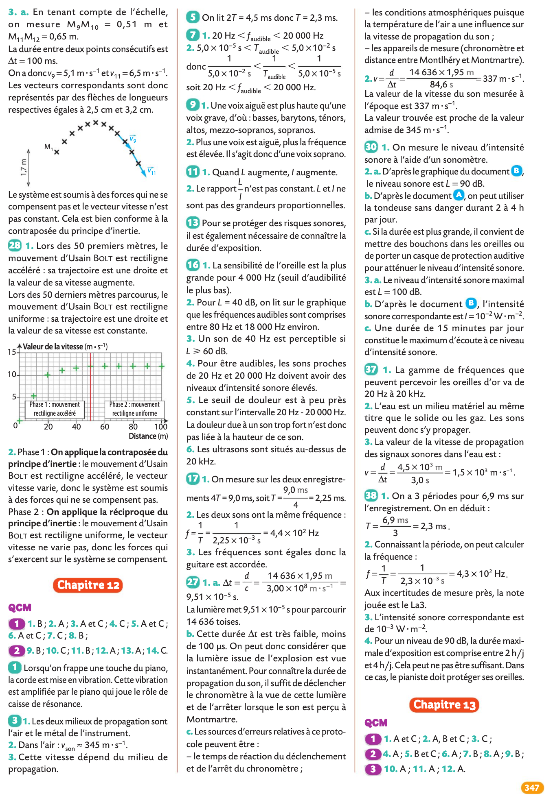
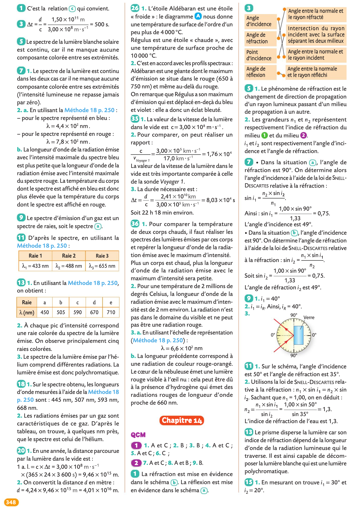
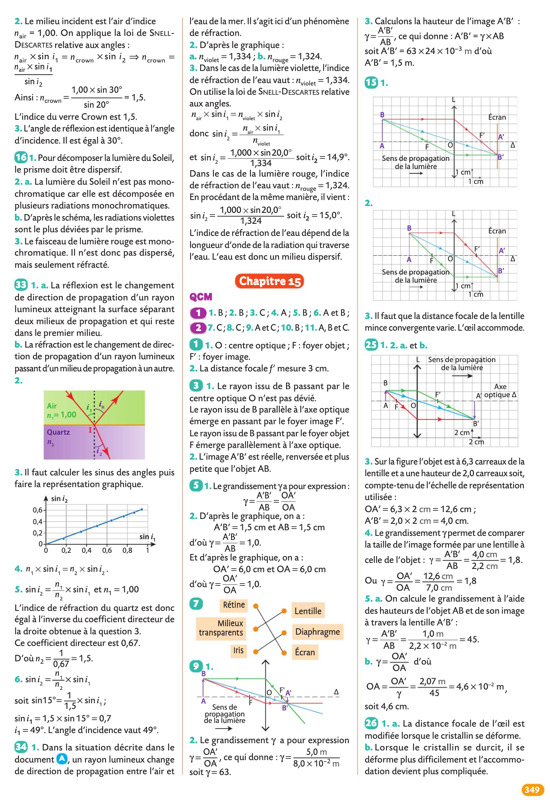

# Cours et TP

!!! success "Consignes"
    - Cours: Veillez à toujours avoir imprimé le chapitre suivant à l'avance ainsi lorsque l'on passera à un nouveau chapitre vous l'aurez à votre disposition.
    - Travaux Pratiques: Terminez systématiquement de rédiger l'activité qui a eu lieu et préparez la suivante pour la prochaine séance de TP. 

{# écrire `cache/` ou `data/` pour cacher ou non un fichier #} 

??? abstract "Chapitre 1: Corps purs et mélanges"
    - [📚Chapitre I](data/Chapitre I cours eleves.pdf){:target="_blank"}
    - [⚛️Activité 1  Corps pur et mélange](data/Act01 corps pur et melange.pdf){:target="_blank"}
    ??? question "Exercices du livre (chap 1 pages 28 à 36)"
        
        
        
        
        
        
        

    
??? abstract "Chapitre 2: Solutions aqueuses"
    - [📚Chapitre II](data/Chapitre II cours eleves.pdf){:target="_blank"}
    - [⚛️Activité 2 Préparation d'une solution par dissolution](data/Act02 dissolution.pdf){:target="_blank"}
    - [⚛️Activité 3 Préparation d'une solution par dilution](data/Act03 dilution.pdf){:target="_blank"}    
    - [⚛️Activité 4 Concentration en masse et masse volumique](data/Act04 vin de Bandol.pdf){:target="_blank"}    
    
    ??? question "Exercices du livre (chap2 pages 52 à 60)"
        
        
        
        
        
        
        
                
    
??? abstract "Chapitre 3: Description des mouvements"
    - [📚Chapitre III](data/Chapitre III cours eleves.pdf){:target="_blank"}
    - [⚛️Activité 5 Vitesse d'un système](data/Act05 vitesse systeme.pdf){:target="_blank"}
    - [⚛️Activité 6 Vecteurs déplacement et vitesse](data/Act06 vecteur deplacement et vitesse.pdf){:target="_blank"}
    ??? question "Exercices du livre (chap9 pages 178 à 186)" 
        
        
        
        
        

    
??? abstract "Chapitre 4: Modéliser une action mécanique"
    - [⚛️Activité 7 Actions réciproques](data/Act07 actions reciproques.pdf){:target="_blank"}
    ??? question "Exercices du livre (chap10 pages 200 à 206)" 
        
        
        
        
        

??? abstract "Chapitre 5: Principe d'inertie"
    - [📚Chapitre V](data/Chapitre V cours eleve.pdf){:target="_blank"}
    - [⚛️Activité 8 Le principe d'inertie](data/Act08 principe d'inertie.pdf){:target="_blank"}
    ??? question "Exercices du livre (chap11 pages 216 à 222)" 
        
        
        
        
        

 
??? abstract "Chapitre 6: De l'atome à l’élément chimique"
    - [📚Chapitre VI](data/Chapitre VI cours Photon eleve.pdf){:target="_blank"}
    - [⚛️Activité 9 Histoire de l'atome](data/Act09 histoire de l'atome.pdf){:target="_blank"}
    ??? question "Exercices du livre (chap3 pages 71 à 76)" 
        
        
         
        
        
        
        
         
         
         
??? abstract "Chapitre 7: Vers des entités plus stables"
    - [📚Chapitre VII](data/Chapitre VII cours eleve.pdf){:target="_blank"}
    - [⚛️Activité 10 Familles chimiques](data/Act10 familles chimiques.pdf){:target="_blank"}
    - [⚛️Activité 11 Formation des ions](data/Act11 formation des ions.pdf){:target="_blank"}    
    - [⚛️Activité 12 Modèle de Lewis](data/Act12 Le modele de Lewis.pdf){:target="_blank"}    
    ??? question "Exercices du livre (chap4 pages 90 à 98)" 
        
        
        
        
        
 
 
??? abstract "Chapitre 8: Émission et perception d'un son"
    - [📚Chapitre VIII](data/Chapitre VIII cours eleves.pdf){:target="_blank"}
    - [⚛️Activité 13 Mesure de la vitesse du son](data/Act13 vitesse du son.pdf){:target="_blank"}
    - [⚛️Activité 14 Analyse d'un son](data/Act14 analyse d'un son.pdf){:target="_blank"}
    ??? question "Exercices du livre (chap12 pages 237 à 246)" 
         
        
        
        
        
    
??? abstract "Chapitre 9: Transformations physiques"
    - [📚Chapitre IX](data/Chapitre IX cours champs eleve.pdf){:target="_blank"}
    - [⚛️Activité 15 Énergie et changement d'état](data/Act15 energie et changement d'etat.pdf){:target="_blank"}
    ??? question "Exercices du livre (chap6 pages 120 à 126)"
        
        
        
        
        
        
        

??? abstract "Chapitre 10: Transformations chimiques"
    - [📚Chapitre X](data/Chapitre X cours mouvements eleves.pdf){:target="_blank"}
    - [⚛️Activité 16 Trouver le réactif limitant](data/Act16 reactifs limitant.pdf){:target="_blank"}    
    - [⚛️Activité 17 Du gaspillage dans les vignes](data/Act17 gaspillage dans les vignes.pdf){:target="_blank"}        
    - [⚛️Activité 18 Transformations chimiques et effet thermique](data/Act18 transformations chimiques et effet thermique.pdf){:target="_blank"}            
    - [⚛️Activité 19 Arôme de banane](data/Act19 preparation d'un arome.pdf){:target="_blank"}                
    ??? question "Exercices du livre (chap7 pages 140 à 148)"
        
        
        
        
        
        
        
    
??? abstract "Chapitre 11: Réfraction et réflexion de la lumière"
    - [📚Chapitre XI](data/Chapitre XI cours EmEcEpp eleves.pdf){:target="_blank"}
    - [⚛️Activité 20 Lois de Snell-Descartes](data/Act20 Snell Descartes.pdf){:target="_blank"}    
    ??? question "Exercices du livre (chap14 pages 279 à 286)"
        
                
        
                
        
                
        
                
        

 
??? abstract "Chapitre 12: Les lentilles convergentes"
    - [📚Chapitre XII](data/Chapitre XII redox eleves.pdf){:target="_blank"}
    - [⚛️Activité 21 Lentille convergente](data/Act21 lentille convergente.pdf){:target="_blank"}    
    ??? question "Exercices du livre (chap 15 pages 298 à 304)"
        
        
        
        
        
        
        
        
        
        
        
        
        
 
 
 
??? abstract "Chapitre 13: Les spectres d'émission"
    - [📚Chapitre XIII](data/Chapitre XIII cours eleves.pdf){:target="_blank"}
    - [⚛️Activité 22 Spectroscopie](data/Act22 spectroscopie.pdf){:target="_blank"}    
    ??? question "Exercices du livre (chap 13 pages 258 à 266)"
        
        
        
        
        
        
 
 
??? abstract "Chapitre 14: Les lois de l'électricité"
    - [📚Chapitre XIV](data/Chapitre XIV cours energie electrique eleves.pdf){:target="_blank"}
    - [⚛️Activité 23](data/Act23 point de fonctionnement.pdf){:target="_blank"}    
    ??? question "Exercices du livre (chap 16 pages 316 à 324)"
        
        
        
        
        
        
        
        
                

