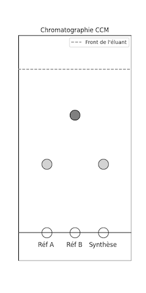
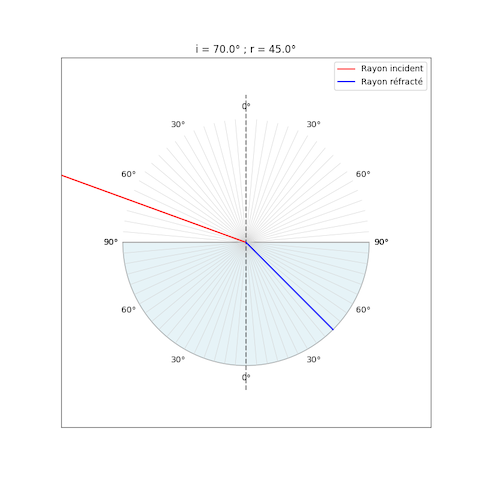

# Python en Physique-Chimie
{{ initexo(0) }}


## Chapitre 1

!!! example "{{ exercice() }} : Corps pur ou mélange"
    === "Énoncé"
        1. Le programme suivant doit permettre de déterminer si l'on a affaire à un corps pur ou à un mélange. Ouvrir le script suivant dans Capytale (**code :**):
           ```python  linenums="1"
           # Corps pur ou mélange 
           observation = input("La température du corps est-elle constante lors du changement d'état ? ")
           if observation == "je réfléchis":
               print("Il s'agit d'un corps pur car la température de changement d'état d'un corps pur est constante.")
           else:
               print("Il s'agit d'un mélange car la température de changement d'état d'un mélange n'est pas constante.")
           ```
        2. À la ligne 3, faut-il remplacer la chaîne de caractère "je réfléchis" par oui (sans guillemets) ou par non (sans guillemets) ou par la chaîne de caractère "oui" ou par la chaîne de caractère "non" ?  Tester le programme pour s'assurer que le choix fait est le bon.
        3. Autres sources d'erreurs qui concernent la syntaxe :
            1. Ne mettre qu'un seul `=` dans le test de comparaison à la ligne 3 puis tester le programme. Que constate-t-on ?
            2. Retirer le caractère `:`à  la fin de la ligne 3 ou à la fin de la ligne 5 et tester le programme. Que constate-t-on ?
            3. Retirer les indentations (c'est-à-dire le décalage) au début des lignes 4 et 6 et tester le programme. Que constate-t-on ?
                - **Données :**
                    - Python souhaite une information de l'utilisateur : `input()` retourne la saisie de l'utilisateur sous forme de chaîne de caractère. 
                    - Comme tous les langages de programmation, Python a des exigences de syntaxe. Il convient de les respecter.
               


## Chapitre 2
!!! example "{{ exercice() }} : Déterminer une concentration (chap02 ex 28 p 56)"
    === "Énoncé"
        1. Le programme suivant permet de déterminer la concentration en masse de chlorure de sodium d’une solution. Ouvrir le script suivant dans Capytale (**code :**):
           ```python  linenums="1"
           # Déterminer une concentration (chap02 ex 28 p 56)
           m = float(input("Masse de chlorure de sodium en g : "))
           V = float(input("Volume de la solution en L : "))
           t = m / V
           if t > 360:
               print("La concentration en masse t = 360 g/L")
           else:
               print("La concentration en masse :", t, "g/L")
           ```
        2. Donner le mode de préparation de la solution S
        3. La ligne 1 correspond à un commentaire. Par quel caractère doit-on commencer une ligne de commentaire ?
        4. Préciser l’objectif de `float()` aux lignes 2 et 3.
        5. Donner le nom de la fonction python utilisée aux lignes 6 et 8 qui permet d'afficher un message à l'écran.
        6. Modifier le programme afin de pouvoir déterminer la masse à prélever connaissant la concentration et le volume. 
              - **Données :**
                - À température ambiante, la concentration maximale en chlorure de sodium d’une solution est égale à 360 g·L<sup>–1</sup>.
                - Python et les nombres : python manipule soit des nombres entiers (`int`) comme 360 soit des nombres réels (`float`) comme 3,14.
                - Python souhaite une information de l'utilisateur : `input()` retourne la saisie de l'utilisateur sous forme de chaîne de caractère. 


## Chapitre 3
!!! example "{{ exercice() }} : Tracer les vecteurs vitesse avec pyplot (32 p 184)"
    === "Énoncé"
        1. Les positions du système, ainsi que les instants `t` ont été extraits d'un pointage. Ouvrir le script suivant dans Capytale (**code :**):
           ```python  linenums="1"
           # Tracer les vecteurs vitesse (capytale c09e32p184)
           import matplotlib.pyplot as plt
           x=[0.0257,0.2877,0.5549,0.8118,1.0842,1.3256,1.6031]
           y=[1.0944,1.4387,1.5980,1.6133,1.4849,1.2177,0.7810]
           t=[0,0.125,0.25,0.375,0.5,0.625,0.75]
           # Calcul des composantes Vx et Vy
           Vx=[]
           for i in range(len(x)-1) :
               Vxi=[(x[i+1]-x[i])/(t[i+1]-t[i])]
               Vx= Vx+ Vxi
           Vy=[]
           for i in range(len(y)-1) :
               Vyi=[(y[i+1]-y[i])/(t[i+1]-t[i])]
               Vy=Vy+Vyi
           # préparation de la zone graphique
           plt.grid()
           plt.title("Représentation du vecteur vitesse")
           plt.xlabel("$x$ (m)")
           plt.ylabel("$y$ (m)")
           # tracé des points de la trajectoire
           plt.plot(x,y,'ro')
           # tracé des vecteurs vitesse avec un facteur d'échelle
           for i in range(len(t)-1):
               plt.arrow(x[i],y[i],Vx[i]/10, Vy[i]/10,head_width=0.03, head_length=0.03,color="blue")
               plt.text(x[i]+0.05,y[i],r"$\vec{v}$"+str(i+1),color="blue")
           # Légende
           plt.text(0.1,0.8,"Echelle 1 cm $\leftrightarrow$ 10 cm/s", color="blue")
           plt.show()
           ```
           2. Repérer dans le programme les lignes correspondant aux données extraites du pointage.
           3. Repérer de même la (ou les) ligne(s) permettant de représenter les vecteurs vitesse. Extraire de cette (ou ces) ligne(s) le facteur de représentation des vecteurs vitesse.
           5. Proposer une modification du programme pour avoir un facteur de représentation des vecteurs vitesse de 1/15.


## Chapitre 4
!!! example "{{ exercice() }} : Calculer une force d'interaction gravitationnelle (chap10 ex 9 p 201)"
    === "Énoncé"
        1. Ouvrir le script suivant dans Capytale (**code :**):
           ```python  linenums="1"
           G = 6.67E-11 # en N.m2/kg2
           d = float(input("d (en m) = "))
           m1 = float(input("m1 (en kg) = "))
           
           F = G * m1 * m2 / d**2
           print("F =", F, "N")
           ```
           2. Syntaxe : indiquer à quoi correspond le `E` à la ligne 1.
           3. Écrire la ligne 4 permettant de demander `m2` à l'utilisateur.
           3. Exécuter le script pour calculer la valeur de la force de l'exercice 9 p 201 (en utilisant `E` pour saisir aisément les valeurs de la formule).
           4. Donner le résultat en notation scientifique avec 2 chiffres significatifs.


## Chapitre 5
!!! example "{{ exercice() }} : Galilée et la chute des corps (chap11 ex 14 p 218)"
    === "Énoncé"
        1. Ouvrir le script suivant dans Capytale (**code :**):
           ```python  linenums="1"
           t = [0, 0.04, 0.08, 0.12, 0.16, 0.20, 0.24]
           d = [4.9 * dt**2 for dt in t]
           v = [(d[i + 1] - d[i]) / (t[i + 1] - t[i]) for i in range(len(t) - 1)]
           l = [round(2 * vitesse, 1) for vitesse in v]
           print("t (en s):", t)
           print("d (en m):", d)
           print("v (en m/s):", v)
           print("l (en cm)", l)
           ```
           2. Quelle ligne du programme utilise la relation de proportionnalité évoquée par Galilée ?
           3. Quelle est la syntaxe Python pour élever au carré ?
           4. Remplir le tableau de l'exercice 14 p 218 à la main (et calculatrice) puis exécuter le script pour vérifier les réponses.
           5. Après exécution du script python `t`, `d`, `v` et `l` sont des listes de valeurs. En se référant à l'énoncé de l'exercice 14 p218, indiquer à quoi correspondent les valeurs de la liste `l`. 
       


## Chapitre 6
!!! example "{{ exercice() }} : Masse approchée d'un atome (chap03 ex 9 p 72)"
    === "Énoncé"
        1. Ouvrir le script suivant dans Capytale (**code :**):
           ```python  linenums="1"
           # Masse approchée d'un atome
           Z = int(input("Nombre de protons: "))
           rep = int(input("Nombre d'électrons: "))
           if rep != Z:
               print("Faux. Un atome est neutre donc il a autant d'électrons que de protons.")
           N = int(input("Nombre de neutrons: "))
           m_nucleon = 1.67E-27
           m_electron = m_nucleon / 1836
           m_noyau = m_nucleon * (Z + N)
           m_atome = m_noyau + m_electron * Z
           print("masse du noyau :", m_noyau)
           print("masse de l'atome :", m_atome)

           ```
           2. Syntaxe : indiquer la signification de `!=` dans le test effectué à la ligne 4.
           3. Exécuter le script pour répondre à l'exercice 9 p 72.
           4. Quel est le calcul simple permettant d'obtenir la masse approchée d'un atome ? Pourquoi parle-t-on de masse approchée ?
           


## Chapitre 7
!!! example "{{ exercice() }} : Obtenir une configuration électronique (chap04 ex 33 p 95)"
    === "Énoncé"
        1. Ouvrir le script suivant dans Capytale (**code :**):
           ```python  linenums="1"
           # Obtenir une configuration électronique (capytale c04e33p95)
           Z = int(input("Que vaut Z (Z < 18) ?"))
           ne = Z # (1)
           # initialisation: les sous-couches électroniques sont vides
           n1s = 0
           n2s, n2p = 0, 0
           n3s, n3p = 0, 0

           # Remplir sous-couche 1s
           while (ne > 0) and (n1s < 2): # (4)
               n1s += 1 # (2)
               ne -= 1  # (3)
               if (ne == 0) or (n1s == 2):
                   config = " 1s" + str(n1s) # (5)

           # Remplir sous-couche 2s
           while (ne > 0) and (n2s < 2):
               n2s += 1
               ne -= 1
               if (ne == 0) or (n2s == 2):
                   config = config + " 2s" + str(n2s) # (6)

           # Remplir sous-couche 2p
           while (ne > 0) and (n2p < 6):
               n2p += 1
               ne -= 1
               if (ne == 0) or (n2p == 6):
                   config = config + " 2p" + str(n2p) # (7)

           # Remplir sous-couche 3s
           while (ne > 0) and (n3s < 2):
               n3s += 1
               ne -= 1
               if (ne == 0) or (n3s == 2):
                   config = config + " 3s" + str(n3s) # (8)

           # Remplir sous-couche 3p
           
           
           
           
           
           
           if ne > 0:
               print("hors programme")
           else:
               print("Pour Z =", Z, "la configuration électronique est", config)
        
           ```
            1. Nombre d'électrons à placer sur les différentes sous-couches
            2. Incrémente le nombre d'électrons sur la sous-couche 1s
            3. Décrémente le nombre total d'électrons restant à placer
            4. Tant qu'il reste des électrons à placer et que la sous-couche 1s n'est pas pleine, continuer de remplir la sous-couche 1s
            5. Commence une chaîne de caractères qui va débuter par *1s* suivi du nombre d'électrons sur cette sous couche. La fonction `str()` transforme un entier en chaine de caractère
            6. Prolonge la chaîne nommée`config`
            7. Prolonge la chaîne nommée`config`
            8. Prolonge la chaîne nommée`config`
        2. En utilisant le script déterminer la configuration électronique de l'hélium $He$(Z = 2) et du berrylium $Be$(Z = 4).
        3. Compléter le script pour la sous-couche 3p 
        4. En utilisant le script déterminer la configuration électronique de l'alluminium $A\ell$(Z = 13).
    === "Correction"
        ```python  linenums="1"
        # Obtenir une configuration électronique (capytale c04e33p95)
        Z = int(input("Que vaut Z (Z < 18) ?"))
        ne = Z # (1)
        # initialisation: les sous-couches électroniques sont vides
        n1s = 0
        n2s, n2p = 0, 0
        n3s, n3p = 0, 0

        # Remplir sous-couche 1s
        while (ne > 0) and (n1s < 2): # (4)
            n1s += 1 # (2)
            ne -= 1  # (3)
            if (ne == 0) or (n1s == 2):
                config = " 1s" + str(n1s) # (5)

        # Remplir sous-couche 2s
        while (ne > 0) and (n2s < 2):
            n2s += 1
            ne -= 1
            if (ne == 0) or (n2s == 2):
                config = config + " 2s" + str(n2s)

        # Remplir sous-couche 2p
        while (ne > 0) and (n2p < 6):
            n2p += 1
            ne -= 1
            if (ne == 0) or (n2p == 6):
                config = config + " 2p" + str(n2p)

        # Remplir sous-couche 3s
        while (ne > 0) and (n3s < 2):
            n3s += 1
            ne -= 1
            if (ne == 0) or (n3s == 2):
                config = config + " 3s" + str(n3s)

        # Remplir sous-couche 3p
        while (ne > 0) and (n3p < 6):
            n3p += 1
            ne -= 1
            if (ne == 0) or (n3p == 6):
                config = config + " 3p" + str(n3p)
        
        if ne > 0:
            print("hors programme")
        else:
            print("Pour Z =", Z, "la configuration électronique est", config)
     
        ```
     

## Chapitre 8
!!! example "{{ exercice() }} : Fonction périodique (chap12 ex 23 p 241)"
    === "Énoncé"
        1. Ouvrir le script suivant dans Capytale (**code :**):
           ```python  linenums="1"
           import matplotlib.pyplot as plt
           import numpy as np
           
           
           # Création d'une variable temps, t, dont 1000 valeurs sont comprises entre 0 et 0,1 seconde
           t = np.linspace(0, 0.1, 1000)

           # valeur ....
           f = 100
           f1 = 100
           
           # Définition des fonctions y et y1 (et y2 à compléter)
           y = 3 * np.sin(2 * np.pi * f * t)
           y1 = 3 * np.sin(2 * np.pi * f1 * t) + 3 * np.sin(4 * np.pi * f1 * t)
           
           # Tracé des courbes sous forme de graphiques empilés dans une grille et mise en place de la légende
           plt.gcf().subplots_adjust(hspace=0.8) # (1)
           plt.title("Acquisition de deux signaux sonores")
           
           # Tracé de y
           plt.subplot(2, 1, 1) # (2)
           plt.xlabel("$t$ (en s)")
           plt.ylabel("$y$")
           plt.grid()
           plt.plot(t, y, color='blue')
           
           # Tracé de y1
           plt.subplot(2, 1, 2) # (3)
           plt.plot(t, y1, color='red')
           plt.xlabel("$t$ (en s)")
           plt.ylabel("$y_1$")
           plt.grid()
           
           # Tracé de y2 (à compléter)
           
           # (4) 
           
           # Affichage de la figure 
           plt.show()
           ```
            1. height space (espace en hauteur) entre lignes de la grille. Au besoin, utiliser `wspace` comme width space pour régler l'espace en largeur entre colonnes.
            2. Dans une grille de 2 lignes x  1 colonne, la figure est placée en  1re ligne. À modifier à la question 6.
            3. Dans une grille de 2 lignes x  1 colonne, la figure est placée en  2e ligne.  À modifier à la question 6.
            4. On peut également sauvegarder l'image dans le répertoire du script avec `plt.savefig("image.png")` 
        2. Déterminer graphiquement la période de chacune des fonctions correspondant aux courbes
        3. Calculer la fréquence de chacune de ces deux fonctions.
        4. Compléter le commentaire de la ligne 8 du programme.
        5. À l’aide de la représentation temporelle de la fonction `y`, indiquer ce que représente le nombre 3 dans la ligne 13 du programme.
        6. Sous le tracé des deux fonctions précédentes, on souhaite tracer une nouvelle fonction `y2` qui est sinusoïdale, de période T égale à 0,020 s et d’amplitude égale à 4. Modifier le programme  (`f2 = ?` ; `y2 = ?` ; Tracé de y2) pour afficher le tracé des trois fonctions. Utiliser `plt.subplot(3, 1, 1)`, `plt.subplot(3, 1, 2)` et `plt.subplot(3, 1, 3)` pour placer les sous figures dans une grille 3x1.
    
## Chapitre 9
!!! example "{{ exercice() }} : Décrire des états physiques (chap06 ex 4 p 121)"
    === "Énoncé"
        1. On a mesuré la température au cours du temps lors de la solidification du cyclohexane. Ouvrir et tester le script suivant dans Capytale (**code :**):    
           ```python  linenums="1"
           # Décrire des états physiques
           import matplotlib.pyplot as plt
           t = [0, 2, 4, 6, 8, 10] # (en min)
           T = 16.0, 11.5, 6.5, 6.5, 6.0, 1.51  # (en °C)
           # préparation de la zone graphique
           plt.grid()
           plt.title("Donner un titre")
           plt.xlabel(".....(en min)")
           plt.ylabel("..... (en °C)")
           # tracé des points de la trajectoire
           plt.plot(t,T,'ro-')
           plt.show()
           ```
           2. Syntaxe : Python est sensible à la "casse" c'est-à-dire qu'il distingue les majuscules et les minuscules. Dans ce script que représentent les variables `t`et `T`?
           3. Lignes 7, 8 et 9 donner un titre au graphique et annoter les axes. 
           3. Exécuter le script pour tracer le graphique représentant l’évolution de la température au cours du temps.
           4. Identifier les états physiques par lesquels passe le cyclohexane au cours du temps.


## Chapitre 10
!!! example "{{ exercice() }} : Chromatographie sur couche mince (CCM)"
    === "Énoncé"
        - Objectifs :
            - Savoir lire un chromatogramme CCM.
            - Identifier les constituants d’un mélange par comparaison avec des espèces de référence.
            - Utiliser un programme Python pour s’entraîner.    
        - Travail demandé:
            - Lancer le programme Python dans Capytale (**code: 7e20-6893103**) puis exécuter une cellule après l'autre.
            - Observer le chromatogramme généré.
            - Analyser le dépôt de synthèse : d’après les positions des taches migrées du mélange (Synthèse), indiquer si l'espèce A est présente. Indiquer si l'espèce B est présente.
            - Vérifier vos réponses grâce à la correction automatique proposée par le programme.
            - Refaire plusieurs fois la procédure.
            
    === "Script python"
        1. Import des modules et paramètres de la plaque
           ```python  linenums="1"
           import matplotlib.pyplot as plt
           import random
           
           # Paramètres de la plaque
           largeur_plaque = 4  # cm
           hauteur_plaque = 8  # cm
           ligne_depot = 1     # cm
           
           # Front de l'éluant (aléatoire à chaque exercice)
           front = random.uniform(6, 7.5) # (1)
           
           # Positions horizontales des dépôts
           # 1 : Référence A
           # 2 : Référence B
           # 3 : Produit de synthèse
           ```
            1. La méthode `uniform ()` renvoie un nombre flottant aléatoire entre les deux nombres spécifiés (tous deux inclus).
        2. Simulation de l'existence et des positions aléatoires des taches
           ```python  linenums="16"
           # Rf des références (valeurs réalistes et bien séparées)
           Rf_A = round(random.uniform(0.2, 0.5), 2)
           Rf_B = round(random.uniform(0.55, 0.9), 2)
           
           # Présence ou non des espèces dans le mélange synthétisé
           contient_A = random.choice([True, False])
           contient_B = random.choice([True, False])
           
           # ordonnées des taches
           yA = ligne_depot + Rf_A * (front - ligne_depot)
           yB = ligne_depot + Rf_B * (front - ligne_depot)
           ```
        3. Affichage de la chromatographie
           ```python  linenums="1"
           plt.figure(figsize=(4, 8))
           
           # Plaque CCM (un rectangle est un polygone fermé)
           x_rect = [0, largeur_plaque, largeur_plaque,              0, 0] # (1)
           y_rect = [0,              0, hauteur_plaque, hauteur_plaque, 0] # (2)
           plt.fill(x_rect, y_rect, facecolor='white', edgecolor='black', linewidth=2) # (3)
           
           # Front de l'éluant
           plt.plot([0, largeur_plaque], [front, front], '--', color='grey', label="Front de l'éluant")
           
           # Ligne de dépôts
           plt.plot([0, largeur_plaque], [ligne_depot, ligne_depot], '-', color='black')
           
           # Dépôts
           plt.scatter(1, ligne_depot, s=400, color='white', edgecolor='black')
           plt.text(1 - 0.3, 0.5, 'Réf A', fontsize=12)
           
           plt.scatter(2, ligne_depot, s=400, color='white', edgecolor='black')
           plt.text(2 - 0.3, 0.5, 'Réf B', fontsize=12)
           
           plt.scatter(3, ligne_depot, s=400, color='white', edgecolor='black')
           plt.text(3 - 0.5, 0.5, 'Synthèse', fontsize=12)
           
           # Tracer les taches migrées
           plt.scatter(1, yA, s=400, color='lightgrey', edgecolor='black')
           plt.scatter(2, yB, s=400, color='grey', edgecolor='black')
           
           if contient_A:
               plt.scatter(3, yA, s=400, color='lightgrey', edgecolor='black')
           if contient_B:
               plt.scatter(3, yB, s=400, color='grey', edgecolor='black')
            
           plt.xlim(0, largeur_plaque)
           plt.ylim(0, hauteur_plaque)
           plt.axis('off')
           plt.title("Chromatographie CCM")
           plt.legend()
           plt.show()
           ```
            1. liste des abscisses des points du polygone fermé
            2. liste des ordonnées des points du polygone fermé
            3. `plt.fill()` attend deux listes : la liste des abscisses et la liste des ordonnées des points du polygone
        4. Questions
           ```python  linenums="1"
           print("\nAnalyse du produit de synthèse :")
           
           reponse_A = input("Le produit contient-il l'espèce A ? (oui/non) ")
           reponse_B = input("Le produit contient-il l'espèce B ? (oui/non) ")
           ```
        5. Correction
           ```python  linenums="1"
           # Correction
           if (reponse_A == 'oui' and contient_A) or (reponse_A == 'non' and not contient_A):
               print("✅ Réponse correcte pour l'espèce A.")
           else:
               print("❌ Réponse incorrecte pour l'espèce A.")
           
           if (reponse_B == 'oui' and contient_B) or (reponse_B == 'non' and not contient_B):
               print("✅ Réponse correcte pour l'espèce B.")
           else:
               print("❌ Réponse incorrecte pour l'espèce B.")
           
           print("Exercice terminé.\n")
           ```
       
## Chapitre 11
!!! example "{{ exercice() }} : Réfraction"
    === "Énoncé"
        - Objectifs :
            - Savoir simuler un phénomène de réfraction.
            - Savoir donner un résultat en ayant un regard critique sur la précision.
            - Utiliser un programme Python pour s’entraîner.    
        - Travail demandé:
            - Lancer le programme Python dans Capytale (**code: 892c-6894267**) puis exécuter une cellule après l'autre.
            - Saisir les paramètres souhaités (angle du rayon incident et indice des milieux) puis simuler le trajet du faisceau lumineux.
            - Vérifier l'angle de réfraction à l'aide de la loi de Snell-Descartes
            - Faire la partie complémentaire concernant la précision du résultat.
            - Vérifier vos réponses grâce à la correction automatique proposée par le programme.
            - Refaire plusieurs fois la procédure.
            

    === "Script python"
        1. Import des modules
           ```python  linenums="1"
           import numpy as np
           import matplotlib.pyplot as plt
           import matplotlib.patches as patches
           ```
        2. Définition de nouvelles fonctions
           ```python  linenums="4"
           # Fonction de calcul de l'angle de réfraction
           def calcul_refraction(n1, n2, i_deg):
               i_rad = np.radians(i_deg)
               sin_r = n1 / n2 * np.sin(i_rad)
               
               if abs(sin_r) > 1:
                   return None  # Réflexion totale
               else:
                   r_rad = np.arcsin(sin_r)
                   r_deg = np.degrees(r_rad)
                   return r_deg           

           # Fonction de tracé
           def tracer_refraction(n1, n2, angle_incident):
               angle_refracte = calcul_refraction(n1, n2, angle_incident)
               
               fig, ax = plt.subplots(figsize=(8, 8))
               
               # Tracé du demi-cylindre (face courbe en bas)
               demi_cercle = patches.Wedge(center=(0, 0), r=1, theta1=180, theta2=360, facecolor='lightblue', edgecolor='black', alpha=0.3)
               ax.add_patch(demi_cercle)
               
               # Surface plane
               plt.plot([-1, 1], [0, 0], color='k', alpha=0.3)  
           
               # Tracé du rapporteur gradué
               for angle in range(-90, 91, 5):
                   rad = np.radians(angle)
                   x = np.sin(rad)
                   y = np.cos(rad)
                   ax.plot([0, x], [0, y], color='lightgray', lw=0.5)
                   ax.plot([0, -x], [0, -y], color='lightgray', lw=0.5)        
                   if angle % 30 == 0:
                       plt.text(1.1 * np.sin(rad), 1.1 * np.cos(rad), f"{abs(angle)}°", ha='center', va='center', fontsize=10)
                       plt.text(-1.1 * np.sin(rad), -1.1 * np.cos(rad), f"{abs(angle)}°", ha='center', va='center', fontsize=10)            
           
               # Rayon incident
               i_rad = np.radians(angle_incident)
               xi = -2 * np.sin(i_rad)
               yi = 2 * np.cos(i_rad)
               ax.plot([xi, 0], [yi, 0], color='red', label="Rayon incident")
           
               # Normale
               ax.plot([0, 0], [-1.2, 1.2], 'k--', alpha=0.5)
           
               # Rayon réfracté
               if angle_refracte is not None:
                   r_rad = np.radians(angle_refracte)
                   xr = np.sin(r_rad)
                   yr = -np.cos(r_rad)
                   ax.plot([0, xr], [0, yr], color='blue', label="Rayon réfracté")
                   plt.title(f"i = {angle_incident}° ; r = {round(angle_refracte, 1)}°")
               else:
                   plt.title(f"i = {angle_incident}° ; Réflexion totale")
           
               ax.set_xlim(-1.5, 1.5)
               ax.set_ylim(-1.5, 1.5)
               ax.set_aspect('equal')
               plt.legend()
               plt.grid(False)
               ax.set_xticks([])
               ax.set_yticks([])
               plt.show()
           ```
        3. Simulation
           ```python  linenums="67"
           # Exemple
           n_air = 1.00
           n_plexiglas = 1.33
           angle_incident = 70.0
           
           tracer_refraction(n_air, n_plexiglas, angle_incident)
           
           ```
        4. Questions et correction
           ```python  linenums="73"
           from random import choice
           r = calcul_refraction(n_air, n_plexiglas, angle_incident)
           A = "a) La précision d'un résultat dépend de la précision des données utilisées ? (oui/non) "
           B = "a) La précision d'un résultat dépend du nombre de décimales affichées par la calculatrice ? (oui/non) "
           C = f"b) r = {r}° est préférable à r = {r:.1f}° car «c'est plus précis» (oui/non) "
           D = f"b) r = {r:.1f}° est préférable à r = {r} car prétendre être plus précis est illusoire (oui/non) "
           Q1, Q2 = choice([A, B]), choice([C, D])
           
           print("\nDONNER UN RÉSULTAT NUMÉRIQUE :\n")
           print(f"L'angle du rayon réfracté est de {r} degrés ou de {r:.1f} degrés ?" )
           reponse_1 = input(Q1)
           reponse_2 = input(Q2)

           # Correction
           if (Q1 == A and reponse_1 == 'oui') or (Q1 == B and reponse_1 == 'non'):
               print("✅ Réponse 1 correcte\n")
           else:
               print("❌ Réponse 1 incorrecte\n")
           
           if (Q2 == C and reponse_2 == 'non') or (Q2 == D and reponse_2 == 'oui'):
               print("✅ Réponse 2 correcte\n")
           else:
               print("❌ Réponse 2 incorrecte\n")
           
           print("Exercice terminé.\n")     
           ```

## Chapitre 12

!!! example "{{ exercice() }} : Lentille"
    === "Énoncé"
        1. Ouvrir et tester le script suivant dans Capytale (**code :**):    
           ```python  linenums="1"
           # Fonction permettant de calculer la taille de l'image
           def calculer_taille_image(AB, OA, OAprime):
               AprimeBprime = AB * OAprime / OA
               return AprimeBprime


           # Les valeurs sont fournies par l'utilisateur
           AB = float(input("Donner la taille de l'objet AB en mètre : \n"))
           OA = float(input("Donner la distance OA en mètre : \n"))
           OAprime = float(input("Donner la distance OA' en mètre : \n"))
           
           # Calcul et affichage du résultat
           resultat = calculer_taille_image(AB, OA, OAprime)
           print("La taille de l'image A'B' est", resultat, "m.")
           ```
           2. Écrire un nouveau programme comportant la fonction `calculer_position_image(AB, OA, AprimeBprime)` qui permet de calculer OA’ connaissant AB, OA et A'B' qui seront les valeurs fournies par l'utilisateur. 
           3. Adapter la partie *Calcul et affichage du résultat* pour afficher la position de l'image.


## Chapitre 14

!!! example "{{ exercice() }} : Parafoudre (chap16 ex 28 p320)"
    === "Énoncé"
        -  Réaliser l'exercice dans Capytale
